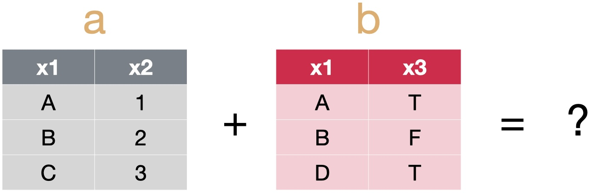
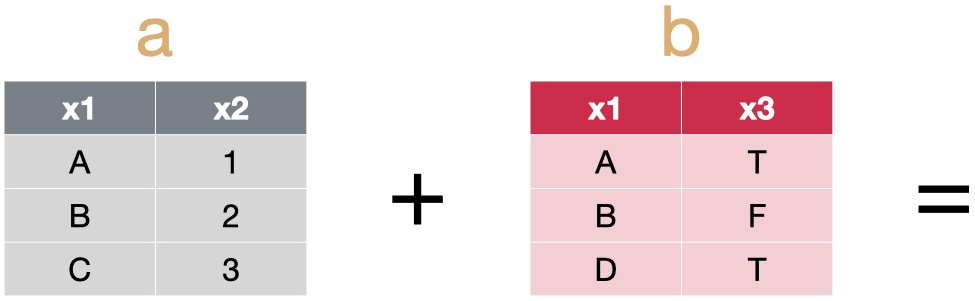
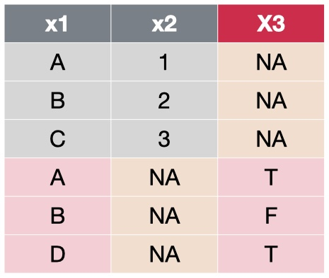
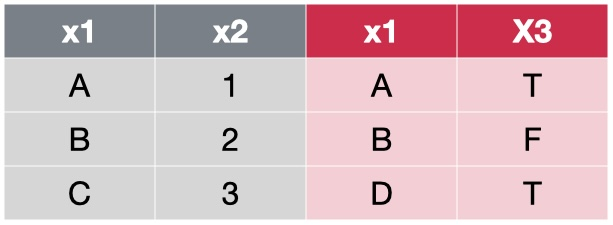
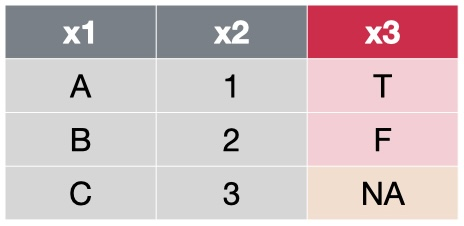
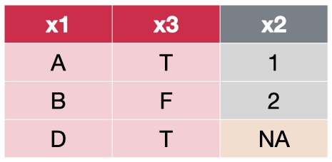
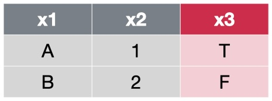
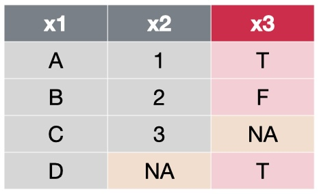
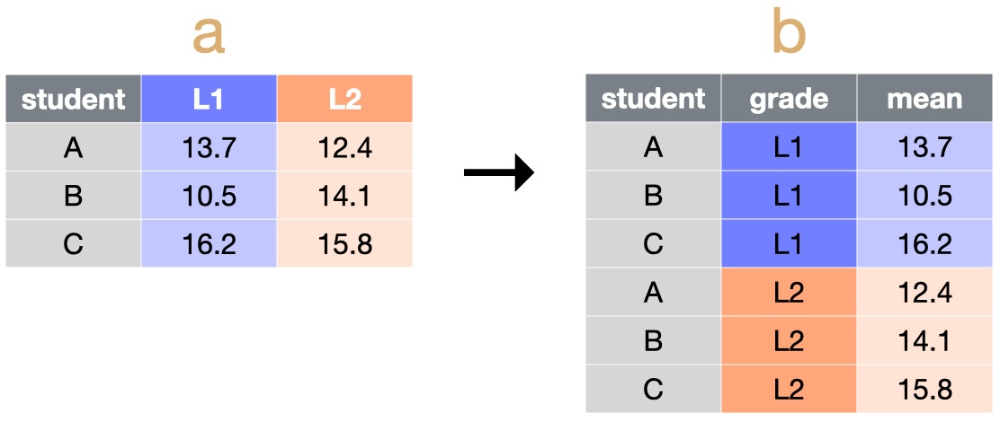
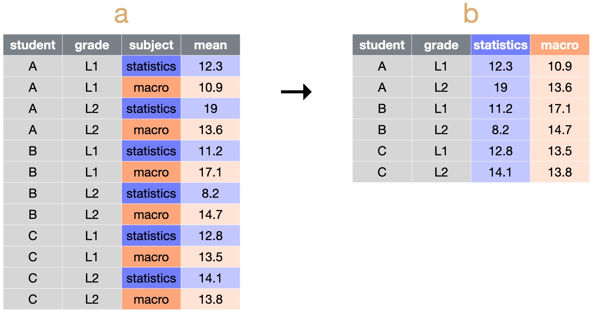

```{r setup, include = FALSE, warning = FALSE, message = FALSE}
options(htmltools.dir.version = FALSE)
knitr::opts_chunk$set(
  message = FALSE,
  warning = FALSE,
  dev = "svg",
  cache = TRUE,
  fig.align = "center"
  #fig.width = 11,
  #fig.height = 5
)

# Load packages
library(tidyverse)
library(pander)
library(ggthemes)
library(gapminder)
library(emo)
library(countdown)
library(xaringanthemer)
library(xaringanExtra)
library(sf)

# countdown style
countdown(
  color_border              = "#dd0747",
  color_text                = "black",
  color_running_background  = "#dd0747",
  color_running_text        = "white",
  color_finished_background = "white",
  color_finished_text       = "#dd0747",
  color_finished_border     = "#dd0747",
  font_size = "1.5em" 
)


style_xaringan( 
  title_slide_background_color = "#dd0747",
  title_slide_text_color = "white",
  text_color = "black",
  header_color = "#dd0747",
  text_bold_color = "#dd0747",
  text_slide_number_color = "black",
  code_inline_background_color = "#e0e1df",
  base_font_size = "24px",
  text_font_family = "metropolis-fonts",
  header_font_family = "metropolis-fonts",
  header_h1_font_size = "45px",
  header_h2_font_size = "35px",
  header_h3_font_size = "28px",
  inverse_background_color = "#f8cdda",
  inverse_text_color = "black",
  inverse_header_color = "#dd0747")

# Theme with only x and y axis ans names
theme_minimum = theme_bw() + 
  theme(
  text = element_text(family = "Palatino"),
  line = element_blank(),  # Masquer toutes les lignes par défaut
  rect = element_blank(),  # Masquer tous les rectangles par défaut
  axis.line = element_line(color = "black"),  # Afficher les lignes des axes
  axis.ticks = element_blank(),  # Masquer les ticks des axes
  plot.title = element_blank(),  # Masquer le titre du graphique
  panel.background = element_blank(),  # Masquer le fond du panneau
  panel.grid.major = element_blank(),  # Masquer la grille principale
  panel.grid.minor = element_blank(),  # Masquer la grille secondaire
  plot.background = element_blank(),  # Masquer le fond du graphique
  legend.position = "none"  # Masquer la légende
)

# A blank theme for ggplot
theme_empty = theme_bw() + 
  theme(
  text = element_text(family = "Palatino"),
  line = element_blank(),  # Masquer toutes les lignes par défaut
  rect = element_blank(),  # Masquer tous les rectangles par défaut
  axis.line = element_line(color = "black"),  # Afficher les lignes des axes
  axis.ticks = element_blank(),  # Masquer les ticks des axes
  axis.text = element_blank(),  # Masquer les étiquettes des axes
  axis.title = element_text(size = 12),  # Afficher les titres des axes
  plot.title = element_blank(),  # Masquer le titre du graphique
  panel.background = element_blank(),  # Masquer le fond du panneau
  panel.grid.major = element_blank(),  # Masquer la grille principale
  panel.grid.minor = element_blank(),  # Masquer la grille secondaire
  plot.background = element_blank(),  # Masquer le fond du graphique
  legend.position = "none"  # Masquer la légende
)


```

layout: true


---
# About me

&nbsp;


Doctorante en Économie à PSE en 3ème année

Champs de recherche: économie de la famille, de l'éducation, du travail


&nbsp;

&nbsp;

.center[
**Me contacter**: florentine.oliveira@psemail.eu

**Si vous avez des questions ou envie/besoin de parler**: Campus Jourdan, Bureau R4-54 
]

---
# Objectifs du cours

&nbsp;

&nbsp;

- Se familiariser avec 
  - les techniques **économétriques** de base
  - la **recherche** en **économie appliquée**

- Apprendre le language de programmation `R`

&nbsp;

$\implies$ pour pouvoir réaliser votre **mémoire** !


---
# Roadmap


&nbsp;


### Semestre 1

1. Séance 1 (aujourd'hui): Rappels de `R` 
2. Séance 2 (12/11/2024): Rédiger en $\LaTeX$
3. Séance 3 (19/12/2024): Régressions linéaires

### Semestre 2
4. Séance 4 (): Méthode des variables instrumentales
5. Séance 5 (): Doubles-Différences (DiD)
6. Séance 6 (): Regression Discontinuity Design (RDD)
7. Séance 7 (): 
8. Séance 8 ():


---
# Validation du cours

## DM


## Mémoire


---
# Cette séance

&nbsp;

1. La recherche en économie appliquée

2. `R`: rappels et **trouver mot**

  2.1. Définition, usages, interface  
  2.2. Projet `R`   
  2.3. Importer des données   
  2.4. Manipulation des données avec `dplyr`   
  2.5. Visualisation des données avec `ggplot`   
  2.6. Maps
  
---
# 1. La recherche en économie appliquée

### Qu'est-ce que la recherche en économie appliquée?

- Répondre à des **questions de recherche** pour apprendre sur les comportements humains, l'efficacité des poliques publiques, ...   

--

  - Quel est l'effet des bourses de scolarité **sur** la réussite scolaire? 

  - Quel est l'effet d'un allongement de la durée du congé parental **sur** la participation au marché du travail des mères?

  - Quelle est l'ampleur de la discrimination dans le processus de recrutement?

  - Quel est l'effet d'un assouplissement des conditions d'éligibilité à l'assurance chômage **sur** l'emploi?

  - Quel est l'effet de la pollution atmosphérique **sur** la productivité?  

  - Quel est le rôle des médias **sur** le comportement de vote?

  - Quel est l'effet de la densité de population **sur** les salaires?

---
# 1. La recherche en économie appliquée

### Qu'est-ce que la recherche en économie appliquée?

- Répondre à des **questions de recherche** pour apprendre sur les comportements humains, l'efficacité des poliques publiques, ...

  - Grande diversité des champs de recherche: éducation, travail, famille, environnement, macroéconomie, politique, migration, genre, urban, crime, économie historique, ...
  
  
- ... en utilisant des techniques statistiques rigoureuses (= **économétrie**) ...

- ... une stratégie/un cadre qui nous permet d'identifier un **effet causal**...

- ... et des données!


- `R` est un logiciel qui permet de réaliser ces analyses descriptives et empiriques.

---
layout: false
class: center, middle, inverse

# R

---
# 2. `R`: rappels et **trouver mot** 


## 2.1. `R`ecap : Définition, usages, interface

- D'après le site internet de `R` : *R is a free software environment for statistical computing and graphics.*

  - un logiciel (interface R studio)
  
  - un language de programmation
  
- `R` est **gratuit** et en **open source**

  - donc utilisé par beaucoup de monde dans les milieux académique insitutionnel

- Logiciel très **polyvalent**

  - statistiques decriptives, analyses économétriques, analyse de données spaciales, ML, Rmarkdown

- Compétence valorisable et de plus en plus appréciée (public & privé)   


---
### Popularité de `R`<sup>1</sup>

.pull-left[
```{r popularity scholar, echo=FALSE, out.width="90%"}
knitr::include_graphics("imgs/popularity_datascientist.jpg")
```
]

.pull-right[
```{r popularity data, echo=FALSE, out.width="80%"}
knitr::include_graphics("imgs/popularity_scholar.png")
```
]

.footnote[
[1]: [The Popularity of Data Science Software](https://r4stats.com/articles/popularity/)
]

---
## 2.1. `R`ecap : Définition, usages, interface

```{r interface, echo=FALSE, out.width="70%"}
knitr::include_graphics("imgs/interface.png")
```


---
## 2.2. `R`ecap : Projet `R`

Les projets `R` permettent une meilleure organisation de votre travail.

.pull-left[
```{r rproj, echo=FALSE, out.width="50%"}
knitr::include_graphics("imgs/rproj.jpeg")
```
]

.pull-right[
**Création d'un projet `R`:** 
- Dans R-Studio  

  - Fichier $\rightarrow$ Nouveau projet  

]


---
background-color: #f19bb5
# Application: créer votre projet `R`

`r countdown(minutes = 3, top = 0)`

.pull-left[
```{r application rproj , echo=FALSE, out.width="70%"}
knitr::include_graphics("imgs/rproj_sans_fond.png")
```
]

.pull-right[
- Créer un projet R pour la Lecture 1 en respectant cette structure

- Créer un nouveau script R, enregistré dans le dossier lecture_1
]


---
## 2.3. `R`ecap: Importer des données

**Format .csv:**

- `read.csv()` ou `read.cvs2()` avec l'argument `sep = ';'`

&nbsp;

**Formats .dta (stata), .sas7bdat (sas): ** package `haven` (nb: `haven` est inclus dans `tidyverse`)

  - `.dta` : `read_dta()`
  
  - `.sas7dbat` : `read_sas()`
  
&nbsp;

**Format .xls ou .xlsx (Excel): ** package `readxl`

  - `read_excel()`  
  
---
## 2.3. `R`ecap: Importer des données

&nbsp;

**Format .rds:** format de données le moins lourd et optimal pour travailler sur R, surtout quand les bases de données sont très volumineuses

- `readRDS()`

&nbsp;

**Conseil**: à la fin du script de cleaning, enregistrer le ou les data.frames nettoyés en format `.RDS` avec la fonction `saveRDS()` et importer ces données nettoyées dans le script sur lequel vous ferez toutes vos analyses.
  
  
---
background-image: url(imgs/dplyr_logo.png)
background-position: 90% 10%
background-size: 15%

## 2.4. `R`ecap: Manipulation des données avec `dplyr`


Principal package pour la manipulation de données : `dplyr`

$$\text{data.frame} \;\; \underbrace{\text}_{\text{pipe}} \;\; \text{function}(\text{your action})$$

--
### Principales fonctions 

- `mutate()`: créer ou modifier des variables
- `summarise()`: résume les données par des statistiques descriptives 
- `filter()`: conserve ou supprime les lignes 
- `group_by()`: permet de grouper des observations entre elles 
- `select()`: consevre ou supprime des colonnes
- `arrange()`: ordonne les observations par rapport aux valeurs d'une colonne


[Cheatsheet Dplyr]()

---
## 2.4. `R`ecap: Manipulation des données avec `dplyr`

### Opérateurs 

&nbsp;

.pull-left[
| Opérateur **arithmétiques**  | Description               |
|------------------------------|---------------------------|
| `+` / `-`                    | Addition / Soustraction   |
| `*` / `/`                    | Multiplication / Division |
| `^`                          | Exposant                  |
]

.pull-right[
| Opérateur **logiques**  | Description                          |
|-------------------------|--------------------------------------|
| `<` / `>`               | Strictement inférieur / supérieur à  |
| `<=` / `>=`             | Supérieur / inférieur ou égal à      |
| `==`                    | Égal à                               |
| `!=`                    | Différent de                         |
| `x %in% c(1,6)`         | $x$ dans $\{1,6\}$                   |
| `x & y`                 | $x$ *et* $y$                         |
| <code>x &#124; y</code> | $x$ *ou* $y$                         |
]

---
background-color: #f19bb5
# Application : Titanic

Ce jeu de données fournit des informations sur le sort des passagers du paquebot « Titanic », résumées en fonction du statut économique (class), du sexe, de l'âge et de la survie.

```{r, echo = T}

titanic = as.data.frame(Titanic)

head(titanic)

```

---
background-color: #f19bb5
# Application : Titanic

`r countdown(minutes = 5, top = 0)`

&nbsp;


1) Calculer le taux de survie par classe, par sexe, et par âge

2) Créer une variable `passenger` qui vaut 1 si l'individu n'est pas un membre d'équipage (*crew*), 0 si c'est un membre d'équipage

3) Créer une table qui résume, pour les adultes uniquement, le taux de survie par classe x Sexe et ordonner par ordre décroissant

---
background-color: #fbe6ec
# Solution : Titanic

1) Calculer le taux de survie par classe, par sexe, et par âge

```{r, echo = T}

titanic %>% 
  group_by(Class) %>% #<< 
  summarise(tx_survie = sum(Freq[Survived == "Yes"])/sum(Freq)) %>% 
  ungroup()

```

---
background-color: #fbe6ec
count: false
# Solution : Titanic

1) Calculer le taux de survie par classe, par sexe, et par âge

```{r, echo = T}

titanic %>% 
  group_by(Class) %>% 
  summarise(tx_survie = sum(Freq[Survived == "Yes"])/sum(Freq)) %>% #<< 
  ungroup()

```

---
background-color: #fbe6ec
# Solution : Titanic

1) Calculer le taux de survie par classe, par sexe, et par âge

```{r, echo = T}

titanic %>% 
  group_by(Sex) %>% 
  summarise(tx_survie = sum(Freq[Survived == "Yes"])/sum(Freq)) %>% 
  ungroup()

```


---
background-color: #fbe6ec
# Solution : Titanic

1) Calculer le taux de survie par classe, par sexe, et par âge

```{r, echo = T}

titanic %>% 
  group_by(Age) %>% 
  summarise(tx_survie = sum(Freq[Survived == "Yes"])/sum(Freq)) %>% 
  ungroup()

```


---
background-color: #fbe6ec
# Solution : Titanic

2) Créer une variable `passenger` qui vaut 1 si l'individu n'est pas un membre d'équipage (*crew*), 0 si c'est un membre d'équipage

```{r, results = 'hide'}

# Solution 1
titanic %>% 
  mutate(passenger = ifelse(Class != "Crew", 1, 0))

# Solution 2
titanic %>% 
  mutate(passenger = case_when(Class != "Crew" ~ 1,
                               Class == "Crew" ~ 0))

```

**Conseil**: utiliser `case_when` quand il y a plus d'une condition.

---
background-color: #fbe6ec
# Solution : Titanic

3) Créer une table qui résume, pour les adultes uniquement, le taux de survie par classe x Sexe et ordonner par ordre décroissant

```{r, echo = T, results = 'hide'}

titanic %>%
  filter(Age == "Adult") %>%
  group_by(Class, Sex) %>%
  summarise(tx_survie = sum(Freq[Survived == "Yes"]) / sum(Freq)) %>%
  arrange(desc(tx_survie))

```


---
## 2.4. `R`ecap: Manipulation des données avec `dplyr`

.center[
```{r datasets joints , echo=FALSE, out.width="40%"}

```
]

- Très souvent, les données relatives à une analyse sont réparties dans plusieurs tables différentes

- Joindre deux tables de données peut permettre d'ajouter 
  - des variables supplémentaires
  - des observations supplémentaires
  
- L'ajout de variables peut se faire sur la base:
  - de la position des observations dans les deux jeux de données: **binding joints**
  - relativement aux valeurs d'une ou plusieurs autres colonnes, les *clés*: **mutating joints**


---
## 2.4. `R`ecap: Manipulation des données avec `dplyr`

### Binding joints 

.center[
**Binding Rows**
```{r little dataset bindrows, echo=FALSE, out.width="45%"}

```
]


.left-column[
```{r datasets joints bindrows, echo=FALSE, out.width="80%"}

```
]
.right-column[
`bind_rows(a, b)`: dans une jointure de lignes, les colonnes sont associées à leur nom et toute colonne manquante est remplacée par NA.
]


---
## 2.4. `R`ecap: Manipulation des données avec `dplyr`

### Binding joints 

.center[
**Binding Columns**
```{r little dataset bindcols, echo=FALSE, out.width="45%"}

```
]


.left-column[
```{r datasets joints bindcols , echo=FALSE, out.width="90%"}

```
]
.right-column[
`bind_cols(a, b)`: dans une jointure de colonnes, les lignes sont mises en correspondance en fonction de leur **position**
]


---
## 2.4. `R`ecap: Manipulation des données avec `dplyr`

### Mutating joints 


.center[
**Left-joint**
```{r little dataset left, echo=FALSE, out.width="45%"}

```
]


.left-column[
```{r joints left, echo=FALSE, out.width="80%"}

```
]
.right-column[
`left_join(a, b, by = "x1")`: pour chaque ligne de **a** on a ajouté les colonnes de **b** pour lesquelles la valeur de la *clé* **x1** est la même
]


---
## 2.4. `R`ecap: Manipulation des données avec `dplyr`

### Mutating joints 

.center[
**Right-joint**
```{r little dataset right, echo=FALSE, out.width="45%"}

```
]


.left-column[
```{r joints right, echo=FALSE, out.width="80%"}

```
]
.right-column[
`right_join(a, b, by = "x1")`: pour chaque ligne de **b** on a ajouté les colonnes de **a** pour lesquelles la valeur de la *clé* **x1** est la même
]


---
## 2.4. `R`ecap: Manipulation des données avec `dplyr`

### Mutating joints 

.center[
**Inner-joint**
```{r little dataset inner, echo=FALSE, out.width="45%"}

```
]


.left-column[
```{r joints inner, echo=FALSE, out.width="80%"}

```
]
.right-column[
`inner_join(a, b, by = "x1")`: seules les lignes présentes à la fois dans **a** et **b** sont jointes
]


---
## 2.4. `R`ecap: Manipulation des données avec `dplyr`

### Mutating joints 

.center[
**Full-joint**
```{r little dataset full, echo=FALSE, out.width="45%"}

```
]


.left-column[
```{r joints full, echo=FALSE, out.width="80%"}

```
]
.right-column[
`full_join(a, b, by = "x1")`: toutes les lignes de **a** et toutes les lignes de **b** sont jointes (avec des NA ajoutés si nécessaire) même si elles sont absentes de l’autre table
]


---
## 2.4. `R`ecap: Manipulation des données avec `dplyr`

### Formats wide et long

Un jeu de données est dit ***tidy*** (i.e. "bien rangé") si:

1. Chaque ligne correspond à une observation  
2. Chaque colonne correspond à une variable  
3. Chaque valeur est présente dans une unique case de la table  

---
## 2.4. `R`ecap: Manipulation des données avec `dplyr`

### Formats wide et long

Pour **rassembler des colonnes** et passer en format **long**: `pivot_longer`

.center[
```{r longer, echo=FALSE, out.width="40%"}

```
]

&nbsp;

`b = pivot_longer(a, cols = 2:3,  names_to = "grade", values_to = "mean")`
       
       
 
---
## 2.4. `R`ecap: Manipulation des données avec `dplyr`

### Formats wide et long

Pour **disperser des lignes** et obtenir un format **wide**: `pivot_wider`

.center[
```{r wider, echo=FALSE, out.width="50%"}

```
]

`b = pivot_wider(a,  names_from = subject, values_from = mean)`      


---
background-color: #f19bb5
# Application : Élections législatives de 2024 en France 

&nbsp;

Utilisation de 3 bases de données:
- résultats au premier tour: `resultats-definitifs-par-circonscription-t1.csv`
- résultats au second tour: `resultats-definitifs-par-circonscription-t2.csv`
- population par circoncsription en 2019: `population_2019.csv`


---
background-color: #f19bb5
# Application : Élections législatives de 2024 en France 

`r emo::ji("rotating_light")` **Encodage du libellé des circonscriptions**

```{r , echo = F, message = F, warning = F}

# 1. Import data 

resultats_t1 = read.csv("data/resultats-definitifs-par-circonscription-t1.csv", sep = ";", na.strings=c("","NA")) 
resultats_t2 = read.csv("data/resultats-definitifs-par-circonscription-t2.csv", sep = ";", na.strings=c("","NA")) 
pop_2019 = read.csv("data/population_2019.csv", sep = ";")

```

```{r , echo = T}

head(resultats_t1[1:4,c(2,4)])

head(pop_2019)[1:4,]
```
 

---
background-color: #f19bb5
# Application : Élections législatives de 2024 en France 

`r emo::ji("rotating_light")` **Encodage du libellé des circonscriptions**


```{r , echo = T}
resultats_t1 = resultats_t1 %>% 
  mutate(Libellé.circonscription.législative = gsub("\\D", "", Libellé.circonscription.législative))

unique(resultats_t1$Libellé.circonscription.législative)  
```

```{r , echo = F}
resultats_t2 = resultats_t2 %>% 
  mutate(Libellé.circonscription.législative = gsub("\\D", "", Libellé.circonscription.législative))
 
```

&nbsp;


$$\underbrace{ \text{gsub}}_{\text{remplace}}( \underbrace{ \text{"\\\D"}}_{\substack{\text{tout ce qui n'est} \\  \text{pas numérique}}}  , \underbrace{\text{""}}_{\substack{\text{par une chaîne} \\ \text{de caractères vide}}},  \underbrace{\text{Libellé.circonscription.législative}}_{\substack{\text{dans la variable} \\ \text{Libellé.circonscription.législative}}})$$


---
background-color: #f19bb5
# Application : Élections législatives de 2024 en France 

`r emo::ji("rotating_light")` **Encodage du libellé des circonscriptions**


```{r , echo = T}
pop_2019 = pop_2019 %>% 
  separate(Circonscriptions, into = c("Libellé.département", "Libellé.circonscription.législative"), sep = ", ") %>% 
  mutate(Libellé.circonscription.législative = gsub("\\D", "", Libellé.circonscription.législative))

unique(pop_2019$Libellé.circonscription.législative)  
```

&nbsp;


$$\underbrace{ \text{separate}}_{\text{sépare}}( \underbrace{ \text{"Circonscriptions"}}_{\substack{\text{les caractères de la} \\ \text{variable Circonscriptions}}}  , \underbrace{\text{into = c("A", "B")}}_{ \substack{ \text{en deux chaînes de caractères} \\ \text{qui définissent ces deux variables}}},  \underbrace{\text{ sep = ", "}}_{\substack{\text{la séparation étant} \\ \text{faite à l'endroit de} \\ \text{la virgule}}})$$

---
background-color: #f19bb5
# Application : Élections législatives de 2024 en France 

`r countdown(minutes = 10, top = 0)`

1) Importer les données

2) Effectuer sur chaque jeu de données les opérations nécessaires pour harmoniser l'encodage du libellé de circonscription   
  - **pop-19**: `separate(Circonscriptions, into = c("Libellé.département", "Libellé.circonscription.législative"), sep = ", ")`    
  - **resultats_t1** et **resultats_t2** et **pop_2019**: `gsub("\\D", "", Libellé.circonscription.législative)`

3) Reformatter `resultats_t1` et `resultats_t2`  en format long

4) Ajouter une variable `tour` qui vaut 1 dans `resultats_t1` et 2 dans `resultats_t2`

5) Concaténer `resultats_t1` et `resultats_t2` et stocker dans `resultats`

6) Ne conserver que les observations des candidats élus

7) Joindre `pop_2019` à `resultats` et renommer `Population.20191...hab..` en `pop`


---
background-color: #fbe6ec
# Solution

1) Importer les données

```{r , echo = T, message = F, warning = F, eval = F}
resultats_t1 = read.csv("data/resultats-definitifs-par-circonscription-t1.csv", sep = ";", na.strings=c("","NA")) 
resultats_t2 = read.csv("data/resultats-definitifs-par-circonscription-t2.csv", sep = ";", na.strings=c("","NA")) 
pop_2019 = read.csv("data/population_2019.csv", sep = ";")
```


2) Effectuer sur chaque jeu de données les opérations nécessaires pour harmoniser l'encodage du libellé de circonscription   

```{r , echo = T, eval = F}
resultats_t1 = resultats_t1 %>% 
  mutate(Libellé.circonscription.législative = gsub("\\D", "", Libellé.circonscription.législative))

resultats_t2 = resultats_t2 %>% 
  mutate(Libellé.circonscription.législative = gsub("\\D", "", Libellé.circonscription.législative))

pop_2019 = pop_2019 %>% 
  separate(Circonscriptions, into = c("Libellé.département", "Libellé.circonscription.législative"), sep = ", ") %>% 
  mutate(Libellé.circonscription.législative = gsub("\\D", "", Libellé.circonscription.législative))
```

---
background-color: #fbe6ec
# Solution

3) Reformatter `resultats_t1` et `resultats_t2`  en format long

4) Ajouter une variable `tour` qui vaut 1 dans `resultats_t1` et 2 dans `resultats_t2`


```{r , echo = T, message = F, warning = F}
resultats_t1_long = resultats_t1 %>%
  pivot_longer(
    cols = matches(".*\\.[1-9]$|.*\\.[1][0-9]$"),  # Sélectionne les variables avec suffixes .1 à .19
    names_to = c(".value", "candidate_number"),
    names_pattern = "(.*)\\.(\\d+)"
  ) %>%
  mutate(tour = 1) 


resultats_t2_long = resultats_t2 %>%
  pivot_longer(
    cols = matches(".*\\.[1-4]$"),  # Sélectionne les variables avec suffixes .1 à .4
    names_to = c(".value", "candidate_number"),
    names_pattern = "(.*)\\.(\\d+)"
  ) %>%
  mutate(tour = 2) 
```


---
background-color: #fbe6ec
# Solution

5) Concaténer `resultats_t1` et `resultats_t2` et stocker dans `resultats`

6) Ne conserver que les observations des candidats élus

7) Joindre `pop_2019` à `resultats` et renommer `Population.20191...hab..` en `pop`


```{r , echo = T, message = F, warning = F}
resultats = bind_rows(resultats_t1_long, resultats_t2_long) %>% 
  filter(Elu == "élu") %>% 
  left_join(pop_2019 %>% rename(pop = Population.20191...hab..), by = c("Libellé.département", "Libellé.circonscription.législative"))
```


---
background-image: url(imgs/ggplot2_logo.png)
background-position: 90% 10%
background-size: 15%

## 2.5. `R`ecap: Visualisation des données avec `ggplot2`


Principal package pour la visualitation de données : `ggplot`

**Template pour n'importe quel graphique**

.center[
ggplot(**data = **)
]

--
### Principales fonctions 

[Cheatsheet Dplyr]()

---
## 2.5. `R`ecap: Visualisation des données avec `ggplot2`

### Une variable _discrète_

.pull-left[
```{r , echo = T, eval = F}
ggplot(resultats, 
       aes(x = Nuance.candidat)) + 
  geom_bar() +
  labs(
    title = "Number of Votes by Candidate",
    x = "Candidate",
    y = "Number") +
  theme_minimal()
```
]

.pull-right[
```{r , echo = F, eval = T, fig.dim = c(5, 4)}
resultats %>% 
  ggplot(aes(x = Nuance.candidat)) + 
  geom_bar() +
  labs(
    title = "Number of Votes by Candidate",
    x = "Candidate",
    y = "Number") +
  theme_minimal()
```
]

---
count: false
## 2.5. `R`ecap: Visualisation des données avec `ggplot2`

### Une variable _discrète_

.pull-left[
```{r , echo = T, eval = F}
resultats %>%
  count(Nuance.candidat) %>% #<<
  mutate(percentage = n/sum(n)*100) %>% #<<
  ggplot(aes(x = Nuance.candidat, 
             y = percentage)) + #<<
  geom_bar(stat = "identity") + #<<
  labs(
    title = "Percentage of Votes by Candidate",
    x = "Candidate",
    y = "Percentage") +
  theme_minimal() 
```
]

.pull-right[
```{r , echo = F, eval = T, fig.dim = c(5, 4)}
resultats %>%
  count(Nuance.candidat) %>%
  mutate(percentage = n / sum(n) * 100) %>% 
  ggplot(aes(x = Nuance.candidat, y = percentage)) + 
  geom_bar(stat = "identity") +
  labs(title = "Percentage of Votes by Candidate",
       x = "Candidate",
       y = "Percentage") +
  theme_minimal() #<<
  
```
]


---
## 2.5. `R`ecap: Visualisation des données avec `ggplot2`

### Une variable _continue_

.pull-left[
```{r , echo = T, eval = F}
resultats %>% 
  mutate(pop = as.numeric(pop)) %>% 
  ggplot(aes(x = pop)) + 
  geom_density() +
  labs(
    title = "Distribution of population",
    x = "Population",
    y = "Frequency") +
  theme_minimal() 
```
]

.pull-right[
```{r , echo = F, fig.dim = c(5, 4)}
resultats %>% 
  mutate(pop = as.numeric(pop)) %>% 
  ggplot(aes(x = pop)) + 
  geom_density() +
  labs(
    title = "Distribution of population",
    x = "Population",
    y = "Frequency") +
  theme_minimal() 
```
]


---
## 2.5. `R`ecap: Visualisation des données avec `ggplot2`

### `facet_wrap`

.pull-left[
```{r , echo = T, eval = F}
resultats %>%
  group_by(Nuance.candidat) %>% #<<
  count(Sexe.candidat) %>% 
  mutate(percentage = n/sum(n)*100) %>% 
  ggplot(aes(x = Sexe.candidat, 
             y = percentage)) + 
  geom_bar(stat = "identity") + 
  labs(
    title = "Percentage of Votes by Candidate",
    x = "Candidate",
    y = "Percentage") +
  facet_wrap( ~ Nuance.candidat) + #<<
  theme_minimal() 
```
]

.pull-right[
```{r , echo = F, eval = T, fig.dim = c(5, 4)}
resultats %>%
  group_by(Nuance.candidat) %>% 
  count(Sexe.candidat) %>% 
  mutate(percentage = n/sum(n)*100) %>% 
  ggplot(aes(x = Sexe.candidat, 
             y = percentage)) + 
  geom_bar(stat = "identity") + 
  labs(
    title = "Percentage of Votes by Candidate",
    x = "Candidate",
    y = "Percentage") +
  facet_wrap( ~ Nuance.candidat) + #<<
  theme_minimal() 
```
]


---
## 2.6. `R`ecap: Maps


---
background-color: #f19bb5
# Application: carte résultats législatives

`r countdown(minutes = 10, top = 0)`


```{r carte résultats, echo = F, message = F, warning = F, include = T}

# Import data 

map = st_read("data/france-circonscriptions-legislatives-2012.shp") %>% 
  rename(Code.département = code_dpt,
         Libellé.circonscription.législative = num_circ) %>% 
  mutate(Code.département = ifelse(substr(Code.département, 1, 1) == "0", substr(Code.département, 2, 2), Code.département))

resultats_map = resultats %>% 
  left_join(map , by = c("Code.département", "Libellé.circonscription.législative"))

ggplot(resultats_map %>% filter(! (Code.département %in% c("971", "972", "973", "974", "975", "976", "986", "987", "988", "ZX", "ZZ")))) +
  geom_sf(aes(fill = Nuance.candidat, geometry = geometry)) +
  theme_minimal() +
  labs(title = "Résultats des élections législatives par circonscription",
       fill = "Parti") +
  theme(legend.position = "bottom", 
        axis.text = element_blank(),
        axis.ticks = element_blank(),
        panel.grid = element_blank())


```


---
name: bestfriend
# Vos 4 meilleurs amis


1. La **commande** `help(.)` ou `?.`

--

2. Les ***cheatsheets***
  - [Exemple](#cheatR)

--

3. **Internet** (stackoverflow): 

  - vous ne serez jamais la première personne à rencontrer les problèmes auxquels vous faites face
  - copier/coller le message d'erreur peut suffire, mais essayez de comprendre par vous même d'abord
  
--

4. **ChatGPT**: devient de plus en plus performant pour résoudre les problèmes de codes. 
  - ⚠️ souvent les packages ne sont pas à jour, les fonctions proposées inventées

--

🤝️ Soyez autonomes: ne demander de l'aide à vos camarades (ou à moi) uniquement après avoir demandé à vos 4 meilleurs amis!


---
# Bonnes pratiques

### Organisation du travail

- Un dossier pour chaque projet de recherche

  - Scripts
    - un scripts par tâche: cleaning, statistiques descriptives, anlayse empirique
  
  - Data
    - `.rds`
  
  - Figures
  
  - (Admin)
  


---
### Commenter son code pour vous-même...<sup>1</sup>

```{r meme1, echo=FALSE, out.width="60%"}
knitr::include_graphics("imgs/meme_comment_code.jpeg")
```

---
### ... et vos collègues<sup>1</sup>

```{r meme2, echo=FALSE, out.width="60%"}
knitr::include_graphics("imgs/headache.png")
```


---
### **Essayer** de ne pas s'énerver<sup>1</sup>

.pull-left[
```{r meme3, echo=FALSE, out.width="70%"}
knitr::include_graphics("imgs/parenthesis.jpeg")
```
]
.pull-right[
L'apprentissage de `R` est long et fastidieux, mais les rendements sont croissants!
.footnote[
[1]: R Memes For Statistical Fiends
]
]


---
# References

[Introduction à l’analyse d’enquêtes avec R et RStudio](https://larmarange.github.io/analyse-R/)
[Causal inference: The Mixtape, Scott Cunningham](https://mixtape.scunning.com/01-introduction)


---
# Appendix

---
# Cheatsheets

- [test1](https://rstudio.github.io/cheatsheets/rstudio-ide.pdf)
- [test](https://posit.co/resources/cheatsheets/)

---
name: cheatR
class: center, middle
```{r cheatR, echo=FALSE, out.width="110%"}
knitr::include_graphics("imgs/cheatsheetR.png")
```
[Back](#bestfriend)


