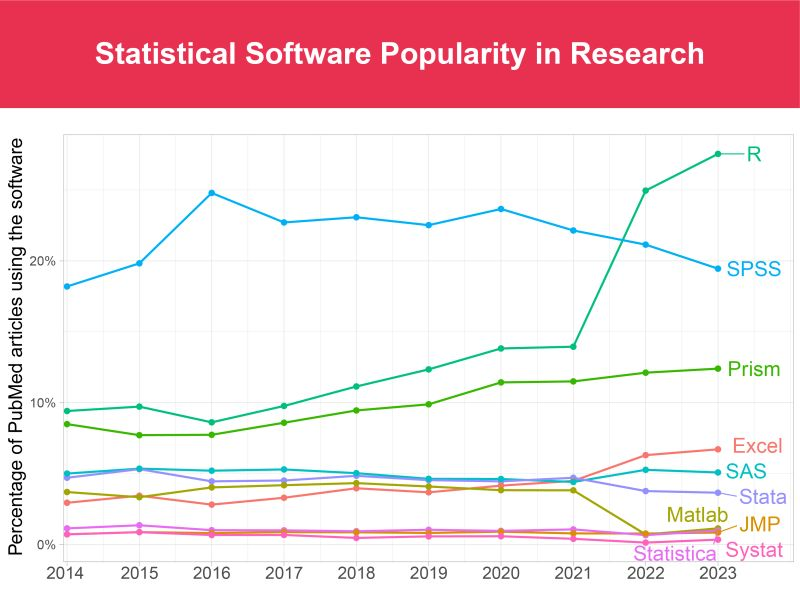

```{r setup, include = FALSE, warning = FALSE, message = FALSE}
options(htmltools.dir.version = FALSE)
knitr::opts_chunk$set(
  message = FALSE,
  warning = FALSE,
  dev = "svg",
  cache = TRUE,
  fig.align = "center"
  #fig.width = 11,
  #fig.height = 5
)

# Load packages
library(tidyverse)
library(pander)
library(ggthemes)
library(gapminder)
library(countdown)
library(xaringanthemer)
library(xaringanExtra)

# countdown style
countdown(
  color_border              = "#dd0747",
  color_text                = "black",
  color_running_background  = "#dd0747",
  color_running_text        = "white",
  color_finished_background = "white",
  color_finished_text       = "#dd0747",
  color_finished_border     = "#dd0747"
)


style_xaringan( 
  title_slide_background_color = "#dd0747",
  title_slide_text_color = "white",
  text_color = "black",
  header_color = "#dd0747",
  text_bold_color = "#dd0747",
  text_slide_number_color = "#dd0747",
  code_inline_background_color = "#e0e1df",
  base_font_size = "24px",
  text_font_family = "Palatino",
  header_font_family = "Palatino",
  header_h1_font_size = "45px",
  header_h2_font_size = "35px",
  header_h3_font_size = "28px",
  inverse_background_color = "#dd0747",
  inverse_text_color = "white")


# style_mono_accent(
#   base_color = "#dd0747",
#   header_font_google = google_font("Palatino"),
#   text_font_google   = google_font("Palatino", "300", "300i"),
#   code_font_google   = google_font("Palatino")
# )

```

layout: true


---
# Contact

&nbsp;

&nbsp;

&nbsp;


.center[

florentine.oliveira@psemail.eu


Campus Jourdan : Bureau R4-54 
]

---
# Objectifs du cours

- Se familiariser avec les techniques **économétriques** de base

- Apprendre le language de programmation `R`


$\implies$ pour pouvoir réaliser votre **mémoire** (et découvrir la **recherche en économie appliquée**)!


---
# Roadmap


&nbsp;


### Semestre 1

1. Séance 1 (aujourd'hui): Prise en main de `R`
2. Séance 2 (): Nettoyer une base de données
3. Séance 3 (): Statistiques Descriptives

### Semestre 2
4. Séance 4 (): Régressions linéaires simples et multiples
5. Séance 5 (): Méthode des variables instrumentales
6. Séance 6 (): Doubles-Différences (DiD)
7. Séance 7 (): Regression Discontinuity Design
8. Séance 8 ():


---
# Qu'est-ce que la recherche en économie appliquée?

- Répondre à des questions de recherche pour apprendre sur le monde...

  - Grande diversité des champs de recherche: 
    - éducation, travail, famille, environnement, macroéconomie, politique, migration, genre, urbaine
  
  
- ... en utilisant des techniques statistiques rigoureuses (= économétrie) ...


- ... et des données!


- `R` est un logiciel qui permet de réaliser ces analyses descriptives et empiriques.

---
# Quelques exemples de questions de recherche 

- Quel est l'effet des bourses sur la réussite scolaire? ( papier de gabrielle)

- Quel est l'effet d'un allongement de la durée du congé parental?

- Quelle est l'ampleur de la discrimination dans le processus de recrutement?

- Quel est l'effet d'un assouplissement des conditions d'éligibilité à l'assurance chômage sur l'emploi ?

- exemple climat 

- exemple political ?


---
layout: false
class: center, middle, inverse

# R

---
### Définition

- D'après le site internet de `R` : *R is a free software environment for statistical computing and graphics.*

  - un logiciel (interface R studio)
  
  - un language de programmation
  
--

### Pourquoi `R` plutôt qu'un autre logiciel/language de programmation?

- `R` est **gratuit** et en **open source**

  - donc utilisé par beaucoup de monde dans les milieux académique insitutionnel

- Logiciel très **polyvalent**

  - statistiques decriptives, analyses économétriques, analyse de données spaciales, ML, Rmarkdown

- Compétence valorisable et de plus en plus appréciée (public & privé)   

---

```{r popularity, echo=FALSE, out.width="80%"}

```

---
### `R`ecap

```{r interface, echo=FALSE, out.width="80%"}
knitr::include_graphics("imgs/interface.png")
```


---
name: bestfriend
# Vos 4 meilleurs amis


1. La **commande** `help(.)` ou `?.`

--

2. Les ***cheatsheets***
  - [Exemple](#cheatR)

--

3. **Internet** (stackoverflow): 

  - vous ne serez jamais la première personne à rencontrer les problèmes auxquels vous faites face
  - copier/coller le message d'erreur peut suffire, mais essayez de comprendre par vous même d'abord
  
--

4. **ChatGPT**: devient de plus en plus performant pour résoudre les problèmes de codes. 
  - ⚠️ souvent les packages ne sont pas à jour, les fonctions proposées inventées

--

🤝️ Soyez autonomes: ne demander de l'aide à vos camarades (ou à moi) uniquement après avoir demandé à vos 4 meilleurs amis!


---
# Bonnes pratiques

### Organisation du travail

- Un dossier pour chaque projet de recherche

  - Scripts
    - un scripts par tâche: cleaning, statistiques descriptives, anlayse empirique
  
  - Data
    - `.rds`
  
  - Figures
  
  - (Admin)
  


---
### Commenter son code pour vous-même...<sup>1</sup>

```{r meme1, echo=FALSE, out.width="60%"}
knitr::include_graphics("imgs/meme_comment_code.jpeg")
```

---
### ... et vos collègues<sup>1</sup>

```{r meme2, echo=FALSE, out.width="60%"}
knitr::include_graphics("imgs/headache.png")
```


---
### **Essayer** de ne pas s'énerver<sup>1</sup>

.pull-left[
```{r meme3, echo=FALSE, out.width="70%"}
knitr::include_graphics("imgs/parenthesis.jpeg")
```
]
.pull-right[
L'apprentissage de `R` est long et fastidieux, mais les rendements sont croissants!
.footnote[
[1]: R Memes For Statistical Fiends
]
]


---
# Cheatsheets

- [test1](https://rstudio.github.io/cheatsheets/rstudio-ide.pdf)
- [test](https://posit.co/resources/cheatsheets/)

---
name: cheatR
class: center, middle
```{r cheatR, echo=FALSE, out.width="110%"}
knitr::include_graphics("imgs/cheatsheetR.png")
```
[Back](#bestfriend)


