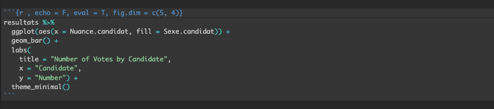
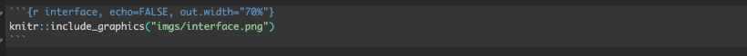

```{r setup, include = FALSE, warning = FALSE, message = FALSE}
options(htmltools.dir.version = FALSE)
knitr::opts_chunk$set(
  message = FALSE,
  warning = FALSE,
  dev = "svg",
  cache = TRUE,
  fig.align = "center"
  #fig.width = 11,
  #fig.height = 5
)

# Load packages
library(tidyverse)
library(pander)
library(ggthemes)
library(gapminder)
library(emo)
library(countdown)
library(xaringanthemer)
library(xaringanExtra)
library(sf)

# countdown style
countdown(
  color_border              = "#dd0747",
  color_text                = "black",
  color_running_background  = "#dd0747",
  color_running_text        = "white",
  color_finished_background = "white",
  color_finished_text       = "#dd0747",
  color_finished_border     = "#dd0747",
  font_size = "2em" 
)


style_xaringan( 
  title_slide_background_color = "#dd0747",
  title_slide_text_color = "white",
  text_color = "black",
  header_color = "#dd0747",
  text_bold_color = "#dd0747",
  text_slide_number_color = "black",
  code_inline_background_color = "#e0e1df",
  base_font_size = "24px",
  text_font_family = "Palatino",
  header_font_family = "Palatino",
  header_h1_font_size = "45px",
  header_h2_font_size = "35px",
  header_h3_font_size = "28px",
  inverse_background_color = "#f8cdda",
  inverse_text_color = "black",
  inverse_header_color = "#dd0747")

# Theme with only x and y axis ans names
theme_minimum = theme_bw() + 
  theme(
  text = element_text(family = "Palatino"),
  line = element_blank(),  # Masquer toutes les lignes par défaut
  rect = element_blank(),  # Masquer tous les rectangles par défaut
  axis.line = element_line(color = "black"),  # Afficher les lignes des axes
  axis.ticks = element_blank(),  # Masquer les ticks des axes
  plot.title = element_blank(),  # Masquer le titre du graphique
  panel.background = element_blank(),  # Masquer le fond du panneau
  panel.grid.major = element_blank(),  # Masquer la grille principale
  panel.grid.minor = element_blank(),  # Masquer la grille secondaire
  plot.background = element_blank(),  # Masquer le fond du graphique
  legend.position = "none"  # Masquer la légende
)

# A blank theme for ggplot
theme_empty = theme_bw() + 
  theme(
  text = element_text(family = "Palatino"),
  line = element_blank(),  # Masquer toutes les lignes par défaut
  rect = element_blank(),  # Masquer tous les rectangles par défaut
  axis.line = element_line(color = "black"),  # Afficher les lignes des axes
  axis.ticks = element_blank(),  # Masquer les ticks des axes
  axis.text = element_blank(),  # Masquer les étiquettes des axes
  axis.title = element_text(size = 12),  # Afficher les titres des axes
  plot.title = element_blank(),  # Masquer le titre du graphique
  panel.background = element_blank(),  # Masquer le fond du panneau
  panel.grid.major = element_blank(),  # Masquer la grille principale
  panel.grid.minor = element_blank(),  # Masquer la grille secondaire
  plot.background = element_blank(),  # Masquer le fond du graphique
  legend.position = "none"  # Masquer la légende
)

#npx decktape \
# --url-load-timeout=60000 --page-load-timeout=60000 --buffer-timeout=60000 \
# --chrome-arg="--disable-web-security" --chrome-arg="--allow-file-access-from-files" \
# "file:///Users/florentineoliveira/Desktop/Teaching/CPES/pratiques-de-la-recherche/Lecture 2/lecture_2_fr.html" \
# "/Users/florentineoliveira/Desktop/Teaching/CPES/pratiques-de-la-recherche/Lecture 2/lecture_2_fr.pdf"

```

layout: true


---
# Format d'un article de recherche 

Les articles académiques en économie empirique suivent un format très **standardisé** :

- **Plan**: 
      - *Introduction*: motivation, présentation de la question de recherche, revue de littérature, contributions
      - *Contexte historique/institutionnel*: contexte spécifique au sujet, cadre économique et institutionnel
      - *Données*: description des sources de données, échantillon, statistiques descriptives
      - *Stratégie empirique modèle*: stratégie et hypothèses d'identification
      - *Résultats*: présentation des résultats principaux
      - *Tests de robustesse*: vérification de la validité des résultats
      - *Conclusion*: synthèse des contributions et implications
- **Bibliographie**: références précises et standardisées, intégrées dans le texte

- **Mise en page très sobre**:    
    - Pas de couleur, sauf pour les graphiques    
    - Police de caractère standardisée (Computer Modern ou Palatino)
    - Marges et interligne standards
    - Titres de sections apparents 
   

---
# Pourquoi ne pas rédiger en Word ?

&nbsp;

- **Mise en page**: 
  - Word est moins adapté aux documents longs et complexes
  - $\LaTeX$ et R Markdown permettent un contrôle plus précis et **automatisé** de la mise en page et de la typographie 

- **Gestion des références et bibliographies**: gestion de la bibliographie automatisée et directement intégrée sur $\LaTeX$ et R Markdown  

- **Collaboration**: $\LaTeX$ et R Markdown sont compatibles avec les outils de contrôle de version comme Git, ce qui facilite le suivi des modifications et la collaboration

- **Intégration des analyses de données**: R Markdown permet d'intégrer du code directement dans le document


---
# LaTeX ?

.center[
 $\LaTeX$ est un **langage** et un **système de composition de documents** (Wikipédia)
 ]

**<span style="color:#dd0747;">Deux attributs principaux</span>**    
- **Mise en page automatique** et conforme à des normes typographiques  
- **Mode Maths**: permet d'écrire des formules mathématiques complexes 


**<span style="color:#dd0747;">Fonctionnement</span>**      
- **Syntaxe en texte brut** : le contenu et la mise en forme sont définis par des commandes $\LaTeX$
- **Compilation** : le code est *compilé* pour générer un PDF


**<span style="color:#dd0747;">Modes d'édition</span>**      
- **Éditeurs locaux**: travailler hors ligne avec *TeXworks*, *TeXShop*, *MiKTeX*
- **Éditeur en ligne: Overleaf**
  - Éditeur en ligne collaboratif permettant de créer, compiler et partager des documents $\LaTeX$ sans installation
  - Particulièrement utile pour les projets en équipe


---
# Cette séance

&nbsp;

.pull-left[
<span>1. Overleaf</span>

  &nbsp;&nbsp; 1.1. Présentation            
  &nbsp;&nbsp; 1.2. Structure de base d'un document            
  &nbsp;&nbsp; 1.3. Formattage du texte             
  &nbsp;&nbsp; 1.4. Math mode            
  &nbsp;&nbsp; 1.5. Figures            
  &nbsp;&nbsp; 1.6. Bibliographie            
  &nbsp;&nbsp; 1.7. Commentaires, compilation, téléchargement           
  &nbsp;&nbsp; 1.8. Avantages et inconvénients          
]

.pull-right[
<span>2. R Markdown</span>

  &nbsp;&nbsp; 2.1. Présentation                
  &nbsp;&nbsp; 2.2. Syntaxe Markdown                
  &nbsp;&nbsp; 2.3. Chunks                
  &nbsp;&nbsp; 2.4. Figures                
  &nbsp;&nbsp; 2.5. Bibliographie                
  &nbsp;&nbsp; 2.6. Commentaires, compilation, téléchargement                
  &nbsp;&nbsp; 2.7. Avantages et inconvénients              
]


---
layout: false
class: center, middle, inverse

# <span style="color:#FAFAFA;">1. Overleaf</span>

---
count:false
class: middle, center,  clearinverse
background-color:  #f8cdda

# <span style="color:#dd0747;">1.1. Présentation</span>


---
background-image: url(imgs/Overleaf_Logo.png)
background-position: 90% 0%
background-size: 10%

# Définition

&nbsp;

- Selon le site internet d'Overleaf,   

  - *"an online $\LaTeX$ editor that's easy to use. No installation, real-time collaboration, version control, hundreds of LaTeX templates, and more."*
  
  
- **Éditeur Latex** en ligne, collaboratif en temps réel  

- Principe identique à *google docs*, mais syntaxe $\LaTeX$


---
# Interface

```{r interface, echo=FALSE, out.width="95%"}
knitr::include_graphics("imgs/preview.png")
```

Console, compilation fichier PDF, téléchargement, collaboration, fichiers, structure du document

---
count:false
class: middle, center,  clearinverse
background-color:  #f8cdda

# <span style="color:#dd0747;">1.2. Structure de base d'un document</span>

---
# Préambule

Le préambule est la partie du document LaTeX avant la commande `\begin{document}`. Il inclut:

1. La définition de la classe de document : `\documentclass{...}`  
  - `article` : pour les articles académiques ou de courts rapports  
  - `report` : pour les rapports plus longs, avec chapitres  
  - `book` : pour les livres, thèses, etc  
  - `beamer` : pour les présentations

2. Les packages ajoutent des fonctionnalités supplémentaires:      
  - `\usepackage{amsmath}` : pour des formules mathématiques avancées  
  - `\usepackage{graphicx}` : pour inclure des images  
  - `\usepackage{xcolor}` : pour utiliser des couleurs   
  
3. Les commandes spécifiques pour configurer le document


---
# Aperçu texte brut et document compilé


```{r structure, echo=FALSE, out.width="90%"}
knitr::include_graphics("imgs/overleaf1.png")
```


---
count:false
class: middle, center,  clearinverse
background-color:  #f8cdda

# <span style="color:#dd0747;">1.3. Formatage du texte</span>

---
# Saut de ligne
```{r saut ligne, echo=FALSE, out.width="90%"}
knitr::include_graphics("imgs/overleaf2.png")
```


---
# Indentation

```{r identation, echo=FALSE, out.width="90%"}
knitr::include_graphics("imgs/overleaf3.png")
```


---
# Section et sous-section

```{r sections, echo=FALSE, out.width="90%"}
knitr::include_graphics("imgs/overleaf4.png")
```

---
# Texte en italique, gras et couleur

```{r formattage texte, echo=FALSE, out.width="90%"}
knitr::include_graphics("imgs/overleaf5.png")
```

---
# Listes à puces et numerotées

```{r listes a puces et numerottees, echo=FALSE, out.width="90%"}
knitr::include_graphics("imgs/overleaf6.png")
```


---
count:false
class: middle, center,  clearinverse
background-color:  #f8cdda

# <span style="color:#dd0747;">1.4. Mode Maths</span>


---
# Fonctionnement et principaux opérateurs

Pour écrire une équation, il suffit de mettre l'expression mathématique entre `$...$`.

Pour des équations centrées et numérotées, utilisez l'environnement `equation`.

.pull-left[
| Opérateur **arithmétiques**  | Description               |
|------------------------------|---------------------------|
| `+` / `-`                    | Addition / Soustraction   |
| `*`                          | Multiplication            |
| `\frac{num.}{denum.}`        | Fraction                  |
| `^`                          | Exposant                  |
| `_`                          | Indice                    |
]

.pull-right[
| Opérateur **logiques**  | Description                          |
|-------------------------|--------------------------------------|
| `<` / `>`               | Strictement inférieur / supérieur à  |
| `\ge` / `\le`           | Supérieur / inférieur ou égal à      |
| `=`                     | Égal à                               |
| `\neq`                  | Différent de                         |
]

&nbsp;

**NB1: l'environnement `equation` est un environnement mathématique, il n'y a donc pas besoin de mettre des `$`** 

**NB2: Pour ne pas numéroter les équations de l'environnement `equation`, utiliser `\begin{equation*}` au lieu de `\begin{equation}`**

---
# Aperçu mode maths

```{r maths, echo=FALSE, out.width="90%"}
knitr::include_graphics("imgs/mathmode.png")
```

---
count:false
class: middle, center,  clearinverse
background-color:  #f8cdda

# <span style="color:#dd0747;">1.5. Images</span>

---
# Figures et Subfigures

Pour insérer une figure, on utilise l'environnement `figure`.

Plusieurs éléments:
- `\caption{Titre de la figure}`: titre de la figure
  - `r emo::ji("rotating_light")` les figures sont numérotées automatiquement selon leur ordre d'apparition dans le document
- `\label{fig1}`: nom de la figure pour référence dans le texte avec la commande `\ref{fig1}`
-  `\centering` pour centrer la figure sur la page
- `\includegraphics[width=9cm]{fig1.png}`: commande qui charge le fichier image 
  - entre `[ ]` est définie la taille de l'image
  - entre `{ }` le nom (ou chemin) de l'image


---
# **Figures** et Subfigures

```{r figure, echo=FALSE, out.width="90%"}
knitr::include_graphics("imgs/figure.png")
```


---
# Figures et **Subfigures**

```{r subfigure, echo=FALSE, out.width="90%"}
knitr::include_graphics("imgs/sufigure.png")
```


---
count:false
class: middle, center,  clearinverse
background-color:  #f8cdda

# <span style="color:#dd0747;">1.6. Bibliographie</span>

---
# Packages

Il existe différents packages qui permettent de mettre en page automatiquement une bibliographie et gérer les citations dans le corps du texte: `biblatex`, `natbib`.  

Aujourd'hui, utilisation du package `natbib` qui est préféré par les éditeurs et journaux.

Quatre éléments indispensables:
- charger le package: `\usepackage{natbib}` et définir un style de bibliographie
- construire un fichier qui recence les références bibliographiques au format `.bib`
- citer la référence dans le corps du texte à l'endroit voulu avec la commande `\cite{}`
- afficher la bibliographie à l'endroit où l'on veut qu'elle apparaisse avec la commande `\bibliography{mybibliography}`

`r emo::ji("rotating_light")` **Seules les références citées dans le texte apparaîtront dans la bibliographie**

---
# Comment ajouter des références bibliographiques ?

1) Chercher le code de la référence souhaitée en ligne (par ex sur Google Scholar) $\rightarrow$ Cliquer sur **Citer** 

```{r cite 1, echo=FALSE, out.width="80%"}
knitr::include_graphics("imgs/cite1.png")
```


---
# Comment ajouter des références bibliographiques ?

1) Chercher le code de la référence souhaitée en ligne (par ex sur Google Scholar) $\rightarrow$ Cliquer sur **BibTex**

```{r cite 2, echo=FALSE, out.width="80%"}
knitr::include_graphics("imgs/cite2.png")
```

---
# Comment ajouter des références bibliographiques ?

2) Copier le code de la citation

```{r cite, echo=FALSE, out.width="80%"}
knitr::include_graphics("imgs/cite3.png")
```

---
# Comment ajouter des références bibliographiques ?

3) Créer un fichier `.bib`

```{r bibfile, echo=FALSE, out.width="75%"}
knitr::include_graphics("imgs/bibfile.png")
```

---
# Comment ajouter des références bibliographiques ?

4) Coller le code de la citation

```{r bibfilecontent, echo=FALSE, out.width="75%"}
knitr::include_graphics("imgs/bibfilecontent.png")
```


---
# Comment ajouter des références bibliographiques ?

5) Citer des références et afficher la bibliographie

```{r renducitation, echo=FALSE, out.width="75%"}
knitr::include_graphics("imgs/renducitation.png")
```


---
count:false
class: middle, center,  clearinverse
background-color:  #f8cdda

# <span style="color:#dd0747;">1.7. Divers</span>

---
# **Commentaires**, compilation et téléchargement

Pour ajouter un commentaire au texte, utiliser `%` suivi du commentaire en fin de ligne de code. 

```{r comment, echo=FALSE, out.width="75%"}
knitr::include_graphics("imgs/comment.png")
```

---
# Commentaires, **compilation** et téléchargement

Pour visualiser un apperçu du fichier pdf suite à chaque modification apportée au document, cliquer sur **Recompile**

```{r recompile, echo=FALSE, out.width="75%"}
knitr::include_graphics("imgs/recompile.png")
```


---
# Commentaires, compilation et **téléchargement**

Pour télécharger le document, cliquer sur le bouton **Download PDF**

```{r save, echo=FALSE, out.width="75%"}
knitr::include_graphics("imgs/save.png")
```


---
count:false
class: middle, center,  clearinverse
background-color:  #f8cdda

# <span style="color:#dd0747;">1.8. Avantages et inconvénients</span>


---
# Avantages et inconvénients

&nbsp;

**Avantages**
- Collaboration en temps réel
- Facilité d'utilisation

&nbsp;

**Inconvénients**
- Dépendance à internet: en cas de connexion instable, compliqué de travailler sur overleaf
- Limites de la version gratuite
- Peut être chronophage: en cas de mise à jour régulière des graphiques/tables


---
layout: false
class: center, middle, inverse

# <span style="color:#FAFAFA;">2. R Markdown</span>


---
count:false
class: middle, center,  clearinverse
background-color:  #f8cdda

# <span style="color:#dd0747;">2.1. Présentation</span>


---
background-image: url(imgs/rmdlogo.png)
background-position: 95% 0%
background-size: 10%

# Présentation

&nbsp;

&nbsp;

*`R Markdown` est une extension de `R` qui se présente sous la forme d’un **package**. `R Markdown` permet de **produire des documents texte en y intégrant nativement des morceaux de code `R` ** (pour le rendre public, pour générer des sorties…). `R Markdown` permet de fluidifier le processus de rédaction d’une publication, en réduisant fortement le nombre de gestes manuels nécessaires pour inclure des graphiques ou du code dans un document : plutôt qu’avoir un code SAS ou Stata ayant généré des sorties Excel/Calc intégrées dans un document Word ou transformées en table LaTeX, on dispose d’un unique document-source qui contient à la fois le texte et les codes qui produisent les sorties du document final. L’utilisation de `R Markdown` **facilite la production de publications reproductibles.** *<sup>1</sup>


.footnote[
[1]: https://book.utilitr.org/03_Fiches_thematiques/Fiche_rmarkdown.html
]


---
count:false
class: middle, center,  clearinverse
background-color:  #f8cdda

# <span style="color:#dd0747;">2.2. Structure de base d'un document</span>


---
# Structure

Un document `R Markdown` comprend deux parties:
- l'en-tête, ou **YAML header** qui définit le titre, le(s) auteur(s), et le format du document

```{r, eval=FALSE}
---
title: "Example"
author: "Florentine Oliveira"
date: "`r Sys.Date()`"
output: pdf_document
---

```

- le contenu, composé à la fois
  - de blocks de texte respectant la syntaxe `markdown`
  - de blocks de code, appelés `chunks`

---
count:false
class: middle, center,  clearinverse
background-color:  #f8cdda

# <span style="color:#dd0747;">2.3. Syntaxe `markdown`</span>


---
# Sections et sous-sections

&nbsp;

&nbsp;

Les sections et sous-sections peuvent-être facilement crées à l'aide de titres de différents niveaux: 

` # Titre de niveau 1`   
` ## Titre de niveau 2`   
` ### Titre de niveau 3`  


---
# Texte en italique et gras

&nbsp;

&nbsp;

Pour écrire un mot en *italique*, il faut encadrer le mot de `*`: `*italique*`  

Pour écrire un mot en **gras**, il faut encadrer le mot de `**`: `**gras**`

Pour écrire un mot en ***gras italique***, il faut encadrer le mot de `***`: `***gras italique***`

---
# Listes à puces

&nbsp;

&nbsp;

Pour créer une liste à puces, il suffit de précéder chaque élément d'un `-`:

`Exemple d'une liste à puces:`    
`- premier élément`   
`- deuxième élément`  


---
# Apperçu
 
```{r rmd, echo=FALSE, out.width="90%"}
knitr::include_graphics("imgs/rmd.png")
```

---
count:false
class: middle, center,  clearinverse
background-color:  #f8cdda

# <span style="color:#dd0747;">2.4. Code `Chunks`</span>


---
# Usage


Le code contenu dans un document `R Markdown` est contenu dans des *chunks* délimités par des balises: ` ``` `

Chaque chunk a la structure suivante:

` ```{r chunk label, options } `

` code `

` ``` `  

Exemple: 

```{r chunk, echo=FALSE, out.width="70%"}

```

---
# Chunk options

&nbsp;

|   Option  | Défault  | Effet                  |
|----------------------|--------------------------------------|
| `echo`    | `TRUE`   | Affiche le code dans le document compilé  |
| `error`   | `FALSE`  | `F`: arrête d'exécuter le code en cas d'erreur, `T`: affiche le message d'erreur dans le document |
| `include` | `TRUE`   | Inclue l'output du chunk dans le document |
| `eval`    | `TRUE`   | Run le code contenu dans le chunk    |
| `message` | `TRUE`   | Affiche les messages du code dans le document |
| `warning` | `TRUE`   | Affiche les warnings du code dans le document |


---
# Chunk options pour les figures

&nbsp;

|        Option                 | Défault   | Effet                                           |
|-------------------------------|-----------|-------------------------------------------------|
| `fig.align`                   | `default` | `"left"`, `"right"`, `"center"`                 |
| `fig.cap`                     | `NULL`    | Titre de la figure (chaîne de caractères)       |
| `fig.width` &  `fig.height`   | 7         | Dimensions de la figure (en pouces)             |
| `out.width`                   |           | Redimensionne la taille de l'output (eg "50%")  |


---
count:false
class: middle, center,  clearinverse
background-color:  #f8cdda

# <span style="color:#dd0747;">2.5. Figures</span>

---
# Différents types de figures

Au sein d'un document `R Markdown`, il est possible d'ajouter:

- des graphiques générés à partir du code contenu dans les code chunks

```{r image chunk, echo=FALSE, out.width="70%"}

```


- des graphiques ou figures non générées dans le document, grâce au package `knitr` et à la fonction `include_graphics()`

```{r image includegraphics, echo=FALSE, out.width="70%"}

```


---
count:false
class: middle, center,  clearinverse
background-color:  #f8cdda

# <span style="color:#dd0747;">2.6. Bibliographie</span>


---
# Méthode

Comme sur Overleaf, il est possible d'ajouter une bibligraphie à votre document `R Markdown`     

Chaque référence est listée dans le fichier `bibliohraphy.bib`, selon le même modèle que vu précedemment     

La bibliographie est appelée dans le document `R Markdown` dans le YAML: 

```{r, eval=FALSE}
---
title: "Example"
author: "Florentine Oliveira"
date: "`r Sys.Date()`"
output: pdf_document
bibliography: bibliography.bib #<<
---

```

Dans le corps du texte, pour renvoyer à une référence, il faut utiliser la commande `@`. 

Par exemple, `@kleven2019children`.

---
count:false
class: middle, center,  clearinverse
background-color:  #f8cdda

# <span style="color:#dd0747;">2.7. Avantages et Inconvénients</span>


---
# Avantages et inconvénients

&nbsp;

**Avantages**
- Intégration avec R
- Syntaxe Markdown simple

&nbsp;

**Inconvénients**
- Nécessite connaissances de base en `R` (mais c'est votre cas `r emo::ji("smile")`)
- Collaboration possible avec GitHub mais coût d'entrée à Git


---
# Sources

[Site internet Overleaf : lean Latex in 30 minutes](https://fr.overleaf.com/learn/latex/Learn_LaTeX_in_30_minutes)        
[R Markdown Cheatsheet](https://rstudio.github.io/cheatsheets/rmarkdown.pdf)     
[R Markdown Cookbook](https://bookdown.org/yihui/rmarkdown-cookbook/)    
 


  