```{r setup, include = FALSE, warning = FALSE, message = FALSE}
options(htmltools.dir.version = FALSE)
knitr::opts_chunk$set(
  message = FALSE,
  warning = FALSE,
  dev = "svg",
  cache = TRUE,
  fig.align = "center"
  #fig.width = 11,
  #fig.height = 5
)

# Load packages
library(tidyverse)
library(pander)
library(ggthemes)
library(gapminder)
library(emo)
library(countdown)
library(xaringanthemer)
library(xaringanExtra)
library(sf)

# countdown style
countdown(
  color_border              = "#dd0747",
  color_text                = "black",
  color_running_background  = "#dd0747",
  color_running_text        = "white",
  color_finished_background = "white",
  color_finished_text       = "#dd0747",
  color_finished_border     = "#dd0747",
  font_size = "2em" 
)


style_xaringan( 
  title_slide_background_color = "#dd0747",
  title_slide_text_color = "white",
  text_color = "black",
  header_color = "#dd0747",
  text_bold_color = "#dd0747",
  text_slide_number_color = "black",
  code_inline_background_color = "#e0e1df",
  base_font_size = "24px",
  text_font_family = "Palatino",
  header_font_family = "Palatino",
  header_h1_font_size = "45px",
  header_h2_font_size = "35px",
  header_h3_font_size = "28px",
  inverse_background_color = "#f8cdda",
  inverse_text_color = "black",
  inverse_header_color = "#dd0747")

# Theme with only x and y axis ans names
theme_minimum = theme_bw() + 
  theme(
  text = element_text(family = "Palatino"),
  line = element_blank(),  # Masquer toutes les lignes par défaut
  rect = element_blank(),  # Masquer tous les rectangles par défaut
  axis.line = element_line(color = "black"),  # Afficher les lignes des axes
  axis.ticks = element_blank(),  # Masquer les ticks des axes
  plot.title = element_blank(),  # Masquer le titre du graphique
  panel.background = element_blank(),  # Masquer le fond du panneau
  panel.grid.major = element_blank(),  # Masquer la grille principale
  panel.grid.minor = element_blank(),  # Masquer la grille secondaire
  plot.background = element_blank(),  # Masquer le fond du graphique
  legend.position = "none"  # Masquer la légende
)

# A blank theme for ggplot
theme_empty = theme_bw() + 
  theme(
  text = element_text(family = "Palatino"),
  line = element_blank(),  # Masquer toutes les lignes par défaut
  rect = element_blank(),  # Masquer tous les rectangles par défaut
  axis.line = element_line(color = "black"),  # Afficher les lignes des axes
  axis.ticks = element_blank(),  # Masquer les ticks des axes
  axis.text = element_blank(),  # Masquer les étiquettes des axes
  axis.title = element_text(size = 12),  # Afficher les titres des axes
  plot.title = element_blank(),  # Masquer le titre du graphique
  panel.background = element_blank(),  # Masquer le fond du panneau
  panel.grid.major = element_blank(),  # Masquer la grille principale
  panel.grid.minor = element_blank(),  # Masquer la grille secondaire
  plot.background = element_blank(),  # Masquer le fond du graphique
  legend.position = "none"  # Masquer la légende
)


```

layout: true


---
# Cette séance

&nbsp;

.pull-left[
1. Overleaf

  1.1. Présentation  
  1.2. Structure de base d'un document  
  1.3. Formattage du texte   
  1.4. Math mode  
  1.4. Références/label Tables et Figures  
  1.5. Bibliographie  
  1.6. Avantages et inconvénients   
]
.pull-right[
2. R Markdown  

  2.1. Présentation  
  2.2. Syntaxe Markdown  
  2.3. Chunks  
  2.4. Avantages et inconvénients  
]
  
---
layout: false
class: center, middle, inverse

# 1. Overleaf

---
background-image: url(imgs/Overleaf_Logo.png)
background-position: 95% 10%
background-size: 7%

## 1.1. Présentation

- Selon le site internet d'Overleaf,   

  - "an online $\LaTeX$ editor that's easy to use. No installation, real-time collaboration, version control, hundreds of LaTeX templates, and more."
  
  
- **Éditeur Latex** en ligne, collaboratif en temps réel  


---
# Interface

```{r interface, echo=FALSE, out.width="100%"}
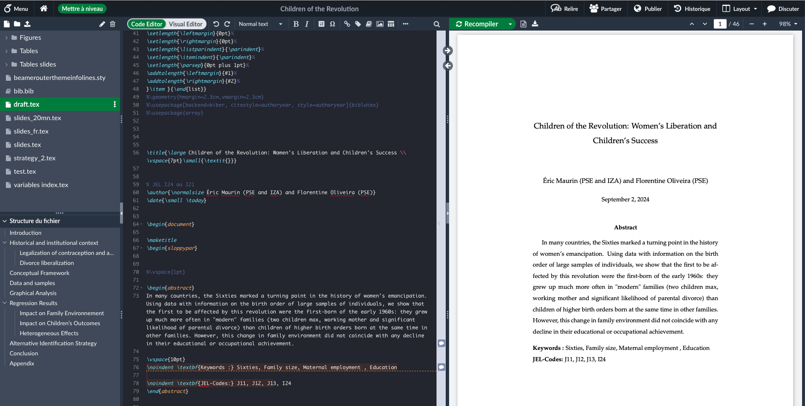
```

Console, compilation fichier PDF, téléchargement, collaboration, fichiers, structure du document

---
# 1. Overleaf

## 1.2. Structure de base d'un document

**Préambule**

Le préambule est la partie du document LaTeX avant la commande `\begin{document}`. Il inclut:

1. La définition de la classe de document : `\documentclass{...}`  
  - `article` : pour les articles académiques ou de courts rapports  
  - `report` : pour les rapports plus longs, avec chapitres  
  - `book` : pour les livres, thèses, etc  
  - `beamer` : pour les présentations

2. Les packages ajoutent des fonctionnalités supplémentaires: `\usepackage{graphicx}`
  - `\usepackage{amsmath}` : pour des formules mathématiques avancées  
  - `\usepackage{graphicx}` : pour inclure des images  
  - `\usepackage{xcolor}` : pour utiliser des couleurs   
  
3. Les commandes spécifiques pour configurer le document


---
# 1. Overleaf

## 1.2. Structure de base d'un document


```{r structure, echo=FALSE, out.width="90%"}

```


---
# 1. Overleaf
## 1.3. Formatage du texte : saut de ligne

```{r saut ligne, echo=FALSE, out.width="90%"}

```


---
# 1. Overleaf
## 1.3. Formatage du texte : indentation

```{r identation, echo=FALSE, out.width="90%"}
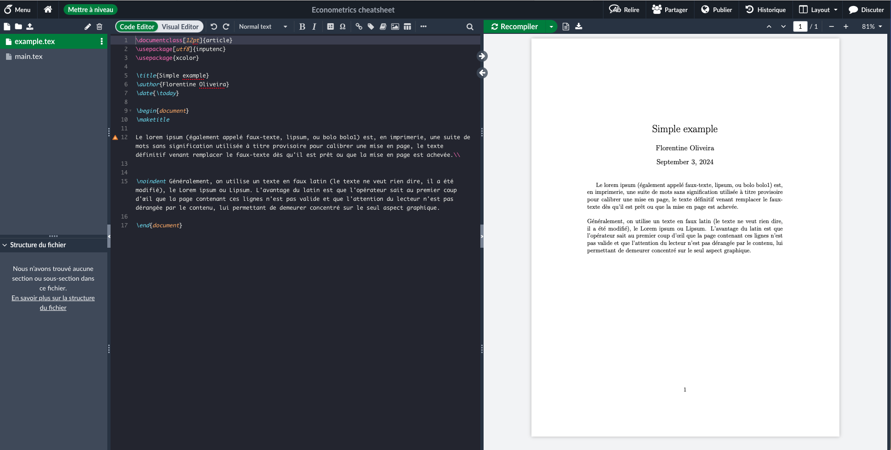
```


---
# 1. Overleaf
## 1.3. Formatage du texte : section et sous-section

```{r sections, echo=FALSE, out.width="90%"}
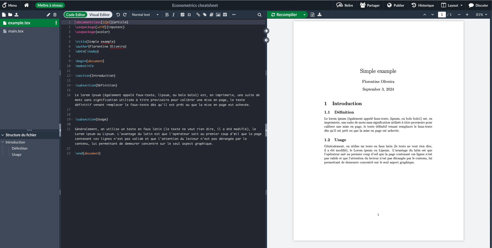
```

---
# 1. Overleaf
## 1.3. Formatage du texte : texte en italique, gras et couleur

```{r formattage texte, echo=FALSE, out.width="90%"}
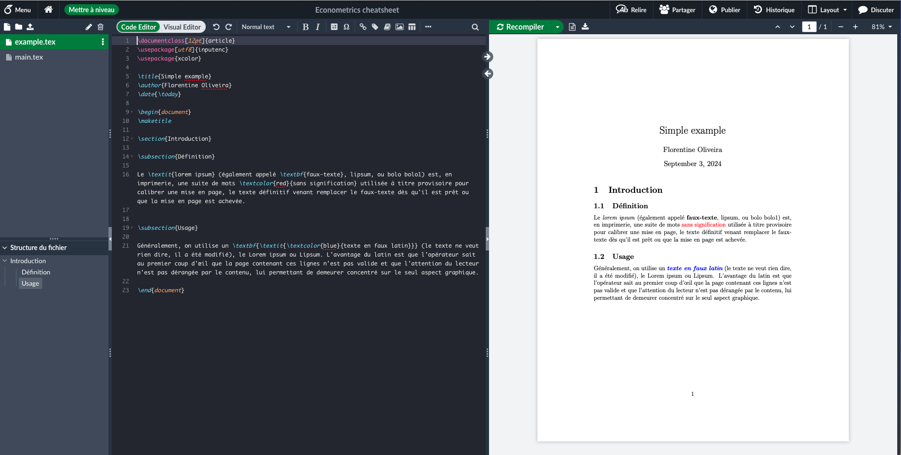
```

---
# 1. Overleaf
## 1.3. Formatage du texte : listes à puces et numerottées

```{r listes a puces et numerottees, echo=FALSE, out.width="90%"}
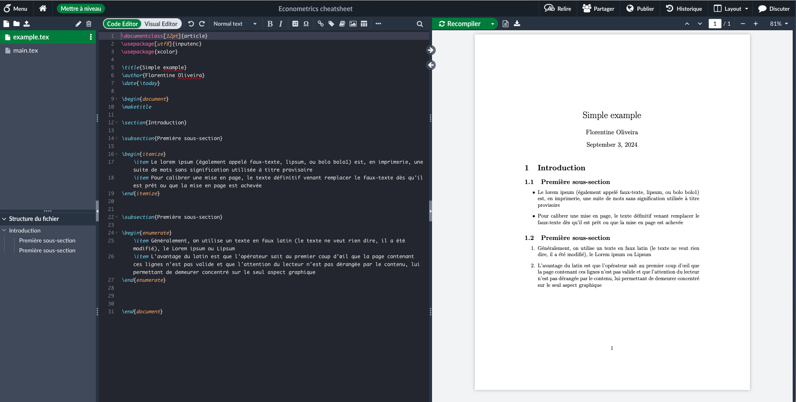
```

---
# 1. Overleaf
## 1.4. Math mode

Pour écrire une équation, il suffit de mettre l'expression mathématique entre `$...$`.

Pour des équations centrées et numérotées, utilisez l'environnement `equation`.

.pull-left[
| Opérateur **arithmétiques**  | Description               |
|------------------------------|---------------------------|
| `+` / `-`                    | Addition / Soustraction   |
| `*`                          | Multiplication            |
| `\frac{num.}{denum.}`        | Fraction                  |
| `^`                          | Exposant                  |
| `_`                          | Indice                    |
]

.pull-right[
| Opérateur **logiques**  | Description                          |
|-------------------------|--------------------------------------|
| `<` / `>`               | Strictement inférieur / supérieur à  |
| `\ge` / `\le`           | Supérieur / inférieur ou égal à      |
| `=`                     | Égal à                               |
| `\neq`                  | Différent de                         |
]

&nbsp;

**NB1: l'environnement `equation` est un environnement mathématique, il n'y a donc pas besoin de mettre des `$`** 

**NB2: Pour ne pas numéroter les équations de l'environnement `equation`, utiliser `\begin{equation*}` au lieu de `\begin{equation}`**

---
# 1. Overleaf
## 1.4. Math mode

```{r maths, echo=FALSE, out.width="90%"}
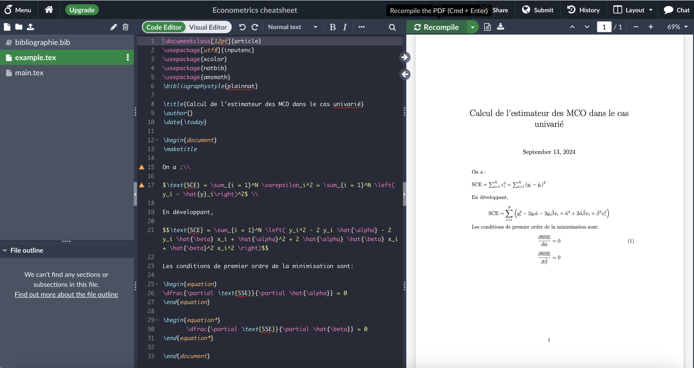
```


---
# 1. Overleaf
## 1.5. Figures et Subfigures

Pour insérer une figure, on utilise l'environnement `figure`.

Plusieurs éléments:
- `\caption{Titre de la figure}`: titre de la figure
  - `r emo::ji("rotating_light")` les figures sont numérotées automatiquement selon leur ordre d'apparition dans le document
- `\label{fig1}`: nom de la figure pour référence dans le texte avec la commande `\ref{fig1}`
-  `\centering` pour centrer la figure sur la page
- `\includegraphics[width=9cm]{fig1.png}`: commande qui charge le fichier image 
  - entre `[ ]` est définie la taille de l'image
  - entre `{ }` le nom (ou chemin) de l'image


---
# 1. Overleaf
## 1.5. **Figures** et Subfigures

```{r figure, echo=FALSE, out.width="90%"}
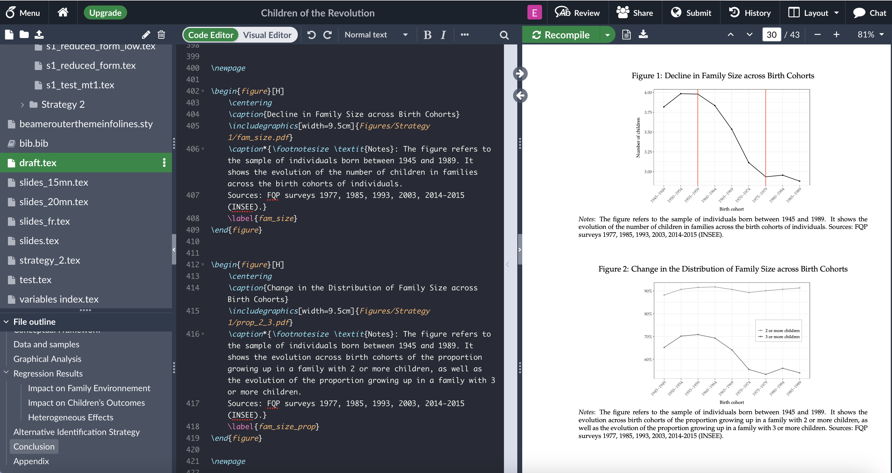
```


---
# 1. Overleaf
## 1.5. Figures et **Subfigures**

```{r subfigure, echo=FALSE, out.width="90%"}
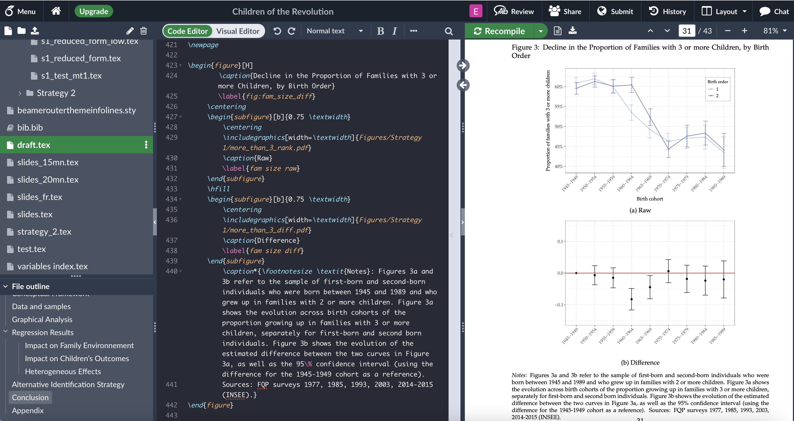
```


---
# 1. Overleaf
## 1.5 Bibliographie

Il existe différents packages qui permettent de mettre en page automatiquement une bibliographie et gérer les citations dans le corps du texte: `biblatex`, `natbib`.  

Aujourd'hui, utilisation du package `natbib` qui est préféré par les éditeurs et journaux.

Quatre éléments indispensables:
- charger le package: `\usepackage{natbib}` et définir un style de bibliographie
- construire un fichier qui recence les références bibliographiques au format `.bib`
- citer la référence dans le corps du texte à l'endroit voulu avec la commande `\cite{}`
- afficher la bibliographie à l'endroit où l'on veut qu'elle apparaisse avec la commande `\bibliography{mybibliography}`

`r emo::ji("rotating_light")` **Seules les références citées dans le texte apparaitront dans la bibliographie**

---
# 1. Overleaf
## 1.5 Bibliographie

1) Chercher le code de la référence souhaitée en ligne (par ex sur Google Scholar) $\rightarrow$ Cliquer sur **Citer** 

```{r cite 1, echo=FALSE, out.width="80%"}
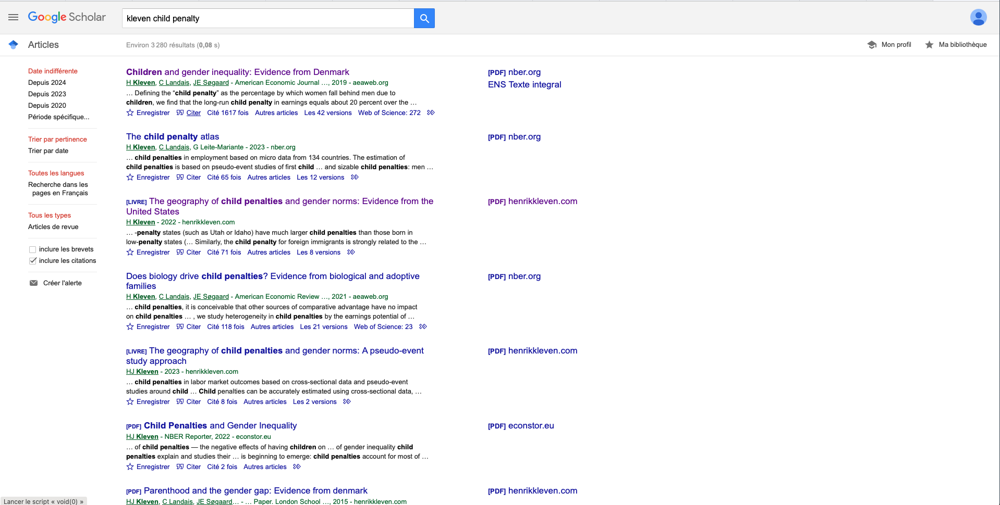
```


---
# 1. Overleaf
## 1.5 Bibliographie

1) Chercher le code de la référence souhaitée en ligne (par ex sur Google Scholar) $\rightarrow$ Cliquer sur **BibTex**

```{r cite 2, echo=FALSE, out.width="80%"}
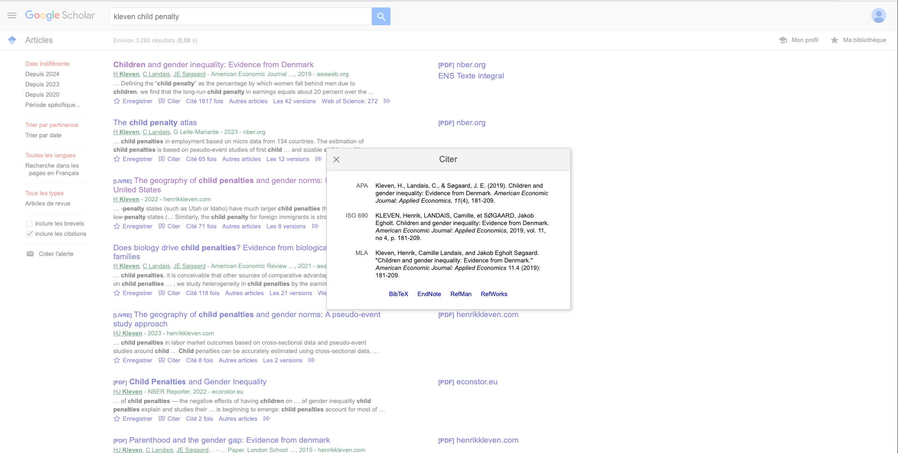
```

---
# 1. Overleaf
## 1.5 Bibliographie

2) Copier le code de la citation

```{r cite, echo=FALSE, out.width="80%"}
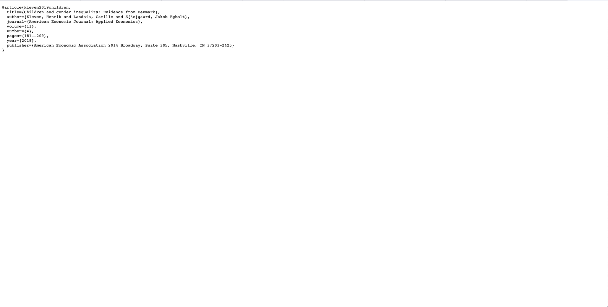
```

---
# 1. Overleaf
## 1.5 Bibliographie

3) Créer un fichier `.bib`

```{r bibfile, echo=FALSE, out.width="75%"}
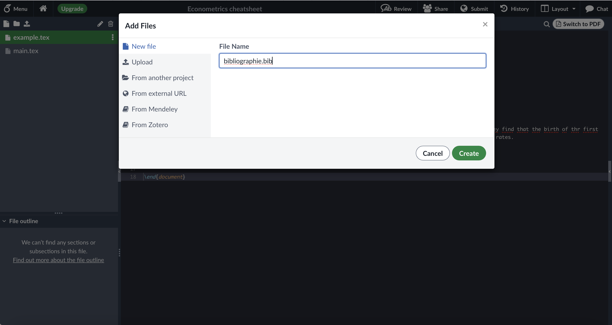
```

---
# 1. Overleaf
## 1.5 Bibliographie

4) Coller le code de la citation

```{r bibfilecontent, echo=FALSE, out.width="75%"}
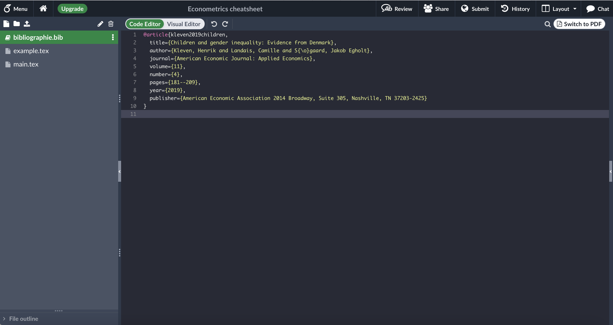
```


---
# 1. Overleaf
## 1.5 Bibliographie

5) Citer des références et afficher la bibliographie

```{r renducitation, echo=FALSE, out.width="75%"}
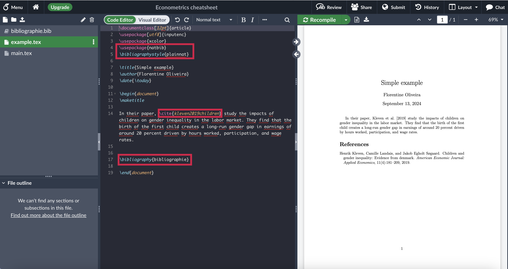
```


---
# 1. Overleaf
## 1.7. **Commentaires**, compilation et téléchargement du fichier

Pour ajouter un commentaire au texte, utiliser `%` suivi du commentaire en fin de ligne de code. 

```{r comment, echo=FALSE, out.width="75%"}
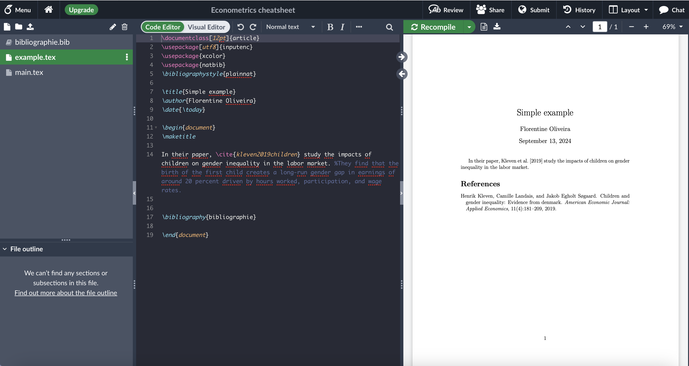
```

---
# 1. Overleaf
## 1.7. Commentaires, **compilation** et téléchargement du fichier

Pour visualiser un apperçu du fichier pdf suite à chaque modification apportée au document, cliquer sur **Recompile**

```{r recompile, echo=FALSE, out.width="75%"}
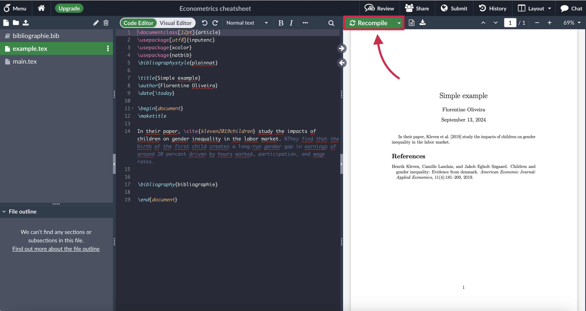
```


---
# 1. Overleaf
## 1.7. Commentaires, compilation et **téléchargement du fichier**

Pour télécharger le document, cliquer sur le bouton **Download PDF**

```{r save, echo=FALSE, out.width="75%"}
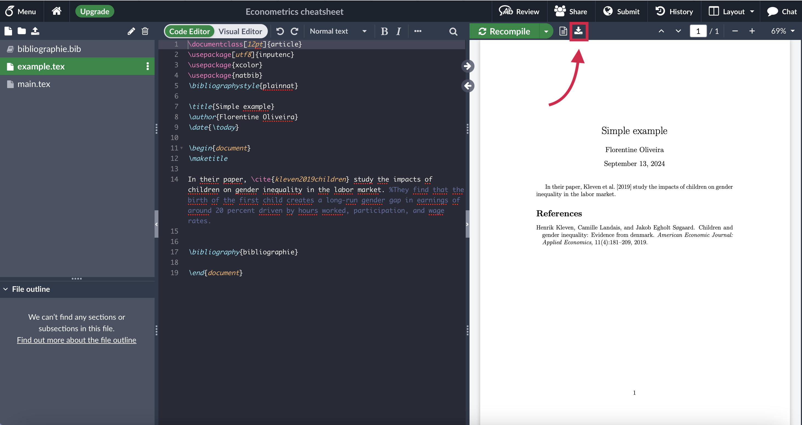
```


---
## Sources 

[Site internet Overleaf : lean Latex in 30 minutes][https://fr.overleaf.com/learn/latex/Learn_LaTeX_in_30_minutes]


---
layout: false
class: center, middle, inverse

# 2. R Markdown


---
background-image: url(imgs/rmdlogo.png)
background-position: 95% 10%
background-size: 7%

# 2. R Markdown
## 2.1. Présentation

&nbsp;

*`R Markdown` est une extension de `R` qui se présente sous la forme d’un **package**. `R Markdown` permet de **produire des documents texte en y intégrant nativement des morceaux de code `R` ** (pour le rendre public, pour générer des sorties…). `R Markdown` permet de fluidifier le processus de rédaction d’une publication, en réduisant fortement le nombre de gestes manuels nécessaires pour inclure des graphiques ou du code dans un document : plutôt qu’avoir un code SAS ou Stata ayant généré des sorties Excel/Calc intégrées dans un document Word ou transformées en table LaTeX, on dispose d’un unique document-source qui contient à la fois le texte et les codes qui produisent les sorties du document final. L’utilisation de `R Markdown` **facilite la production de publications reproductibles.** *<sup>1</sup>


.footnote[
[1]: https://book.utilitr.org/03_Fiches_thematiques/Fiche_rmarkdown.html
]
---
# 2. R Markdown
## 2.2. Structure de base d'un document

Un document `R Markdown` comprend deux parties:
- l'en-tête, ou **YAML header** qui définit le titre, le(s) auteur(s), et le format du document

```{r, eval=FALSE}
---
title: "Example"
author: "Florentine Oliveira"
date: "`r Sys.Date()`"
output: pdf_document
---

```

- le contenu, composé à la fois
  - de blocks de texte respectant la syntaxe `markdown`
  - de blocks de code, appelés `chunks`

---
# 2. R Markdown
 
## 2.3. Syntaxe `markdown` : sections et sous-sections

Les sections et sous-sections peuvent-être facilement crées à l'aide de titres de différents niveaux: 

` # Titre de niveau 1`   
` ## Titre de niveau 2`   
` ### Titre de niveau 3`  


---
# 2. R Markdown
 
## 2.3. Syntaxe `markdown` : texte en italique et gras

Pour écrire un mot en *italique*, il faut encadrer le mot de `*`: `*italique*`  

Pour écrire un mot en **gras**, il faut encadrer le mot de `**`: `**gras**`

Pour écrire un mot en ***gras italique***, il faut encadrer le mot de `***`: `***gras italique***`

---
# 2. R Markdown
 
## 2.3. Syntaxe `markdown` : listes à puces

Pour créer une liste à puces, il suffit de précéder chaque élément d'un `-`:

`Exemple d'une liste à puces:`    
`- premier élément`   
`- deuxième élément`  


---
# Apperçu
 
```{r rmd, echo=FALSE, out.width="90%"}
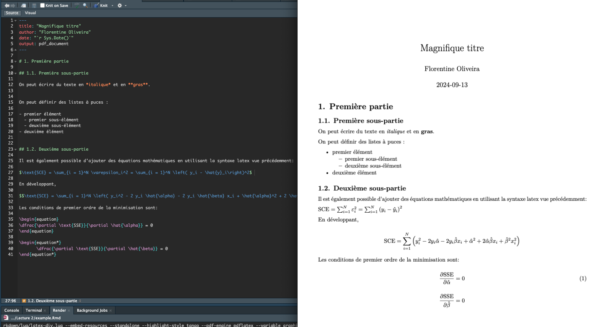
```


---
# 2. R Markdown
 
## 2.4. Code `Chunks`


Le code contenu dans un document `R Markdown` est contenu dans des *chunks* délimités par des balises: ` ``` `.

Chaque chunk a la structure suivante:


  