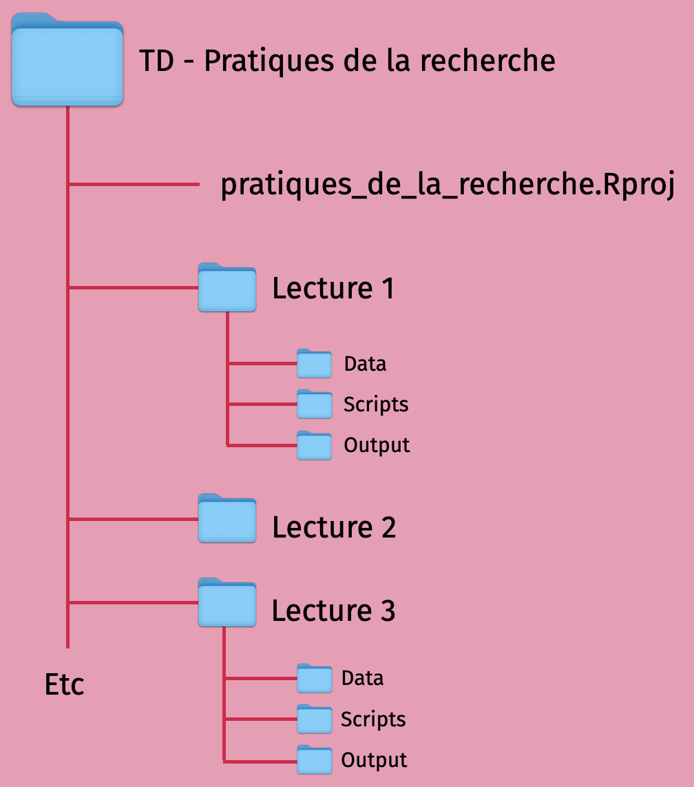

```{r setup, include = FALSE, warning = FALSE, message = FALSE}
options(htmltools.dir.version = FALSE)

knitr::opts_chunk$set(
  message = FALSE,
  warning = FALSE,
  dev = "svg",
  cache = TRUE,
  fig.align = "center"
  #fig.width = 11,
  #fig.height = 5
)

# Load packages
library(tidyverse)
library(here)
library(pander)
library(ggthemes)
library(gapminder)
library(haven)
library(broom)
library(countdown)
library(xaringanthemer)
library(latex2exp)
library(xaringanExtra)
library(parallel)
library(gridExtra)
#library(xaringancolor)

# countdown style
countdown(
  color_border              = "#dd0747",
  color_text                = "black",
  color_running_background  = "#dd0747",
  color_running_text        = "white",
  color_finished_background = "white",
  color_finished_text       = "#dd0747",
  color_finished_border     = "#dd0747",
  font_size = "1.5em" 
)


style_xaringan( 
  title_slide_background_color = "#dd0747",
  title_slide_text_color = "#eee",
  text_color = "black",
  header_color = "#dd0747",
  text_bold_color = "#dd0747",
  text_slide_number_color = "black",
  code_inline_background_color = "#e0e1df",
  base_font_size = "24px",
  text_font_family = "Palatino",
  header_font_family = "Palatino",
  header_h1_font_size = "45px",
  header_h2_font_size = "35px",
  header_h3_font_size = "28px",
  inverse_background_color = "#f8cdda",
  inverse_text_color = "black",
  inverse_header_color = "#dd0747")

# Theme with only x and y axis ans names
theme_minimum = theme_bw() + 
  theme(
  text = element_text(family = "Palatino"),
  line = element_blank(),  # Masquer toutes les lignes par défaut
  rect = element_blank(),  # Masquer tous les rectangles par défaut
  axis.line = element_line(color = "black"),  # Afficher les lignes des axes
  axis.ticks = element_blank(),  # Masquer les ticks des axes
  plot.title = element_blank(),  # Masquer le titre du graphique
  panel.background = element_rect(fill = "#FAFAFA", color = "#FAFAFA"), # Masquer le fond du panneau
  panel.grid.major = element_blank(),  # Masquer la grille principale
  panel.grid.minor = element_blank(),  # Masquer la grille secondaire
  plot.background = element_rect(fill = "#FAFAFA", color = "#FAFAFA"), # Masquer le fond du graphique
  legend.position = "none"  # Masquer la légende
)


theme_empty = theme_bw() + 
  theme(
  text = element_text(family = "Palatino"),
  line = element_blank(),  # Masquer toutes les lignes par défaut
  rect = element_blank(),  # Masquer tous les rectangles par défaut
  axis.line = element_line(color = "black"),  # Afficher les lignes des axes
  axis.ticks = element_blank(),  # Masquer les ticks des axes
  axis.text = element_blank(),  # Masquer les étiquettes des axes
  axis.title = element_text(size = 12),  # Afficher les titres des axes
  plot.title = element_blank(),  # Masquer le titre du graphique
  panel.background = element_rect(fill = "#FAFAFA", color = "#FAFAFA"),  # Masquer le fond du panneau
  panel.grid.major = element_blank(),  # Masquer la grille principale
  panel.grid.minor = element_blank(),  # Masquer la grille secondaire
  plot.background = element_rect(fill = "#FAFAFA", color = "#FAFAFA"),  # Masquer le fond du graphique
  legend.position = "none"  # Masquer la légende
)

```


```{r dataset simulation, include = F, cache = T}
set.seed(123)

# Population and sample size
n_population = 100
n_sample = 40

# True parameters
a = 1.6
b = 0.7

# Regressor and error term
x = rnorm(n_population, mean = 3, sd = 1.5)
e = rnorm(n_population, mean = 0, sd = 1)
  
# Outcome
y = a + b*x + e

# Dataframe
df_simulation = data.frame(
  a = rep(a, n_population),
  b = rep(b, n_population),
  x = x,
  e = e,
  y = y,
  s1 = sample(x = c(rep(TRUE, n_sample), rep(FALSE, n_population - n_sample))),
  s2 = sample(x = c(rep(TRUE, n_sample), rep(FALSE, n_population - n_sample))),
  s3 = sample(x = c(rep(TRUE, n_sample), rep(FALSE, n_population - n_sample)))
)

# Regressions
lm0 <- lm(y ~ x, data = df_simulation)
lm1 <- lm(y ~ x, data = filter(df_simulation, s1 == T))
lm2 <- lm(y ~ x, data = filter(df_simulation, s2 == T))
lm3 <- lm(y ~ x, data = filter(df_simulation, s3 == T))

```

layout: true

---
# Cette séance


1. Rappels : Régression linéaire simple   
  1.1. Interprétation géométrique      
  1.2. Formule de l'estimateur MCO dans le cas univarié   
  1.3. Hypothèses et propriétés     
  1.4. Implémentation sur `R`     
  1.5. Application: performances scolaires et taille de la fratie

2. Causalité  
  2.1.  Corrélation *vs* Causalité   
  2.2.  Potential Outcomes Framework   
  2.3.  Application: simulations

3. Randomized Controlled Trials (RCT)      
  3.1.  Résolution du problème de sélection         
  3.2.  Application : STAR Experiment         
  3.2.  Limites (coût, ethique, durée, etc)            
  


---
count:false
class: middle, center
background-color: #dd0747

# <span style="color:#FAFAFA;">  1. Rappels: Régression linéaire simple </span>

---
# 1. Rappels: Régression linéaire simple 

## 1.1. Interprétation géométrique   

La régression linéaire simple est une méthode statistique permettant de trouver une relation **linéaire** entre

  * une **variable expliquée** (ou **variable dépendante** ou ***outcome***), *** $y$ ***
  
  * une **variable explicative** (ou **variable indépendante** ou **régresseur**), *** $x$ ***
  
  
La relation linéaire entre $y$ et $x$ n'est pas parfaite: elle est perturbée par une **erreur** (ou **bruit** ou ***noise***), $\varepsilon$ qui comprend tous les facteurs **non observés** qui affectent $y$.


Le modèle linéaire univarié s'écrit, $\forall \; i$, 

$$y_i = \beta_0 + \beta_1x_i + \varepsilon_i$$


---
# 1. Rappels: Régression linéaire simple   

## 1.1. Interprétation géométrique   

On considère l'échantillon suivant

--

```{R, nuage, echo = F, dev = "svg", fig.width = 9, fig.height = 4.5}
ggplot(data = df_simulation, aes(x = x, y = y)) +
  geom_point(size = 3, color = "black", alpha = 0.9) +
  scale_x_continuous(limits = c(-1,8)) +
  scale_y_continuous(limits = c(0.5,7)) +
  theme_empty 

```

---
count: false
# 1. Rappel: Régression linéaire simple   

## 1.1. Interprétation géométrique   

Pour toute droite $\tilde{y} = \tilde{\beta_0} + \tilde{\beta_1} x$,

```{R, nuage et droite, echo = F, dev = "svg", fig.width = 9, fig.height = 4.5}

# Define a function
y_hat <- function(x, b0, b1) {b0 + b1 * x}
# Define line's parameters
b0 <- 4
b1 <- 0.4
# The plot
x_min2 <- sort(df_simulation$x)[2]
y_min2 <- df_simulation$y[df_simulation$x == x_min2]
y_hat_min2 <- y_hat(x_min2, b0, b1)

ggplot(data = df_simulation, aes(x = x, y = y)) +
    geom_point(size = 3, color = "black", alpha = 0.9) +
    geom_abline(intercept = b0, slope = b1, color = "#f08b27", size = 1, alpha = 0.9)  +
    annotate("text", x = -0.4, y = 3.2, label = "tilde(y)", parse = TRUE, color = "#f08b27", size = 6, family = "serif") +
    scale_x_continuous(limits = c(-1,8)) +
    scale_y_continuous(limits = c(0.5,7)) +
    theme_empty

```


---
count: false
# 1. Rappel: Régression linéaire simple   

## 1.1. Interprétation géométrique   

Pour toute droite $\tilde{y} = \tilde{\beta_0} + \tilde{\beta_1} x$, on peut calculer les erreurs: $\varepsilon_i = y_i - \tilde{y}_i$

```{R, nuage et droite et point y2, echo = F, dev = "svg", fig.width = 9, fig.height = 4.5}

ggplot(data = df_simulation, aes(x = x, y = y)) +
  geom_point(size = 3, color = "black", alpha = 0.9) +
  geom_point(data = df_simulation %>% filter(x == x_min2), size = 3, color = "#f08b27", alpha = 0.9) +
  geom_abline(intercept = b0, slope = b1, color = "#f08b27", size = 1, alpha = 0.9) + 
  annotate("text", x = x_min2, y = y_min2 - 0.2, label = paste0("y[2]"), parse = TRUE, color = "#f08b27", size = 6, family = "serif") +
  annotate("text", x = -0.4, y = 3.2, label = "tilde(y)", parse = TRUE, color = "#f08b27", size = 6, family = "serif") +
  scale_x_continuous(limits = c(-1,8)) +
  scale_y_continuous(limits = c(0.5,7)) +
  theme_empty

```


---
count: false
# 1. Rappel: Régression linéaire simple   

## 1.1. Interprétation géométrique   

Pour toute droite $\tilde{y} = \tilde{\beta_0} + \tilde{\beta_1} x$, on peut calculer les erreurs: $\varepsilon_i = y_i - \tilde{y}_i$

```{R, nuage et droite et point y2 et e2, echo = F, dev = "svg",  fig.width = 9, fig.height = 4.5}

ggplot(data = df_simulation, aes(x = x, y = y)) +
    geom_point(size = 3, color = "black", alpha = 0.9) +
    geom_point(data = df_simulation %>% filter(x == x_min2), size = 3, color = "#f08b27", alpha = 0.9) +
    geom_abline(intercept = b0, slope = b1, color = "#f08b27", size = 1, alpha = 0.9) +
    geom_segment(aes(x = x_min2, xend = x_min2, y = y_min2, yend = y_hat_min2), color = "#f08b27", size = 0.5, alpha = 0.2) +
    annotate("text", x = -0.4, y = 3.2, label = "tilde(y)", parse = TRUE, color = "#f08b27", size = 6, family = "Palatino") +
    annotate("text", x = x_min2, y = y_min2 - 0.2, label = paste0("y[2]"), parse = TRUE, color = "#f08b27", size = 6, family = "Palatino") +
    annotate("text", x = x_min2 - 0.1, y = (y_min2 + y_hat_min2) / 2, label = expression(epsilon[2]), color = "#f08b27", size = 6, family = "Palatino") +
    scale_x_continuous(limits = c(-1,8)) +
    scale_y_continuous(limits = c(0.5,7)) +
    theme_empty
```


---
count: false
# 1. Rappel: Régression linéaire simple   

## 1.1. Interprétation géométrique   

Pour toute droite $\tilde{y} = \tilde{\beta_0} + \tilde{\beta_1} x$, on peut calculer les erreurs: $\varepsilon_i = y_i - \tilde{y}_i$

```{R, nuage et droite et toutes erreurs, echo = F, dev = "svg",  fig.width = 9, fig.height = 4.5}

ggplot(data = df_simulation, aes(x = x, y = y)) +
    geom_point(size = 3, color = "black", alpha = 0.9) +
    geom_abline(intercept = b0, slope = b1, color = "#f08b27", size = 1, alpha = 0.9) +
    geom_segment(aes(x = x, xend = x, y = y, yend = y_hat(x, b0, b1)), size = 0.5, alpha = 0.2) +
    annotate("text", x = -0.4, y = 3.2, label = "tilde(y)", parse = TRUE, color = "#f08b27", size = 6, family = "serif") +
    scale_x_continuous(limits = c(-1,8)) +
    scale_y_continuous(limits = c(0.5,7)) +
    theme_empty
```


---
count: false
# 1. Rappel: Régression linéaire simple   

## 1.1. Interprétation géométrique   

Pour toute droite $\tilde{y} = \tilde{\beta_0} + \tilde{\beta_1} x$, on peut calculer les erreurs: $\varepsilon_i = y_i - \tilde{y}_i$

```{R, nuage et autre droite et toutes erreurs , echo = F, dev = "svg", fig.width = 9, fig.height = 4.5}

b0 <- 5
b1 <- -0.2

ggplot(data = df_simulation, aes(x = x, y = y)) +
    geom_point(size = 3, color = "black", alpha = 0.9) +
    geom_abline(intercept = b0, slope = b1, color = "#f08b27", size = 1, alpha = 0.9) +
    geom_segment(aes(x = x, xend = x, y = y, yend = y_hat(x, b0, b1)), size = 0.5, alpha = 0.2) +
    annotate("text", x = -0.4, y = 5.6, label = "tilde(y)", parse = TRUE, color = "#f08b27", size = 6, family = "Palatino") +
    scale_x_continuous(limits = c(-1,8)) +
    scale_y_continuous(limits = c(0.5,7)) +
    theme_empty
```


---
count: false
# 1. Rappel: Régression linéaire simple   

## 1.1. Interprétation géométrique   

SCE = $\left(\sum \varepsilon_i^2\right)$: les erreurs importantes sont davantage pénalisées

```{R, penalties, echo = F, dev = "svg", fig.width = 9, fig.height = 4.5}

df_simulation = df_simulation %>%
  mutate(y_hat = y_hat(x, b0, b1),
         distance = abs(y - y_hat))

ggplot(data = df_simulation, aes(x = x, y = y)) +
    annotate("text", x = -0.4, y = 5.6, label = "tilde(y)", parse = TRUE, color = "#f08b27", size = 6, family = "Palatino") +
    geom_rect(aes(xmin = x, xmax = x + distance, ymin = pmin(y, y_hat), ymax = pmax(y, y_hat)), 
              color = "#f7c593", fill = "#f7c593", alpha = 0.09) +
    geom_point(size = 3, color = "black", alpha = 0.9) +
    geom_abline(intercept = b0, slope = b1, color = "#f08b27", size = 1, alpha = 0.9) +
    geom_segment(aes(x = x, xend = x, y = y, yend = y_hat(x, b0, b1)), size = 0.5, alpha = 0.2) +
    scale_x_continuous(limits = c(-1,8)) +
    scale_y_continuous(limits = c(0.5,7)) +
    theme_empty
```


---
count: false
# 1. Rappel: Régression linéaire simple   

## 1.1. Interprétation géométrique   

L'estimateur des MCO (*OLS*) calcule $\hat{\beta_0}$ et $\hat{\beta_1}$ qui **<span style="color:#dd0747;">minimisent la SCE</span>**.

```{R, mco penalties, echo = F, dev = "svg", fig.width = 9, fig.height = 4.5}
# Define a function
y_hat <- function(x, b0, b1) {b0 + b1 * x}
# Define line's parameters
b0 <- lm0$coefficients[1]
b1 <- lm0$coefficients[2]

# The plot
df_simulation = df_simulation %>%
  mutate(y_hat = y_hat(x, b0, b1),
         distance = abs(y - y_hat))

ggplot(data = df_simulation, aes(x = x, y = y)) +
    annotate("text", x = -0.4, y = 2, label = "hat(y)", parse = TRUE, color = "#dd0747", size = 6, family = "Palatino") +
    geom_rect(aes(xmin = x, xmax = x + distance, ymin = pmin(y, y_hat), ymax = pmax(y, y_hat)), 
              color = "#f7c593", fill = "#f7c593", alpha = 0.09) +
    geom_point(size = 3, color = "black", alpha = 0.9) +
    geom_abline(intercept = b0, slope = b1, color = "#dd0747", size = 1, alpha = 0.9) +
    geom_segment(aes(x = x, xend = x, y = y, yend = y_hat(x, b0, b1)), size = 0.5, alpha = 0.2) +   
    scale_x_continuous(limits = c(-1,8)) +
    scale_y_continuous(limits = c(0.5,7)) +
    theme_empty 
```

---
count: false
# 1. Rappel: Régression linéaire simple   

## 1.1. Interprétation géométrique   

L'estimateur des MCO (*OLS*) calcule $\hat{\beta_0}$ et $\hat{\beta_1}$ qui **<span style="color:#dd0747;">minimisent la SCE</span>**.

```{R, mco, echo = F, dev = "svg",fig.width = 9, fig.height = 4.5}

ggplot(data = df_simulation, aes(x = x, y = y)) +
    annotate("text", x = -0.4, y = 2, label = "hat(y)", parse = TRUE, color = "#dd0747", size = 6, family = "Palatino") +
    geom_point(size = 3, color = "black", alpha = 0.9) +
    geom_abline(intercept = b0, slope = b1, color = "#dd0747", size = 1, alpha = 0.9) +
    geom_segment(aes(x = x, xend = x, y = y, yend = y_hat(x, b0, b1)), size = 0.5, alpha = 0.2) +
    scale_x_continuous(limits = c(-1,8)) +
    scale_y_continuous(limits = c(0.5,7)) +
    theme_empty 
```

---
name: OLS
# 1. Rappel: Régression linéaire simple   

##  1.2. Formule de l'estimateur MCO dans le cas univarié  

L'estimateur des MCO calcule $\hat{\beta_0}$ et $\hat{\beta_1}$ qui minimmise la Somme des Carrés des Erreurs (SCE, ou *Sum of Squared Errors*) : 

$$\min_{\hat{\beta_0},\, \hat{\beta_1}} \text{SCE} =\sum_{i=1}^N \varepsilon _i^2$$
On obtient, dans le cas univarié:

.center[
$\hat{\beta_0} = \overline{y} - \hat{\beta} \overline{x}$ 

$\hat{\beta_1} = \dfrac{Cov(x,y)}{Var(x)}$
]

[Maths modèle univarié](#derivation)

---
name:hypothesis
# 1. Rappel: Régression linéaire simple   

## 1.3. Hypothèses

<span style="color:#9933FF"> $\color{#9933FF}{H_1}$ **Linéarité**</span>: le modèle est linéaire dans les paramètres
  - Formellement, $\color{#9933FF}{\frac{\partial y_i}{\partial x_{ik}} = \beta_k}$,  $\color{#9933FF}{\forall k =1, ..., K}$
  

<span style="color:#9933FF"> $\color{#9933FF}{H_2}$ **Échantillon Aléatoire**</span>: l'échantillon $(x_i, y_i)$ est un échantillon aléatoire et représentatif de la population.
  - [Visualisation](#randomsample)

  
<span style="color:#9933FF"> $\color{#9933FF}{H_3}$ **Exogeneité/Identification**</span>: $X$ est exogène
  - Formellement, $\color{#9933FF}{\mathbb{E}(\varepsilon_i|x) = 0}$   


<span style="color:#9933FF"> $\color{#9933FF}{H_4}$ **Variation**:</span> il y a suffisamment de variation dans $x$. 
  - Dit autrement, chaque variable explicative apporte une information qui lui est propre
  - Formellement, les explicatives ne sont pas colinéaires (cas univarié: $\color{#9933FF}{x_i \neq}$ <span style="color:#9933FF">constante</span>)
  - `r emo::ji("rotating_light")` [Outliers](#outliers)
  


---
name: hypothesis2
# 1. Rappel: Régression linéaire simple   

## 1.3. Hypothèses

  
<span style="color:#9933FF"> $\color{#9933FF}{H_5}$ **Les erreurs $\varepsilon_i$ sont sphériques** </span>:
  - <span style="color:#9933FF"> $\color{#9933FF}{H_{5a}}$ **Homoscédasticité** </span>: la variance est constante : $\color{#9933FF}{\forall i}$, $\color{#9933FF}{\mathbb{V}(\varepsilon_i|x) = \mathbb{E}(\varepsilon_i^2|x) = \sigma^2}$    
    - [Visualisation](#heteroscedasticity)
  - <span style="color:#9933FF"> $\color{#9933FF}{H_{5b}}$ **Absence d'autocorrélation** </span>: $\color{#9933FF}{\mathbb{E}(\varepsilon_i\varepsilon_j|x) =  0, \forall i \neq j}$
  
  &nbsp;

<span style="color:#9933FF"> **Propriété: Normalité (asymptotique)**:</span> sous hypothèse que l'échantillon $(x_{i}, y_{i})$ est $iid$, l'esitmateur $\hat{\beta}$ suit une loi normale:  $$\color{#9933FF}{\hat{\beta} \; {\sim} \; \mathcal{N}(\beta, \mathbb{V}(\hat{\beta})) }$$

&nbsp;

<span style="color:#dd0747">**Sous ces hypothèses, l'estimateur des MCO est BLUE (Best Linear Unbiased Estimator)**</span> (cf démonstrations faites en cours).


---
# 1. Rappel: Régression linéaire simple   

## 1.4. Implémentation sur `R`

- Calcul de la variance empirique

```{r, echo = TRUE, eval = FALSE}
var(x)
```

- Calcul de la covariance empirique
```{r, echo = TRUE, eval = FALSE}
cov(x,y)
```

- Régression linéaire (simple)
```{r, echo = TRUE, eval = FALSE}
lm(variable dépendante ~  variable indépendante, data = data.frame)
```

- Résultats de l'estimation visibles avec la commande `summary`


---
background-color: #f19bb5
# Application 

### Projet R

.pull-left[
```{r rproj, echo=FALSE, out.width="80%"}

```
]

.pull-right[
**Mise à jour structure projet `R`**:
- un seul projet pour l'ensemble du TD
- un dossier par TD
]


---
background-color: #f19bb5
# Application 

### Taille de la fratrie et performances scolaires

`r countdown(minutes = 5, top = 0)`

**Cleaning** 


1) Importer la base de données `simulated_data_black_et_al_2005.rds` que vous nommerez `df`

2) Effectuer les opérations ne nettoyage de données suivantes:
  - ne conserver que les enfants âgés d'au moins 25 ans
  - ne conserver que les enfants dont la mère avait entre 16 et 49 ans à leur naissance
  - ne conserver que les familles pour lesquelles le nombre d'observations au sein de la famille est égale à la taille de la fratrie


---
background-color: #f19bb5
# Application 

### Taille de la fratrie et performances scolaires

`r countdown(minutes = 10, top = 0)`

**Intuition** 

3) Selon vous, quelle est la relation entre **taille de la fratrie** et **performances scolaires** ?


**Sur `R`: se familiariser avec les données**


4) Calculer quelques statistiques descriptives de la **taille de la fratrie** (`family_size`) et du **nombre d'années d'études** (`education`):  
  - moyenne, écart-type, corrélation entre les deux variables

5) Représenter le nuage de points qui définit la relation entre **taille de la fratrie** et **nombre d'années d'études**

6) Calculer les estimateurs de $\beta_0$ et $\beta_1$ du modèle $\text{Nb Années études} = \beta_0 + \beta_1 \text{Taille Fratrie} + \varepsilon$, à la main et directement via la fonction `lm`


---
background-color: #fbe6ec
# Solution

### Cleaning

1) Importer la base de données `simulated_data_black_et_al_2005.rds` que vous nommerez `data`


```{r, echo=T, eval = T}
# Import data
df = readRDS("data/simulated_data_black_et_al_2005.rds") 
```

--

2) Effectuer les opérations ne nettoyage de données suivantes:
  - ne conserver que les enfants âgés d'au moins 25 ans
  - ne conserver que les enfants dont la mère avait entre 16 et 49 ans à leur naissance
  - ne conserver que les familles pour lesquelles le nombre d'observations au sein de la famille est égale à la taille de la fratrie

```{r, echo=T, eval = T}
df = df %>% 
  filter(age_2000 >= 25,
         (mother_age_2000 - age_2000 <= 49) & (mother_age_2000 - age_2000 >= 16)) %>% 
  group_by(family_id) %>% 
  mutate(n = n()) %>% 
  ungroup() %>% 
  filter(family_size == n)
```
 


---
background-color: #fbe6ec
# Solution

### Cleaning

1) Importer la base de données `simulated_data_black_et_al_2005.rds` que vous nommerez `df`


```{r, echo=T, eval = F}
# Import data
df = readRDS("data/simulated_data_black_et_al_2005.rds") 
```


2) Effectuer les opérations ne nettoyage de données suivantes:
  - **ne conserver que les enfants âgés d'au moins 25 ans**
  - ne conserver que les enfants dont la mère avait entre 16 et 49 ans à leur naissance
  - ne conserver que les familles pour lesquelles le nombre d'observations au sein de la famille est égale à la taille de la fratrie

```{r, echo=T, eval = F}
df = df %>% 
  filter(age_2000 >= 25, #<<
         (mother_age_2000 - age_2000 <= 49) & (mother_age_2000 - age_2000 >= 16)) %>% 
  group_by(family_id) %>% 
  mutate(n = n()) %>% 
  ungroup() %>% 
  filter(family_size == n)
```
 


---
count:false
background-color: #fbe6ec
# Solution

### Cleaning

1) Importer la base de données `simulated_data_black_et_al_2005.rds` que vous nommerez `df`


```{r, echo=T, eval = F}
# Import data
df = readRDS("data/simulated_data_black_et_al_2005.rds") 
```


2) Effectuer les opérations ne nettoyage de données suivantes:
  - ne conserver que les enfants âgés d'au moins 25 ans
  - **ne conserver que les enfants dont la mère avait entre 16 et 49 ans à leur naissance**
  - ne conserver que les familles pour lesquelles le nombre d'observations au sein de la famille est égale à la taille de la fratrie

```{r, echo=T, eval = F}
df = df %>% 
  filter(age_2000 >= 25,
         (mother_age_2000 - age_2000 <= 49) & (mother_age_2000 - age_2000 >= 16)) %>% #<<
  group_by(family_id) %>% 
  mutate(n = n()) %>% 
  ungroup() %>% 
  filter(family_size == n)
```
 


---
count:false
background-color: #fbe6ec
# Solution

### Cleaning

1) Importer la base de données `simulated_data_black_et_al_2005.rds` que vous nommerez `df`


```{r, echo=T, eval = F}
# Import data
df = readRDS("data/simulated_data_black_et_al_2005.rds") 
```


2) Effectuer les opérations ne nettoyage de données suivantes:
  - ne conserver que les enfants âgés d'au moins 25 ans
  - ne conserver que les enfants dont la mère avait entre 16 et 49 ans à leur naissance
  - **ne conserver que les familles pour lesquelles le nombre d'observations au sein de la famille est égale à la taille de la fratrie**

```{r, echo=T, eval = F}
df = df %>% 
  filter(age_2000 >= 25,
         (mother_age_2000 - age_2000 <= 49) & (mother_age_2000 - age_2000 >= 16)) %>% 
  group_by(family_id) %>% #<<
  mutate(n = n()) %>% #<<
  ungroup() %>% #<<
  filter(family_size == n) #<<
```
 


---
background-color: #fbe6ec
# Solution

### Intuition 

3) Selon vous, quelle est la relation entre **taille de la fratrie** et **performances scolaires** ?

--

- Relation théorique ([Becker (1960)](https://www.nber.org/system/files/chapters/c2387/c2387.pdf), [Becker and Lewis (1973)](https://www.jstor.org/stable/1840425), [Becker and Tomes (1976)](https://www.jstor.org/stable/1831106)): 

  - arbitrage entre la quantité et la *qualité* des enfants au sein d'une famille.

--

- Relations empiriques ([Black, Devereux and Salvanes (2005)](https://watermark.silverchair.com/120-2-669.pdf?token=AQECAHi208BE49Ooan9kkhW_Ercy7Dm3ZL_9Cf3qfKAc485ysgAAA2YwggNiBgkqhkiG9w0BBwagggNTMIIDTwIBADCCA0gGCSqGSIb3DQEHATAeBglghkgBZQMEAS4wEQQMRUFpt9yUxU8Wuu4FAgEQgIIDGVcdvdpNZkmD_Fbj4_wa9HaGQTAoM2tQsF2wuRUmWvvlH23Fhxp68TwZUK_P2MpI1e4pA0PyMp-QAURQMsN_P7FcQuEoYqMkBs_7l-8reeiCLHbQYIdRAyJ7Ud-hDxSJwuZ1iqH-7kMcMtNHtrlh5JydP2Ya8p9GRWtFVmtfq4bzIbKfbqh2dI4_dv_8mVc-h8CQQxE-J7ME9RH9pw-1ZQccud0e4RCqHuVa6tR3ByEceFgsmwl1l779gZjQGoBrLm5sBLxc47Ni6bVW8_Czit3EPJjaq6vh22L8XnfsF256FHmtDgmSFUTljZ8l37VwGA4Y_4q62_k4RKJZbJft3i7_XW2eJxcfWAFTje1jjUIHi81WitYT24sisKkRmqHak6_yQFwbayocifHA23T8PfXoKqkLlDO9ewUYL83HrGsOrPHSd8JbitwP400KOWotEZVDATVqQxJhnJRa6LsVTtiYuZVcC6-PLcVSTAHPDbRF7Q_WcB4QL-0MeEorgQ-ULn_9trRFCjrs3tXlCo_6qPEvDFtAm3YAcZVVEaCcMRcwY5cnLeIL7q2gsB06txdyzGgriCrc_gMZksCy3M_V32yX8pP4RE81BP6cggKZu7BwlLzh3nOozg0AJqvC00IKcJ7k5iMhjSARFURevVtIhWz3RQ6_CAQAU5M4PfSaAnYzDHLO2FDKfnTThgJmZEYMAqUUJOXgLn4jrcE4OLXxuPLHfxdiqoAiAfhzTsTu6Wvn5x0YTaRq27_2bhw2pMXRNDotTjHQW6StxWxhlCvynLBVONRE4YKiXLN_YCXTd0FNjEyGQQRjmLbTQK6vvGgReEP2aUdB4-FarpRYU0b3DMFn6eFCUx0hdFMc2BunByvGDB8f3h5aubWaEZM4E-H-a7fIA_FE9wAORKqHd7wM1rx2x3nYVGk9k0HqHbYCyO48lAS2L5DmKUXPhH81ugVBbWCgX9EpzyLgUlloaTWnseadBr1rZBsUOUBqZ0M9gzJjtzYbqH8xvJiFtZ4Za01xveOJAv4qBp3uib9MHFtJqK1JkpQRP214aEQ)): 
  - données norvégiennes exhaustives
  - corrélation négative entre la taille des fratries et le nombre d'années de scolarisation moyen des enfants


---
background-color: #fbe6ec
# Solution


4) Calculer quelques statistiques descriptives de la **taille de la fratrie** (`family_size`) et du **nombre d'années d'études** (`education`): 
  - moyenne
  - écart-type et variance
  - corrélation entre les deux variables

```{r, echo=T, eval = T}
df %>%
  summarise(
    across(c(family_size, education), ~ round(mean(.), 2), .names = "mean_{.col}"),
    across(c(family_size, education), ~ round(sd(.), 2), .names = "sd_{.col}"),
    across(c(family_size, education), ~ round(var(.), 2), .names = "var_{.col}"),
    correlation = cor(family_size, education, use = "complete.obs")
  )
```


---
background-color: #fbe6ec

# Solution 

5) Représenter le nuage de points qui définit la relation entre **taille de la fratrie** et **nombre d'années d'études**

```{r, echo=FALSE,fig.width = 8, fig.height = 5}
g_educ = ggplot(df, aes(x = as.numeric(family_size), y = as.numeric(education))) + 
  geom_point(size = 2, alpha = 0.5) +
  xlim(0,8) +
  ylim(0, 20) +
  labs(
    x = "Taille de la fratrie",
    y = "Nombre d'années d'études",
    title = "") +
  theme_minimum

g_educ
```


```{r, echo = F, eval = F}
# g_educ = ggplot(data, aes(x = education, y = as.numeric(log_weekly_wage))) + 
#   geom_point(size = 2, alpha = 0.5) +
#   xlim(0,20) +
#   ylim(-3, 15) +
#   labs(
#     x = "Highest grade completed",
#     y = "Log(weekly wage)",
#     title = "") +
#   theme_bw(base_size = 20)
# g_educ


```


```{r, echo=FALSE, include = F, fig.width = 8, fig.height = 5}
educ_avg_famsize <- df %>%
 mutate(family_size = as.numeric(family_size),
        education = as.numeric(education)) %>% 
 group_by(family_size) %>%
 summarise(mean_educ = mean(education))

g_educ_famsize = ggplot(educ_avg_famsize, aes(x = family_size, y = mean_educ)) + 
   geom_point(size = 2) +
   xlim(0,8) +
   ylim(0, 20) +
   labs(
     x = "Taille de la fratrie",
     y = "Nombre d'années d'études",
     title = "") +
   theme_minimum
g_educ_famsize


# wage_avg_grade <- data %>%
#  group_by(education) %>%
#  summarise(mean_wage = mean(log_weekly_wage))
# 
# g_wage_educ = ggplot(wage_avg_grade, aes(x = education, y = mean_wage)) + 
#    geom_point(size = 2) +
#    xlim(0,8) +
#    ylim(0, 20) +
#    labs(
#     x = "Highest grade completed",
#     y = "Log(weekly wage)",
#      title = "") +
#    theme_bw(base_size = 20)
# g_wage_educ


```

---
background-color: #fbe6ec

# Solution 

6) Calculer les estimateurs de $\beta_0$ et $\beta_1$ du modèle $\text{Nb Années études} = \beta_0 + \beta_1\text{Taille Fratrie} + \varepsilon$, à la main et directement via la fonction `lm`

```{r, echo=T, eval = T}
# 1: Calcul à la main
beta_1 = cov(df$family_size, df$education)/var(df$family_size)
beta_1
beta_0 = mean(df$education) - beta_1*mean(df$family_size)
beta_0
# 2: Via lm
summary(lm(education ~ family_size, data = df))$coefficients
```


---
# Taille de fratrie et nombre d'années d'études

.middle[
```{r, echo = F,fig.width = 8, fig.height = 5}
plot_1 <- g_educ_famsize +
    ylim(11, 12.7) +
    theme_minimum

plot_1
```
]

---
# Taille de fratrie et nombre d'années d'études

.middle[
```{r, echo = F,fig.width = 8, fig.height = 5}
plot_2 <- g_educ_famsize +
    ylim(11, 12.7) +
    theme_minimum +
  geom_abline(intercept = beta_0, slope = beta_1, color = "#dd0747", size = 1, alpha = 0.9) +
  #stat_smooth(data = educ_avg_famsize, method = "lm", se = FALSE, colour = "#dd0747") +
  theme_minimum
plot_2
```
]


---
# Taille de fratrie et nombre d'années d'études

&nbsp;

**Question**: Que se passe t-il quand on considère `family_size` comme une variable discrète et non continue?    
     
--

.center[
*hint*: utiliser `as.factor(family_size)`
]


--

&nbsp;

**Question**: Est-ce que $\hat{\beta_1}$ représente l'**effet causal** de la taille de la fratrie sur le nombre d'années d'études?

--

&nbsp;

<span style="color:#dd0747"> **Black, Devereux and Salvanes (2005)** </span>: montrent qu'il existe un autre prédicteur de la performance scolaire, corrêlé à la taille de la fratrie       

--
  

 .center[
<span style="color:#dd0747"> le rang de naissance </span>
 ]


---
background-color: #d7e2d8
# Recap: Régression linéaire simple

**Data**: Données observationnelles

<span style="color:#9933FF">**Hypothèse d'identification**</span>: $\color{#9933FF}{\mathbb{E}(\varepsilon_i|x) = 0}$, i.e. $x$ n'est pas corrêlée au terme d'erreur $\varepsilon$
- dit autrement, $x$ est exogène, i.e. il n'y a pas de variable omise/biais de sélection

**Modèle**: pour tout individu $i$, 

$$Y_i = \beta_0 + \beta_1 x_i + \varepsilon_i$$
  
**Estimateur de l'effet causal de $x$ sur $Y$**:

$$\hat{\beta_1} = \frac{Cov(x,y)}{\mathbb{V}(x)}$$

**Implémentation sur `R`**
- `lm` pour estimer les paramètres du modèle
- `summary` pour afficher le résultat de l'estimation
- `coeftest`, argument `vcov = vcovHC(fit, type = 'HC0')` pour obtenir des se robustes à l'hétéroscédasticité
- `stargazer` ou `modelsummary` pour exporter les résultats en une table $\LaTeX$


---
count:false
class: middle, center
background-color: #dd0747

# <span style="color:#FAFAFA;">  2. Causalité </span>


---
name: introcausality
# 2. Causalité

## 2.1. Corrélation *vs* Causalité

L'hypothèse d'exogeneité implique que l'estimateur des MCO est non biaisé
  - donc que $\hat{\beta}$ représente l'effet causal de $x$ sur $y$

<span style="color:#dd0747">**Cependant, cette hypothèse est très forte et rarement vérifiée**</span>

<span style="color:#33B8FF">**Biais de Variable Omise/Biais de sélection** (*Omitted Variable Bias - OVB*) : il existe un biais de variable omise lorsqu'une variable qui n'est pas inclue dans le set de variables explicatives (et donc $\in \varepsilon$),       
1) affecte $y$      
2) est correlée à $x_i$ </span>  

**Exemple canonique de l'équation de Mincer**: on cherche à estimer l'effet d'une année de scolarisation supplémentaire sur le salaire: $\text{Wage} = \alpha + \beta \text{Education} + \varepsilon$
  - Problème: l'abilité, la motivation, ne sont pas observées
  - Dans ce cas, le paramètre $\beta$ n'estime pas l'effet *causal* de l'éducation sur le salaire, mais une *corrélation*
  

---
# 2. Causalité
## 2.2. Potential Outcomes Framework

**Neyman, 1923** & **Rubin, 1974**: cadre conceptuel qui aide à penser la causalité. On s'intéresse à la relation entre deux variables:

- une variable d'outcome $Y_i$  
- une variable de traitement (que l'on suppose binaire par simplicité), $$D_i = \left\{ \begin{array}{ll} 1 \; \text{si l'individu} \; i  \; \text{est traîté} \\ 0 \; \text{si l'individu} \; i \; \text{ n'est pas est traîté}  \end{array} \right.$$

&nbsp;

On cherche estimer l'**effet de $D_i$ sur $Y_i$**, par exemple:
- l'effet d'avoir un master sur le salaire (*returns to education*)
- l'effet d'une peine de prison sur la probabilité de récidive
- l'effet d'un médicament sur la santé d'un patient
- l'effet d'appartenir à une fratrie de plus de 2 enfants sur la réussite scolaire


---
# 2. Causalité
## 2.2. Potential Outcomes Framework

Chaque individu $i$ a deux outcomes potentiels:
- $Y_{1i}$ si $D_i = 1$, l'outcome en cas de traitement
- $Y_{0i}$ si $D_i = 0$, l'outcome en l'absence de traitement

L'effet causal du traitement pour chaque individu $i$ est simplement la différence entre l'outcome en cas de traitement et l'outcome en l'absence de traitement:

$$\delta_i = Y_{1i} - Y_{0i}$$
L'espérance des $\delta_i$ donne l'effet **moyen** du traitement (**A**verage **T**reatment **E**ffect):

<span style="color:#dd0747"> $$\text{ATE} = \mathbb{E}(\delta_i) = \mathbb{E}(Y_{1i}) - \mathbb{E}(Y_{0i})$$ </span>


---
# 2. Causalité
## 2.2. Potential Outcomes Framework

&nbsp;

.center[
`r emo::ji("rotating_light")` <span style="color:#dd0747"> **Problème fondamental de l'inférence causale: il n'est pas possible d'observer à la fois $\color{#dd0747}{\text{Y}_{1i}}$ et $\color{#dd0747}{\text{Y}_{0i}}$**</span> `r emo::ji("rotating_light")`
]

&nbsp;

On observe uniquement $Y_i = Y_{1i} D_i + Y_{0i}(1 - D_i)$:
- quand l'individu $i$ est traîté, i.e. $D_i = 1$, on observe uniquement $Y_i = Y_{1i}$
- quand l'individu $i$ n'est pas traîté, i.e. $D_i = 0$, on observe uniquement $Y_i = Y_{0i}$

$\implies$ on observe **deux groupes**: le groupe des individus **traités** et le groupe des individus **non traîtés (ou témoins ou contrôles)**


---
# 2. Causalité
## 2.2. Potential Outcomes Framework

&nbsp;

<span style="color:#dd0747">**Question:**</span> que peut-on faire à partir des données que l'on observe sur ces deux groupes ?
 
--

&nbsp;

<span style="color:#dd0747">**Réponse:**</span> calculer la différence entre l'outcome moyen des individus traîtés et l'outcome moyen des individus non traîtés, 

$$\Delta = \mathbb{E}(Y_{1i} | D_i = 1) - \mathbb{E}(Y_{0i} | D_i = 0)$$ 
 
 
---
name: potential
# 2. Causalité
## 2.2. Potential Outcomes Framework

&nbsp;

<span style="color:#dd0747">**Question:**</span> est-ce que $\Delta$ = ATE, l'effet causal moyen du traitement ?

--

&nbsp;

<span style="color:#dd0747">**Réponse: si le traitement n'est pas corrêlé à l'outcome**</span>

Intuition: 
- si le **le traitement est indépendant de l'outcome**, i.e. si le groupe de contrôle est comparable au groupe de traîtés, ou formellement si $(Y_{1i}, Y_{0i}) \perp D_i$,
- alors il n'y a pas de biais de sélection dans le traitement,
- donc **la différence entre l'outcome moyen du groupe des individus traîtés et celui des individus non traîtés estime l'effet causal du traitement (ATE)**:
$$\Delta = \mathbb{E}(Y_{1i} | D_i = 1) - \mathbb{E}(Y_{0i} | D_i = 0) = \text{ATE} \;\; \text{iff} \;\; (Y_{1i}, Y_{0i}) \perp D_i$$ 

[Maths](#mathpotential)


---
# 2. Causalité
## 2.2. Potential Outcomes Framework

<span style="color:#dd0747">Problème </span>: $\mathbb{E}(Y_{0i} | D_i = 1) = \mathbb{E}(Y_{0i} | D_i = 0)$ (= absence de sélection) est une hypothèse forte. Souvent les groupes traités et non traîtés ne sont pas comparables (étudiants qui décident de faire un master sont peut-être plus motivés, les individus incarcérés sûrement plus dangereux, etc, **inobservable**).

&nbsp;

Différents *types* de sélection:

- **Auto-selection**:
  - si les gains espérés du traitement sont corrêlés à l'outcome 
  - si les coûts liés au traitement sont hétérogènes

- **Selection par les entités qui délivrent le traitement**:
  - si seuls les individus ayant un outcome initial faible sont traîtés
  - ou l'inverse

---
background-color: #f19bb5
# Application 

`r countdown(minutes = 4, top = 0)`

Voici le code pour simuler un jeu de données. Il comprend 10 000 individus, deux variables d'outcome potentiel $Y_0$ et $Y_1$, une variable de traitement D:

```{r, echo = T, include = T}
set.seed(123) # pour la reproductibilité
n = 10000 # nombre d'individus
ATE = 3 

# Outcomes potentiels
Y0 = rnorm(n, mean = 10, sd = 2)  # outcome potentiel en cas de traitement
Y1 = Y0 + rnorm(n, mean = ATE, sd = 1)  # outcome potentiel en l'absence de traitement

# Traitement non aléatoire
D = ifelse(Y0 > median(Y0), 1, 0)

# Outcome observé
Y = Y1*D + Y0*(1-D)  
```

Calculer:   
  - $\Delta$  
  - l'ATT
  - le biais de sélection   
  

---
background-color: #fbe6ec
# Solution   

```{r, echo = T, include = T}
head(data.frame(Y0, Y1, D, Y))
```

  
---
background-color: #fbe6ec
# Solution   

```{r, echo = T, include = T}
SD = mean(Y1[D == 1]) - mean(Y0[D == 0])
ATT = mean(Y1[D==1] - Y0[D==1])
bias = mean(Y0[D == 1]) - mean(Y0[D == 0])

# Afficher les résultats
data.frame(
  Delta = SD,
  ATT = ATT,
  Biais_de_selection = bias
)
```


---
count:false
class: middle, center
background-color: #dd0747

# <span style="color:#FAFAFA;">  3. Randomized Controlled Trials (RCTs) </span>


---
# 3. Randomized Controlled Trials (RCTs)

## 3.1. Suppression du biais de sélection

La **randomisation** permet d'éliminer le biais de sélection en allouant aléatoirement les individus au groupe de contrôle et au gorupe de traitement.

Formellement, cela signifie que $(Y_{1i}, Y_{0i}) \perp D_i \;\; \implies \mathbb{E}(Y_{0i} | D_i = 1) = \mathbb{E}(Y_{0i} | D_i = 0)$. 

Donc, $$\begin{align} \text{Biais de Sélection} &= \mathbb{E}(Y_{0i} | D_i = 1) - \mathbb{E}(Y_{0i} | D_i = 0) \\ &= 0 \end{align}$$

Les expériences aléatoires contrôlées, ou ***Randomized Controlled Trials (RCT)***, permettent ainsi d'estimer l'effet causal d'un traitement
  - Très répandues en médecine 
  - De plus en plus répandues (et reconnues) en économie pour l'évaluation des politiques publiques (Prix Nobel par Esther Duflo, Abhijit Banerjee et Michael Kremer en 2019)
  

---
# 3. Randomized Controlled Trials (RCTs)

## 3.2. Exemple: le projet STAR

<span style="color:#dd0747">**Krueger, A. B.** </span> "Experimental estimates of education production functions.", QJE 1999   


Le projet **STAR** (*Student-Teacher Achievement Ratio*) est un exemple très connu d'expériementation qui a pour but d'estimer l'**effet causal de la taille des classes sur les performances scolaires des élèves**.

Principaux éléments:
- 11 600 élèves de l'état du Tennessee ont participé à l'expérimentation
- l'expériementation a débutée l'année scolaire 1985-1986 et concerne des élèves de la GS au CE2 
- **Trois groupes de traitement**:
   - assigmement à une classe de petite taille, de 13 à 17 élèves
   - assignement à une classe de taille moyenne, de 22 à 35 élèves (= groupe de contrôle)
   - assignement à une classe de taille moyenne, de 22 à 35 élèves + aide d'un professeur à temps plein
- élèves et enseignants répartis aléatoirement, à l'échelle d'une école, dans ces trois types de classes
- chaque année les compétences en maths et lecture des élèves sont évaluées


---
background-color: #f19bb5
name: star
# Application: le projet STAR

`r countdown(minutes = 5, top = 0)`

La réplication des résultats de cette expérimentation est possible grâce à la mise à disposition des données directement sur `R`, à l'aide du package `AER` (pour Applied Econometrics with `R`). [Variables details](#variables)

```{r, echo = T, include = T}
#install.packages("AER") 
library(AER)

data(STAR)

head(STAR)
```


---
background-color: #f19bb5
# Application: le projet STAR

### Intuition:
1) En l'absence de randomisation, pourquoi simplement comparer les résultats moyens des élèves de petites classes et de classes de taille moyenne ne suffit pas à estimer un effet causal de la taille des classes ?

### Code

**NB: Aide pour calculer les percentiles**.

2) Représenter graphiquement la densité de `avg_perc` pour le groupe *small* et le groupe *regular + regular-with-aide* (Reproduction de la Figure 1, Panel Kindergarten, page 509)

3) Estimer les paramètres du modèle : $Y_i = \beta_0 + \beta_1 \text{Small}_i + \beta_2 \text{RegularAide}_i + \varepsilon_i$ (Reproduction de la Table 5, Colonne 1 page 512)   

---
background-color: #fbe6ec
# Data Cleaning   

*In each grade level the regular and regular/aide students were pooled together, and students were assigned percentile scores based on their raw test scores, ranging from 0 (lowest score) to 100 (highest score). A separate percentile distribution was generated for each subject test (e.g. _Math-STA_, _Reading-SAT_, _Word-SAT_, etc). For each test I then determined where in the distribution of the regular-class students every student in the small classes would fall, and students in the small classes were assigned these percentiles scores. Finally, to summarize overall achievement, the average of the _three_ SAT percentile rankings was calculated.*

```{r}

STAR = STAR %>%
  mutate(
    group = ifelse(as.character(stark) == "regular+aide", "regular", as.character(stark)), 
    readk_perc = case_when(
      group == "regular" ~ ecdf(readk[group == "regular"])(readk) * 100, 
      group == "small"   ~ ecdf(readk[group == "regular"])(readk) * 100),
    mathk_perc = case_when(
      group == "regular" ~ ecdf(mathk[group == "regular"])(mathk) * 100,  
      group == "small"   ~ ecdf(mathk[group == "regular"])(mathk) * 100),
    avg_perc = (readk_perc + mathk_perc)/2
  )
```

---
count: false
background-color: #fbe6ec
# Data Cleaning   

*In each grade level the **regular and regular/aide students were pooled together**, and students were assigned percentile scores based on their raw test scores, ranging from 0 (lowest score) to 100 (highest score). A separate percentile distribution was generated for each subject test (e.g. _Math-STA_, _Reading-SAT_, _Word-SAT_, etc). For each test I then determined where in the distribution of the regular-class students every student in the small classes would fall, and students in the small classes were assigned these percentiles scores. Finally, to summarize overall achievement, the average of the _three_ SAT percentile rankings was calculated.*

```{r}

STAR = STAR %>%
  mutate(
    group = ifelse(as.character(stark) == "regular+aide", "regular", as.character(stark)), #<<
    readk_perc = case_when(
      group == "regular" ~ ecdf(readk[group == "regular"])(readk) * 100, 
      group == "small"   ~ ecdf(readk[group == "regular"])(readk) * 100),
    mathk_perc = case_when(
      group == "regular" ~ ecdf(mathk[group == "regular"])(mathk) * 100,  
      group == "small"   ~ ecdf(mathk[group == "regular"])(mathk) * 100),
    avg_perc = (readk_perc + mathk_perc)/2
  )
```

---
count:false
background-color: #fbe6ec
# Data Cleaning   

*In each grade level the regular and regular/aide students were pooled together, and students were assigned percentile scores based on their raw test scores, ranging from 0 (lowest score) to 100 (highest score). A **separate percentile distribution was generated for each subject test (e.g. _Math-STA_, _Reading-SAT_, _Word-SAT_, etc). For each test I then determined where in the distribution of the regular-class students every student in the small classes would fall**, and students in the small classes were assigned these percentiles scores. Finally, to summarize overall achievement, the average of the _three_ SAT percentile rankings was calculated.*

```{r}

STAR = STAR %>%
  mutate(
    group = ifelse(as.character(stark) == "regular+aide", "regular", as.character(stark)),
    readk_perc = case_when(
      group == "regular" ~ ecdf(readk[group == "regular"])(readk) * 100, #<<
      group == "small"   ~ ecdf(readk[group == "regular"])(readk) * 100),
    mathk_perc = case_when(
      group == "regular" ~ ecdf(mathk[group == "regular"])(mathk) * 100, #<<
      group == "small"   ~ ecdf(mathk[group == "regular"])(mathk) * 100),
    avg_perc = (readk_perc + mathk_perc)/2
  )
```

---
count:false
background-color: #fbe6ec
# Data Cleaning   

*In each grade level the regular and regular/aide students were pooled together, and students were assigned percentile scores based on their raw test scores, ranging from 0 (lowest score) to 100 (highest score). A separate percentile distribution was generated for each subject test (e.g. _Math-STA_, _Reading-SAT_, _Word-SAT_, etc). For each test I then determined where in the distribution of the regular-class students every student in the small classes would fall, and **students in the small classes were assigned these percentiles scores**. Finally, to summarize overall achievement, the average of the _three_ SAT percentile rankings was calculated.*

```{r}

STAR = STAR %>%
  mutate(
    group = ifelse(as.character(stark) == "regular+aide", "regular", as.character(stark)),
    readk_perc = case_when(
      group == "regular" ~ ecdf(readk[group == "regular"])(readk) * 100, 
      group == "small"   ~ ecdf(readk[group == "regular"])(readk) * 100), #<<
    mathk_perc = case_when(
      group == "regular" ~ ecdf(mathk[group == "regular"])(mathk) * 100, 
      group == "small"   ~ ecdf(mathk[group == "regular"])(mathk) * 100), #<<
    avg_perc = (readk_perc + mathk_perc)/2
  )
```


---
count:false
background-color: #fbe6ec
# Data Cleaning   

*In each grade level the regular and regular/aide students were pooled together, and students were assigned percentile scores based on their raw test scores, ranging from 0 (lowest score) to 100 (highest score). A separate percentile distribution was generated for each subject test (e.g. _Math-STA_, _Reading-SAT_, _Word-SAT_, etc). For each test I then determined where in the distribution of the regular-class students every student in the small classes would fall, and students in the small classes were assigned these percentiles scores. Finally, to **summarize overall achievement, the average of the _three_ SAT percentile rankings was calculated**.*

```{r}

STAR = STAR %>%
  mutate(
    group = ifelse(as.character(stark) == "regular+aide", "regular", as.character(stark)),
    readk_perc = case_when(
      group == "regular" ~ ecdf(readk[group == "regular"])(readk) * 100, 
      group == "small"   ~ ecdf(readk[group == "regular"])(readk) * 100),
    mathk_perc = case_when(
      group == "regular" ~ ecdf(mathk[group == "regular"])(mathk) * 100, 
      group == "small"   ~ ecdf(mathk[group == "regular"])(mathk) * 100),
    avg_perc = (readk_perc + mathk_perc)/2 #<<
  )
```

---
background-color: #fbe6ec
# Solution   

### Intuition

1) En l'absence de randomisation, pourquoi simplement comparer les résultats des élèves de petites classes et de classes de taille moyenne ne suffit pas à estimer un effet causal de la taille des classes ?


--

&nbsp;


**Within School sorting**: L'allocation des élèves et professeurs **au sein** des écoles n'est pas aléatoire  
- les élèves les plus en difficultés peuvent-être volontairement placés dans des classes plus petites 
    - auquel cas l'abilité de l'élève, que l'on observe pas, est correlée à la taille des classes, et est également intrinsèquement liée à ses performances scolaires
    - donc l'effet de la taille des classes peut refléter l'effet de l'abilité initiale 
- les enseignants les plus expérimentés peuvent vouloir préférer enseigner dans les classes les plus petites au sein des écoles
  
  
---
background-color: #fbe6ec
# Solution   

2) Représenter graphiquement la densité de `avg_perc` pour le groupe *small* et le groupe *regular + regular-with-aide* (Reproduction de la Figure 1, Panel Kindergarten, page 509)

.pull-left[
```{r,  fig.dim = c(5.5, 3)}

STAR %>% 
  ggplot(aes(x = avg_perc, color = stark, fill = stark)) + 
  geom_density(alpha = 0.4) +  
  labs(title = "Densité de avg_perc par stark",
       x = "",
       y = "Densité") +
  theme_minimal()

```
]

.pull-right[
```{r,  fig.dim = c(5.5, 3)}

STAR %>% 
  ggplot(aes(x = avg_perc, color = group, fill = group)) + 
  geom_density(alpha = 0.4) +  
  labs(title = "Densité de avg_perc par group",
       x = "",
       y = "Densité") +
  theme_minimal()

```
]
  
    
---
background-color: #fbe6ec
# Solution   

3) Estimer les paramètres du modèle : $Y_i = \beta_0 + \beta_1 \text{Small}_i + \beta_2 \text{RegularAide}_i + \varepsilon_i$ (Reproduction de la Table 5, Colonne 1 page 512)  

```{r,  fig.dim = c(5.5, 3)}

STAR = STAR %>% 
  mutate(smallk = ifelse(as.character(stark == "small"), 1, 0),
         regularaidek = ifelse(as.character(stark == "regular+aide"), 1, 0))

summary(lm(avg_perc ~ smallk + regularaidek, data = STAR)) # coeftest(lm(avg_perc ~ smallk + regularaidek, data = STAR), vcov = sandwich)
```

---
# 3. Randomized Controlled Trials (RCTs)

## 3.3. Limites

Bien qu'il s'agisse d'une stratégie empirique très ***clean***, les expériences aléatoires comportent des limites:
- **Coût**:
  - Financier: coût de mise en place de la politique (ex: projet STAR = $12 million)
  - Durée: design de l'expérimentation, validation par l'ERB, pilote, durée du traitement, analyse des résultats (ex: projet STAR a duré 4 ans)
  
- **Validité externe**: les expérimentations sont souvent réalisées à une échelle très locale. Dans quelle mesure les résultats se généralisent à d'autres contextes? Quid du passage à l'échelle?

- Ethique: 
  - une partie de la population "privée" du traitement
  - Quel accompagnement après le traitement?


---
background-color: #d7e2d8
# Recap: Randomized Controlled Trial

**Data**: Données expérimentales

<span style="color:#9933FF">**Hypothèse d'identification**:  </span>
- <span style="color:#9933FF"> Intuition: allocation aléatoire du statut de traitement </span>
- <span style="color:#9933FF"> Formellement: $\color{#9933FF}{(Y_{1i}, Y_{0i}) \perp D_i}$ </span>

**Modèle**: pour tout individu $i$,
$$Y_i = \alpha + \delta D_i + \varepsilon$$

**Estimateur de l'effet du traitement**:
- Différence entre l'outcome moyen du groupe des individus traîtés et celui du groupe de contrôle
- $\hat{\delta} = \mathbb{E}(Y_i | D_i = 1) - \mathbb{E}(Y_i | D_i = 0)$

**Implémentation sur `R`**: 
- Balancing Tests: test de différences de moyennes 
- Estimation de l'effet du traitement: `lm(y ~ D, data = data)`


---
background-color: #f19bb5
# Application 

`r countdown(minutes = 2, top = 0)`

Voici le code utilisé dans la précédente application auquel on ajoute une variable `D_random` qui distribue aléatoirement le traitement $D$.

```{r, echo = T, include = T}

set.seed(123) # pour la reproductibilité
n = 10000 # nombre d'individus
ATE = 3 
Y0 = rnorm(n, mean = 10, sd = 2)  # outcome potentiel en cas de traitement
Y1 = Y0 + rnorm(n, mean = ATE, sd = 1)  # outcome potentiel en l'absence de traitement
D = ifelse(Y0 > median(Y0), 1, 0)
Y = Y1*D + Y0*(1-D)  

# Traitement aléatoire
D_random = rbinom(n, 1, 0.5)
Y_random = Y1*D_random + Y0*(1-D_random)
```

Calculer:   
  - <span style="color:grey"> $\Delta$ avec `D`   </span> 
  - <span style="color:grey"> l'ATT </span> 
  - <span style="color:grey"> le biais de sélection   </span> 
  - $\Delta$ avec `D_random`
  

---
background-color: #fbe6ec
# Solution   

```{r, echo = T, include = T}

SDO = mean(Y[D == 1]) - mean(Y[D == 0])
ATT = mean(Y1[D_random == 1] - Y0[D_random == 1])
bias = mean(Y0[D_random == 1]) - mean(Y0[D_random == 0])
SD_random = mean(Y1[D_random == 1]) - mean(Y0[D_random == 0])

# Afficher les résultats
data.frame(
  Delta = SD,
  ATT = ATT,
  Biais_de_selection = bias,
  Random_diff = SD_random
)
```


---
# Sources

[Econometrics with R](https://www.econometrics-with-r.org/13.3-experimental-estimates-of-the-effect-of-class-size-reductions.html)    
[Project STAR: Student-Teacher Achievement Ratio in AER](https://rdrr.io/cran/AER/man/STAR.html)    
[Causal inference: The Mixtape, Scott Cunningham](https://mixtape.scunning.com/04-potential_outcomes)    
[Florian Oswald](https://raw.githack.com/ScPoEcon/ScPoEconometrics-Slides/master/chapter_slr/chapter_slr.html)               
[Edward Rubin](https://github.com/edrubin/EC421S19/tree/master)               
[Scott Cunningham](https://mixtape.scunning.com)               
[Scientific Research and Methodology, Peter K. Dunn](https://bookdown.org/pkaldunn/Book/)               
Économétrie: méthodes et applications. Bruno Crépon et Nicolas Jacquemet


---
count:false
class: middle, center
background-color: #dd0747

# <span style="color:#FAFAFA;">  Annexe </span>


---
count:false
name: randomsample
# $\hat{\beta}$ est une variable aléatoire


.pull-left[
```{R, scatter1, echo = F, fig.fullwidth = T, dev = "svg", fig.width = 6, fig.height = 5}
ggplot(data = df_simulation, aes(x = x, y = y)) +
geom_abline( intercept = lm0$coefficients[1], slope = lm0$coefficients[2], color = "#dd0747", size = 1) +
geom_point(color = "black", size = 3) +
theme_empty
```
]

--

.pull-left[
```{R, sample1 scatter, echo = F, fig.fullwidth = T, dev = "svg", fig.width = 6, fig.height = 5}
ggplot(data = df_simulation, aes(x = x, y = y)) +
geom_abline(intercept = lm0$coefficients[1], slope = lm0$coefficients[2], color = "#dd0747", size = 1, alpha = 0.3) +
geom_point(aes(shape = s1), color = "black", size = 3) +
geom_abline( intercept = lm1$coefficients[1], slope = lm1$coefficients[2], size = 1, linetype = 2, color = "black") +
scale_shape_manual(values = c(1, 19)) +
theme_empty
```
]

[Tiré du cours d'Edward Rubin](#https://raw.githack.com/edrubin/EC421S19/master/LectureNotes/02Review/02_review.html#1)

---
count:false
# $\hat{\beta}$ est une variable aléatoire

.pull-left[

```{R, scatter1 opur sample 2, echo = F, fig.fullwidth = T, dev = "svg", fig.width = 6, fig.height = 5}
ggplot(data = df_simulation, aes(x = x, y = y)) +
geom_abline(intercept = lm0$coefficients[1], slope = lm0$coefficients[2],color = "#dd0747", size = 1) +
geom_point(color = "black", size = 3) +
theme_empty
```


]


.pull-left[

```{R, sample2 scatter, echo = F, fig.fullwidth = T, dev = "svg", fig.width = 6, fig.height = 5}
ggplot(data = df_simulation, aes(x = x, y = y)) +
geom_abline( intercept = lm0$coefficients[1], slope = lm0$coefficients[2], color = "#dd0747", size = 1, alpha = 0.3) +
geom_point(aes(shape = s2), color = "black", size = 3) +
geom_abline(intercept = lm1$coefficients[1], slope = lm1$coefficients[2],size = 1, linetype = 2, color = "black", alpha = 0.3) +
geom_abline(intercept = lm2$coefficients[1], slope = lm2$coefficients[2],size = 1, linetype = 2, color = "black") +
scale_shape_manual(values = c(1, 19)) +
theme_empty
```
]

[Tiré du cours d'Edward Rubin](#https://raw.githack.com/edrubin/EC421S19/master/LectureNotes/02Review/02_review.html#1)

---
count:false
# $\hat{\beta}$ est une variable aléatoire

.pull-left[

```{R, scatter1 opur sample 3, echo = F, fig.fullwidth = T, dev = "svg", fig.width = 6, fig.height = 5}
ggplot(data = df_simulation, aes(x = x, y = y)) +
geom_abline(intercept = lm0$coefficients[1], slope = lm0$coefficients[2],color = "#dd0747", size = 1) +
geom_point(color = "black", size = 3) +
theme_empty
```
]


.pull-left[

```{R, sample3 scatter, echo = F, fig.fullwidth = T, dev = "svg", fig.width = 6, fig.height = 5}
ggplot(data = df_simulation, aes(x = x, y = y)) +
geom_abline(intercept = lm0$coefficients[1], slope = lm0$coefficients[2],color = "#dd0747", size = 1, alpha = 0.3) +
geom_point(aes(shape = s3), color = "black", size = 3) +
geom_abline(intercept = lm1$coefficients[1], slope = lm1$coefficients[2],size = 1, linetype = 2, color = "darkgrey", alpha = 0.3) +
geom_abline(intercept = lm2$coefficients[1], slope = lm2$coefficients[2],size = 1, linetype = 2, color = "darkgrey", alpha = 0.3) +
geom_abline(intercept = lm3$coefficients[1], slope = lm3$coefficients[2],size = 1, linetype = 2, color = "black") +
scale_shape_manual(values = c(1, 19)) +
theme_empty
```
]

[Tiré du cours d'Edward Rubin](#https://raw.githack.com/edrubin/EC421S19/master/LectureNotes/02Review/02_review.html#1)

---
count:false
# $\hat{\beta}$ est une variable aléatoire

.pull-left[
```{R, simulation, echo = F, fig.fullwidth = T, dev = "svg", fig.width = 6, fig.height = 5}
# simulations
simulate_regression <- function(seed, df_simulation, n_sample) {
  set.seed(seed)
  sample_df_simulation <- df_simulation %>% sample_n(n_sample)
  model <- lm(y ~ x, data = sample_df_simulation)
  coefs <- coef(model)
  return(data.frame(intercept = coefs[1], slope = coefs[2]))
}

# Effectuer les simulations en parallèle
results <- do.call(rbind, mclapply(1:10000, simulate_regression, df = df_simulation, n_sample = n_sample, mc.cores = parallel::detectCores()))

# Tracer les résultats
ggplot() +
  geom_abline(data = results, aes(intercept = intercept, slope = slope), alpha = 0.01, color = "black") +
  geom_point(data = df_simulation, aes(x = x, y = y), size = 3, color = "black", alpha = 0.8) +
  geom_smooth(data = df_simulation, aes(x = x, y = y), method = "lm", color = "#dd0747", se = FALSE, size = 1) +
  theme_empty

```

[Tiré du cours d'Edward Rubin](#https://raw.githack.com/edrubin/EC421S19/master/LectureNotes/02Review/02_review.html#1)


]

--

.pull-right[

- En **moyenne**, les droites de régressions sur les échantillons sont très proches de la droite de régression sur l'ensemble de la population


- Mais certaines en sont très éloignées


- ** $\hat{\beta}$ est une variable aléatoire : sa valeur est propre à l'échantillon sur lequel il est estimé**


$\implies$ Tout l'enjeu pour l'économètre est d'assurer que l'échantillon est aléatoire et/ou représentatif de telle sorte à ce que $\hat{\beta}$ soit proche de $\beta$

`r emo::ji("rotating_light")` Bien lire la description de l'échantillon et utiliser les variables de **pondération** lorsque cela est nécessaire!

]


---
count:false
# Échantillon non représentatif/aléatoire

&nbsp;

```{r representative, echo = F, dev = "svg",fig.width = 9, fig.height = 4.5}

ggplot(data = df_simulation, aes(x = x, y = y)) +
    geom_point(size = 3, color = "black", alpha = 0.9) +
    geom_abline(intercept = b0, slope = b1, color = "#dd0747", size = 1, alpha = 0.9) +
    scale_x_continuous(limits = c(-1,8)) +
    scale_y_continuous(limits = c(0.5,7)) +
    theme_empty 
```


---
count:false
# Échantillon non représentatif/aléatoire

&nbsp;


```{r non representative,  echo = F, dev = "svg",fig.width = 9, fig.height = 4.5}
selected_sample = df_simulation %>% filter(y > quantile(y, 0.75)) %>% mutate(selected = "Selected")
df_simulation = df_simulation %>% mutate(selected = ifelse(x %in% selected_sample$x & y %in% selected_sample$y, "Selected", "not selected"))
b0_selected = (lm(y ~ x, data = selected_sample))$coefficients[1]
b1_selected = (lm(y ~ x, data = selected_sample))$coefficients[2]

ggplot() +
    geom_point(data = df_simulation, aes(x = x, y = y, shape = selected), size = 3, color = "black", alpha = 0.8) +
    scale_shape_manual(values = c("Selected" = 19, "not selected" = 1)) +
    #geom_smooth(data = selected_sample, aes(x = x, y = y), method = "lm", color = "#921539", se = FALSE, size = 1, fullrange = TRUE) +
    geom_abline(intercept = b0_selected, slope = b1_selected, color = "#921539", size = 1, alpha = 0.9) +
    #geom_abline(intercept = b0, slope = b1, color = "#dd0747", size = 1, alpha = 0.9) +
    scale_x_continuous(limits = c(-1,8)) +
    scale_y_continuous(limits = c(0.5,7)) +
    theme_empty
```


---
count:false
# Échantillon non représentatif/aléatoire

&nbsp;


```{r non representative 2 lines,  echo = F, dev = "svg",fig.width = 9, fig.height = 4.5}
selected_sample = df_simulation %>% filter(y > quantile(y, 0.75)) %>% mutate(selected = "Selected")
df_simulation = df_simulation %>% mutate(selected = ifelse(x %in% selected_sample$x & y %in% selected_sample$y, "Selected", "not selected"))
b0_selected = (lm(y ~ x, data = selected_sample))$coefficients[1]
b1_selected = (lm(y ~ x, data = selected_sample))$coefficients[2]

ggplot() +
    geom_point(data = df_simulation, aes(x = x, y = y, shape = selected), size = 3, color = "black", alpha = 0.8) +
    scale_shape_manual(values = c("Selected" = 19, "not selected" = 1)) +
    #geom_smooth(data = selected_sample, aes(x = x, y = y), method = "lm", color = "#921539", se = FALSE, size = 1, fullrange = TRUE) +
    geom_abline(intercept = b0_selected, slope = b1_selected, color = "#921539", size = 1, alpha = 0.9) +
    geom_abline(intercept = b0, slope = b1, color = "#dd0747", size = 1, alpha = 0.9) +
    scale_x_continuous(limits = c(-1,8)) +
    scale_y_continuous(limits = c(0.5,7)) +
    theme_empty
```


[Back](#hypothesis)


---
count:false
name: outliers
# Outliers

&nbsp;


```{r no outliers, echo = F, dev = "svg",fig.width = 9, fig.height = 4.5}
ggplot(data = df_simulation, aes(x = x, y = y)) +
    geom_point(size = 3, color = "black", alpha = 0.9) +
    geom_abline(intercept = b0, slope = b1, color = "#dd0747", size = 1, alpha = 0.9) +
    scale_x_continuous(limits = c(-1,11)) +
    scale_y_continuous(limits = c(0.5,41)) +
    theme_empty 
```


---
count:false
# Outliers

&nbsp;

```{r point outlier, echo = F, dev = "svg",fig.width = 9, fig.height = 4.5}
df_with_outlier <- rbind(df_simulation %>% select(x,y,selected), data.frame(x = 10, y = 40, selected = "Outlier"))
b0_outliers = (lm(y ~ x, data = df_with_outlier))$coefficients[1]
b1_outliers = (lm(y ~ x, data = df_with_outlier))$coefficients[2]

ggplot(data = df_with_outlier, aes(x = x, y = y)) +
    geom_point(size = 3, color = "black", alpha = 0.9) +
    #geom_abline(intercept = b0, slope = b1, color = "#dd0747", size = 1, alpha = 0.9) +
    scale_x_continuous(limits = c(-1,11)) +
    scale_y_continuous(limits = c(0.5,41)) +
    theme_empty 
```


---
count:false
# Outliers

&nbsp;

```{r outliers, echo = F, echo = F, dev = "svg",fig.width = 9, fig.height = 4.5}

ggplot(data = df_with_outlier, aes(x = x, y = y)) +
  geom_point(size = 3, alpha = 0.8) +
  geom_abline(intercept = b0_outliers, slope = b1_outliers, color = "#921539", size = 1, alpha = 0.9) +
  scale_x_continuous(limits = c(-1,11)) +
  scale_y_continuous(limits = c(0.5,41)) +
  theme_empty

```


---
count:false
# Outliers

&nbsp;

```{r outliers 2 lines, echo = F, echo = F, dev = "svg",fig.width = 9, fig.height = 4.5}

ggplot(data = df_with_outlier, aes(x = x, y = y)) +
  geom_point(size = 3, alpha = 0.8) +
  geom_abline(intercept = b0_outliers, slope = b1_outliers, color = "#921539", size = 1, alpha = 0.9) +
  geom_abline(intercept = b0, slope = b1, color = "#dd0747", size = 1, alpha = 0.9) +
  scale_x_continuous(limits = c(-1,11)) +
  scale_y_continuous(limits = c(0.5,41)) +
  theme_empty

```


---
count:false
# Traitement des outliers

&nbsp;

**Solution 1: Supprimer les outliers**
- Identifier les outliers:
  - à partir de l'**écart-type**: *lorsque la distribution des données est relativement symétrique*. Une observation éloignée de plus de 3 $\times$ écart-type de la moyenne peut être considérée comme une valeur abberrante 
  - à partir de l'**écart interquartile**: peut être considérée comme outlier toute observation non incluse dans l'intervalle $[Q_1 - k(Q_3 - Q_1) \;;\; Q3 + k (Q3 - Q1)]$  où $k>0$. On détecte des outliers *moyens* pour $k=1.5$, et *extrêmes* pour $k=3$


**Solution 2: Windsoring**: remplacer les outliers par la valeur du 99ème percentile de la variable


**Solution 3: utiliser le log de la variable**


**Solution 4: ne rien faire**. Parfois certaines observations/individus sont très éloignés de la moyenne.

&nbsp;

[Back](#hypothesis)


---
count:false
name: heteroscedasticity
# Hétéroscédasticité

```{r dataset simulation heteroscedasticity, include = F, cache = T}
set.seed(123)

# Population and sample size
n_population_h = 1000

# True parameters
a = 1.6
b = 0.7

# Regressor and error term
x = rnorm(n_population_h, mean = 3, sd = 1.5)
e = rnorm(n_population_h, mean = 0, sd = 1)
e_heteroscedastic <- rnorm(n_population_h, mean = 0, sd = abs(x)^(1/3))
  
# Outcome
y = a + b*x + e
y_heteroscedastic <- a + b * x + e_heteroscedastic

# Dataframe
df_simulation_h = data.frame(
  a = rep(a, n_population_h),
  b = rep(b, n_population_h),
  x = x,
  e = e,
  y = y,
  e_heteroscedastic = e_heteroscedastic,
  y_heteroscedastic = y_heteroscedastic
)
```

.pull-left[
```{r nuage homoscedastic, echo = F, fig.fullwidth = T, dev = "svg", fig.width = 6, fig.height = 5}

ggplot(data = df_simulation_h, aes(x = x, y = y)) +
  geom_point(size = 3, color = "black", alpha = 0.9) +
  theme_empty 

```
]

.pull-right[
```{r nuage heteroscedastic, echo = F, fig.fullwidth = T, dev = "svg", fig.width = 6, fig.height = 5}
ggplot(data = df_simulation_h, aes(x = x, y = y_heteroscedastic)) +
  geom_point(size = 3, color = "black", alpha = 0.9) +
  theme_empty 

```
]


[Back](#hypothesis2)


---
count:false
name: derivation
# Calcul de l'estimateur des MCO dans le cas univarié

On a : $\text{SCE} = \sum_{i = 1}^N \varepsilon_i^2 = \sum_{i = 1}^N \left( y_i - \hat{y}_i\right)^2  = \sum_{i = 1}^N \left( y_i^2 - 2 y_i \hat{\beta_0} - 2 y_i \hat{\beta_1} x_i + \hat{\beta_0}^2 + 2 \hat{\beta_0} \hat{\beta_1} x_i + \hat{\beta_1}^2 x_i^2 \right)$

Les conditions de premier ordre de la minimisation sont:

.center[
$\dfrac{\partial \text{SSE}}{\partial \hat{\beta_0}} = 0$   **(1)**      et      $\dfrac{\partial \text{SSE}}{\partial \hat{\beta}} = 0$    **(2)**
]

Pour (1):

$$\begin{align} \dfrac{\partial \text{SSE}}{\partial \hat{\beta_0}} = 0 
 \;\;\;\; &\implies \sum_{i = 1}^N \left( 2 \hat{\beta_0} + 2 \hat{\beta_1} x_i - 2 y_i \right) = 2N \hat{\beta_0} + 2 \hat{\beta_1} \sum_{i = 1}^N x_i - 2 \sum_{i = 1}^N y_i = 2N \hat{\beta_0} + 2\hat{\beta} N \overline{x} - 2N \overline{y} = \; 0 \\&\implies \color{#dd0747}{\hat{\beta_0} = \overline{y} - \hat{\beta_1} \overline{x}} \;\;\;\;\;(3)\end{align}$$
 
où 
$\overline{x} = \frac{\sum_{i=1}^N x_i}{n}$ et $\overline{y} = \frac{\sum_{i=1}^N y_i}{N}$ sont les moyennes de $x$ et $y$ sur notre échantillon de taille $n$.


---

Pour (2):

$$\begin{align} 
\dfrac{\partial \text{SSE}}{\partial \hat{\beta}} = 0  \;\;\;\; &\implies \sum_{i = 1}^N \left( 2 \hat{\beta_0} x_i + 2 \hat{\beta_1} x_i^2 - 2 y_i x_i \right) = 2 \hat{\beta_0} N \overline{x} + 2 \hat{\beta_1} \sum_{i = 1}^N x_i^2 - 2 \sum_{i = 1}^N y_i x_i = 0   \;\;\;\;\; (4)\end{align}$$


En remplaçant $\hat{\beta_0}$ par sa valeur définie dans (3), on obtient:
.center[
$2N \left(\overline{y} - \hat{\beta_1} \overline{x}\right) \overline{x} + 2 \hat{\beta} \sum_{i = 1}^N  x_i^2 - 2 \sum_{i = 1}^N  y_i x_i = 0$
]

en développant, 
.center[
$$2N \overline{y} \, \overline{x} - 2N \hat{\beta} \overline{x}^2 + 2 \hat{\beta} \sum_{i = 1}^N  x_i^2 - 2 \sum_{i = 1}^N  y_i x_i = 0 \; \implies \; 2 \hat{\beta} \left( \sum_{i = 1}^N  x_i^2 - N \overline{x}^2 \right) = 2 \sum_{i = 1}^N  y_i x_i - 2N \overline{y}\,\overline{x}$$

$$\implies \color{#dd0747}{\hat{\beta}} = \dfrac{\sum_{i = 1}^N  y_i x_i - N \overline{y}\,\overline{x}}{\sum_{i = 1}^N  x_i^2 - N \overline{x}^2} = \dfrac{\sum_{i = 1}^N  (x_i - \overline{x})(y_i - \overline{y})}{\sum_{i = 1}^N  (x_i - \overline{x})^2}   \color{#dd0747}{=\dfrac{Cov(x,y)}{Var(x)}}$$
]

[Back](#OLS)


---
count:false
name: mathpotential

# ATE

On a $\delta_i = Y_{1i} - Y_{0i}$ que l'on peut réécrire 
$$Y_{1i} = \delta_i + Y_{0i} \;\; \;\; (1)$$ 

Prenons la différence entre <span style="color:#88aa8b">l'outcome moyen des individus traîtés</span> et <span style="color:#9f9cc3">l'outcome moyen des individus non traîtés</span>:

$$\begin{align}\Delta &= \color{#88aa8b}{\mathbb{E}(Y_i | D_i = 1)} - \color{#9f9cc3}{\mathbb{E}(Y_i | D_i = 0)} \\ &= \mathbb{E}(Y_{1i} | D_i = 1) - \mathbb{E}(Y_{0i} | D_i = 0) \end{align}$$
En remplaçant $Y_{1i}$ par sa valeur décrite en (1),

$$\begin{align}\Delta  &= \mathbb{E}(\delta_i + Y_{0i} | D_i = 1) - \mathbb{E}(Y_{0i} | D_i = 0) \\ &= \underbrace{\mathbb{E}(\delta_i| D_i = 1)}_{= \;\text{ATT}} + \underbrace{\mathbb{E}(Y_{0i} | D_i = 1)  - \mathbb{E}(Y_{0i} | D_i = 0)}_{= \;\text{Selection Bias}} \end{align}$$
Donc $\Delta = \text{ATT} + \text{Selection Bias}$.


---
count:false
# ATE

Si <span style="color:#dd0747"> $\color{#dd0747}{D_i}$ n'est pas corrêlé à l'outcome</span>, formellement si $(Y_{1i}, Y_{0i}) \perp D_i$,

Alors $$\mathbb{E}(\delta_i | D_i = 1) = \mathbb{E}(\delta_i)$$

Et $$\mathbb{E}(Y_{0i} | D_i = 1) = \mathbb{E}(Y_{0i} | D_i = 0)$$

Donc $$\color{#dd0747}{\Delta = ATE}$$


[Back](#potential)


---
count:false
name: variables
# Variables STAR 

- `gender`: genre de l'élève,`male` ou `female`
- `ethnicity`: ethnicité de l'élève, `cauc` (caucasien), `afam` (afro-americain), `asian`, hispanic, `amindian` (amerindien), `other`
- `birth`: sous la forme Année de naissance Trimestre de naissance (eg 1998 Q2)
- `stark` à `star3`: groupe de traitement (`small` ou `regular-with-aide`) ou contrôle (`regular`) pour chaque classe du kindergarten (GS) à la grade 3 (CE2). Si `NA`, alors l'élève ne fait pas encore parti/a quitté l'expérience
- `readk` à `read3`: score en lecture, pour chaque classe (k,1,2,3)
- `mathk` à `math3`: score en maths pour, chaque classe (k,1,2,3)
- `lunchk` à `lunch3`: dummy qui indique si l'élève est élègible aux repas gratuits (= proxy pour l'origine sociale), pour chaque classe (k,1,2,3)
- `schoolk` à `school3`: type d'école (`inner-city`, `suburban`, `rural` or `urban`), pour chaque classe (k,1,2,3)
- `degreek` à `degree3`: plus haut niveau de diplôme du professeur (`bachelor`, `master`, `specialist`, `phd`), pour chaque classe (k,1,2,3)
- `ladderk` à `ladder3`: degré d'expérience/statut du professeur (`level1`, `level2`, `level3`, `apprentice`, `probation`, `pending`), pour chaque classe (k,1,2,3)
- `experiencek` à `experience3`: nombre d'années d'expérience du professeur, pour chaque classe (k,1,2,3)
- `tethnicityk` à `tethnicity3`: ethnicité du professeur, `cauc` (caucasien), `afam` (afro-americain), `asian`
- `systemk` à `system3`: identifiant du système scolaire
- `schoolidk` à `schoolid3`: identifiant de l'école   
[Back](#star)


