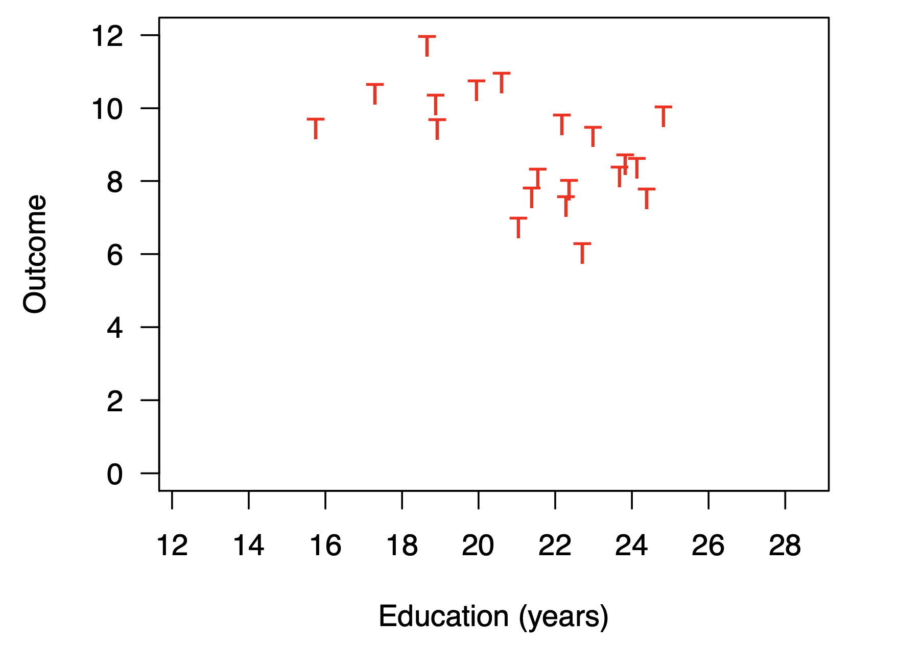
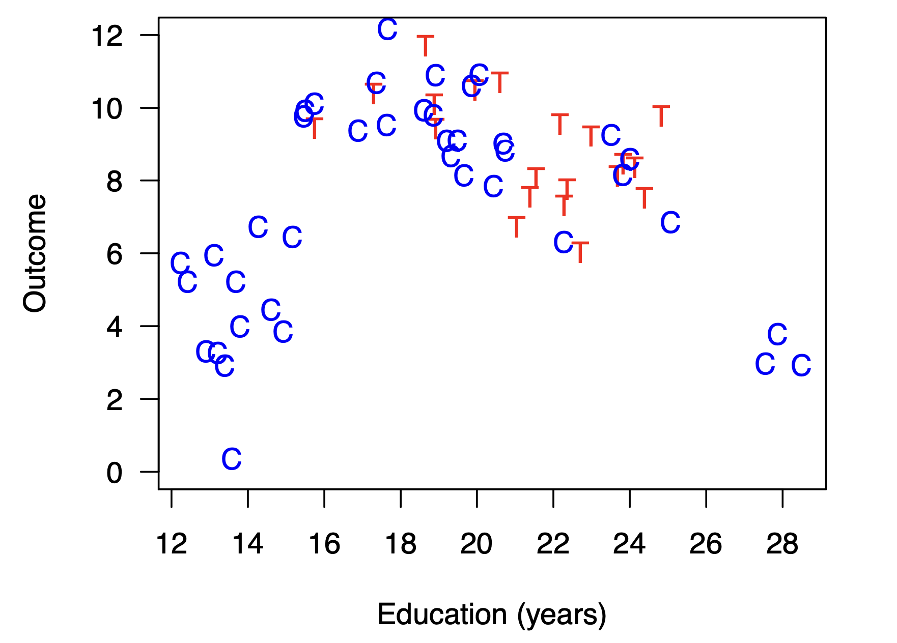
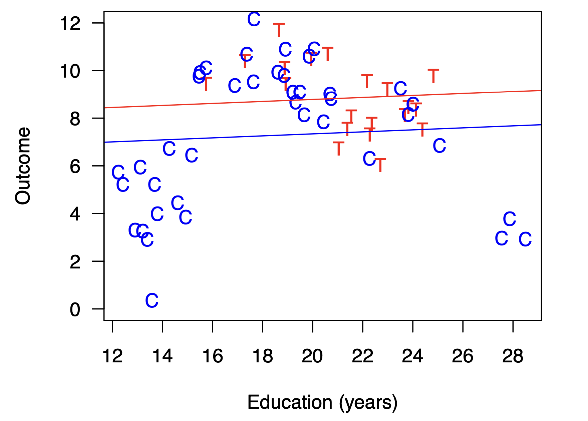
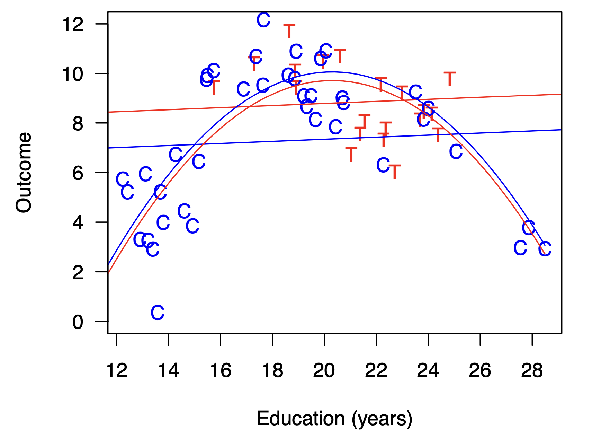
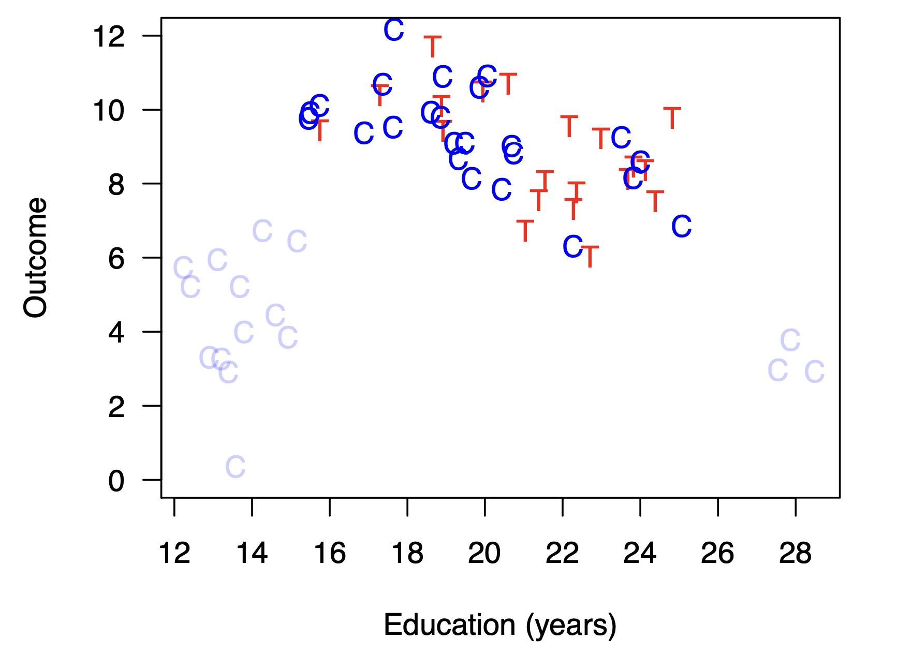
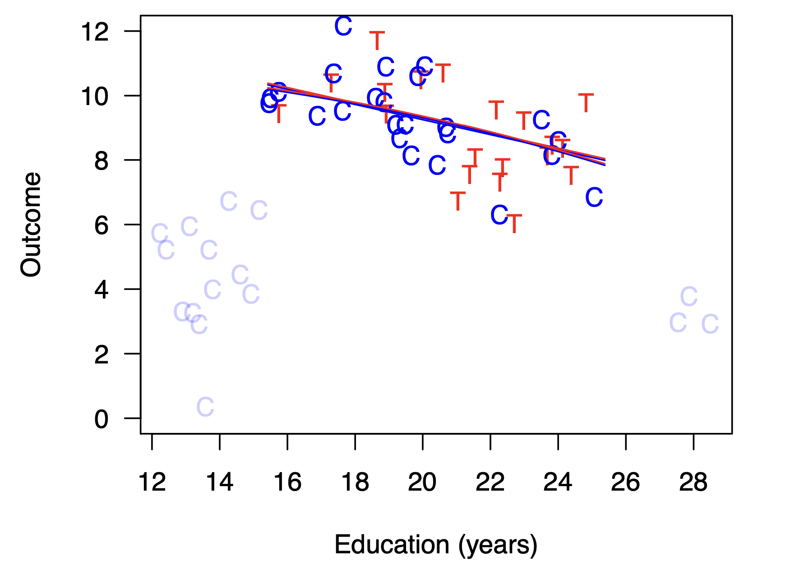

```{r setup, include = FALSE, warning = FALSE, message = FALSE}
options(htmltools.dir.version = FALSE)
knitr::opts_chunk$set(
  message = FALSE,
  warning = FALSE,
  dev = "svg",
  cache = TRUE,
  fig.align = "center"
  #fig.width = 11,
  #fig.height = 5
)

# Load packages
library(tidyverse)
library(pander)
library(ggthemes)
library(gapminder)
library(emo)
library(countdown)
library(xaringanthemer)
library(xaringanExtra)
library(sf)
library(stargazer)
library(kableExtra)
library(knitr)

style_xaringan( 
  title_slide_background_color = "#dd0747",
  title_slide_text_color = "white",
  text_color = "black",
  header_color = "#dd0747",
  text_bold_color = "#dd0747",
  text_slide_number_color = "black",
  code_inline_background_color = "#e0e1df",
  base_font_size = "24px",
  text_font_family = "Palatino",
  header_font_family = "Palatino",
  header_h1_font_size = "45px",
  header_h2_font_size = "35px",
  header_h3_font_size = "28px",
  inverse_background_color = "#f8cdda",
  inverse_text_color = "black",
  inverse_header_color = "#dd0747")

# Theme with only x and y axis ans names
theme_minimum = theme_bw() + 
  theme(
  text = element_text(family = "Palatino"),
  line = element_blank(),  # Masquer toutes les lignes par défaut
  rect = element_blank(),  # Masquer tous les rectangles par défaut
  axis.line = element_line(color = "black"),  # Afficher les lignes des axes
  axis.ticks = element_blank(),  # Masquer les ticks des axes
  plot.title = element_blank(),  # Masquer le titre du graphique
  panel.background = element_rect(fill = "#FAFAFA", color = "#FAFAFA"), # Masquer le fond du panneau
  panel.grid.major = element_blank(),  # Masquer la grille principale
  panel.grid.minor = element_blank(),  # Masquer la grille secondaire
  plot.background = element_rect(fill = "#FAFAFA", color = "#FAFAFA"), # Masquer le fond du graphique
  legend.position = "none"  # Masquer la légende
)

# A blank theme for ggplot
theme_empty = theme_bw() + 
  theme(
  text = element_text(family = "Palatino"),
  line = element_blank(),  # Masquer toutes les lignes par défaut
  rect = element_blank(),  # Masquer tous les rectangles par défaut
  axis.line = element_line(color = "black"),  # Afficher les lignes des axes
  axis.ticks = element_blank(),  # Masquer les ticks des axes
  axis.text = element_blank(),  # Masquer les étiquettes des axes
  axis.title = element_text(size = 12),  # Afficher les titres des axes
  plot.title = element_blank(),  # Masquer le titre du graphique
  panel.background = element_rect(fill = "#FAFAFA", color = "#FAFAFA"), # Masquer le fond du panneau
  panel.grid.major = element_blank(),  # Masquer la grille principale
  panel.grid.minor = element_blank(),  # Masquer la grille secondaire
  plot.background = element_rect(fill = "#FAFAFA", color = "#FAFAFA"), # Masquer le fond du graphique
  legend.position = "none"  # Masquer la légende
)


#npx decktape \
# --url-load-timeout=60000 --page-load-timeout=60000 --buffer-timeout=60000 \
# --chrome-arg="--disable-web-security" --chrome-arg="--allow-file-access-from-files" \
# "file:///Users/florentineoliveira/Desktop/Teaching/CPES/pratiques-de-la-recherche/Lecture 4/lecture_4_fr.html" \
# "/Users/florentineoliveira/Desktop/Teaching/CPES/pratiques-de-la-recherche/Lecture 4/lecture_4_fr.pdf"

```

layout: true

---
count: false
layout: false
class: center, middle, inverse

# <span style="color:#FAFAFA;">Reminder</span>

---

L'objectif est d'estimer l'effet d'un **traitement** $D$ sur une variable d'**outcome** $Y$.
  - par exemple l'effet d'avoir un master sur le salaire

&nbsp;

--

Peut-on en déduire l'effet du traitement en comparant l'outcome des individus traités à celui des individus non traités? 
  - par exemple peut-on quantifier l'effet d'avoir un master sur le salaire en comparant les individus qui ont un master à ceux qui n'en ont pas? 

&nbsp;

--

<span style="color:#dd0747">**Dans 99,99999% des cas, NON!**: le groupe des traités et celui des contrôles ne sont en général pas comparables</span> 
  - par exemple, les femmes et les enfants issus de milieux sociaux favorisés sont plus susceptibles de faire de hautes études, et ces caractéristiques peuvent aussi influencer le salaire


--

Dans 0,00001% des cas, il est possible de comparer l'outcome moyen des individus traités et des individus témoins si le traitement est distribué de façon aléatoire (RCT; mais cela est très onéreux, pose des questions éthiques, etc.).
  


---
# Cette séance

&nbsp;

1. Modèle de régression linéaire multivarié
 
  1.1. Biais de variable omise (OVB)        
  1.2. Hypothèses    
  1.3. Estimateur    
  1.4. Bonnes et mauvaises variables de contrôle    
  1.5. Coefficient de détermination (R2)

2. Matching

  2.1. Intuition   
  2.2. Méthodes    

3. Causalité


---
count: false
layout: false
class: center, middle, inverse

# <span style="color:#FAFAFA;"> 1. Modèle de régression linéaire multivarié</span>


---
count:false
class: middle, center,  clearinverse
background-color:  #f8cdda

# <span style="color:#dd0747;">1.1. Biais de variable omise (OVB)</span>


---
# Biais de variable omise (OVB)

Notre modèle de base s'écrit   
\begin{equation}
Y_i = \alpha + \beta D_i + \varepsilon_i \;\;\;\;\;\;\;\;\; (1)
\end{equation}


Par exemple, $Y_i$ désigne le salaire de l'individu $i$, $D_i$ une dummy qui représente le fait d'avoir un master ou non, et $\varepsilon_i$ le terme d'erreur.

--

Supposons qu'il existe une variable $W_i$, par exemple une variable binaire égale à 1 si $i$ est une Femme.

--

$W_i$ est implicitement contenue dans le terme d'erreur dans le modèle (1).

--

Or, les femmes sont en moyenne davantage éduquées que les hommes.

--

Donc $D_i$ est corrêlé à $\varepsilon_i$, ou dit autrement $\mathbb{E}(\varepsilon_i|D_i) \neq 0$

--

.center[`r emo::ji("rotating_light")` <span style="color:#dd0747"> **= Biais de variable omise**</span> `r emo::ji("rotating_light")`]


---
# Biais de variable omise (OVB)


On a le modèle 
$$Y_i = \alpha + \color{#DC7660}{\beta} D_i + \varepsilon_i$$

où la (ou les) variable $W_i$ est omise (donc appartient à $\varepsilon_i$).

La modèle *multivarié* s'écrit 
$$ Y_i = \gamma + \color{#DC7660}{\delta} D_i + \color{#60DC89}{\phi} W_i + \nu_i$$
On a donc la relation:

$$\color{#DC7660}{\beta} = \underbrace{\color{#DC7660}{\delta}}_{"vrai" estimateur} + \underbrace{\color{#60DC89}{\phi} \color{#6660DC}{\pi}}_{OVB}$$
où $\pi$ est le coefficient de la régression de $W_i$ sur $D_i$ ( $W_i = \lambda + \color{#6660DC}{\pi} D_i$ )


---
# Biais de variable omise (OVB)

**Exemple tiré du DM**

```{r, echo = F, results='asis', }

data_ovb = readRDS('data/eec_t1_2017_simulated_wage.rds') %>% 
  mutate(femme = ifelse(SEXE == 2, 1, 0),
         at_least_bac = ifelse(DIP11 < 50, 1, 0),
         wage_winsor = ifelse(wage > quantile(wage, seq(0,1,0.01), na.rm = T)[100], quantile(wage, seq(0,1,0.01), na.rm = T)[100], wage),
         log_wage_winsor = log(wage_winsor)) %>% 
  filter(AGE5 != 15,
         log_wage_winsor > 0)

no_control = lm(log_wage_winsor ~ at_least_bac, data = data_ovb)
women = lm(femme ~ at_least_bac, data = data_ovb)
control = lm(log_wage_winsor ~ at_least_bac + femme, data = data_ovb)

```

```{r, echo = F}

library(modelsummary)

#options(modelsummary_factory_html = 'kableExtra')

modelsummary(list("   Log(Wage)   "= no_control,"   Women   "= women,"   Log(Wage)   "=control),
             output = 'html', # "html", "markdown"
             stars = c( '*'=.1, '**'=.05, '***'=0.01 ),
             vcov = "HC1",
             gof_map = c("nobs", "adj.r.squared"),
             coef_rename = c('at_least_bac' = 'At least Bac', 'femme'='Women')
             )

```

```{r, echo = F}

#coef_d <- c( paste0(round(no_control$coefficients[2],4), "***"), "", paste0(round(control$coefficients[2],4), "***"))
#se_d = se_d = c(round(coef(summary(no_control))[2, "Std. Error"], 4), "", round(coef(summary(control))[2, "Std. Error"], 4)) %>%
#  purrr::map_chr(~ ifelse(. == "", "", paste0("(", ., ")")))
#
#
#coef_f <- c("", paste0(round(women$coefficients[2],4),"***"), paste0(round(control$coefficients[3],4), "***"))
#se_f = c("", round(coef(summary(women))[2, "Std. Error"],4) , round(coef(summary(control))[3, "Std. Error"],4) ) %>%
#  purrr::map_chr(~ ifelse(. == "", "", paste0("(", ., ")")))
#
#controls <- c("Aucun", "", "Femme")
#
#outcomes <- c("Salaire", "Femme", "Salaire")
#
#table <- matrix(c(coef_d, se_d, coef_f, se_f, controls), nrow = 5, byrow = T)
#
#row.names(table) <- c("At least Bac","", "Femme","", "Contrôles")
#
#kable(
#  x = table,
#  format = "latex",
#  col.names = outcomes,
#  caption = "",
#  align = "c",
#  position = "center",
#  full_width = FALSE
#) %>%
#column_spec(1, , width = "4cm", bold = T, italic = F) %>% 
#column_spec(2, width = "4cm") %>%
#column_spec(3, width = "4cm") %>%
#column_spec(4, width = "4cm") 


```


---
count:false
class: middle, center,  clearinverse
background-color:  #f8cdda

# <span style="color:#dd0747;">1.2. Hypothèses du modèle multivarié</span>


---
# Hypothèses du modèle multivarié


$\color{#9933FF}{H_1}$ Linéarité: le modèle est linéaire dans les paramètres: $\color{#9933FF}{\frac{\partial y_i}{\partial x_{ik}} = \beta_k}$,  $\color{#9933FF}{\forall k =1, ..., K}$
  

$\color{#9933FF}{H_2}$ Échantillon Aléatoire: l'échantillon est aléatoire et représentatif de la population.


.center[
<span style="color:#9933FF"> $\color{#9933FF}{H_3}$ **Exogeneité _conditionnelle_**: Conditionnellement aux contrôles $W$, $D$ est exogène</span> 

  Formellement, $\color{#9933FF}{\mathbb{E}(\varepsilon_i|D,W) = 0}$   
]

$\color{#9933FF}{H_4}$ Variation: il y a suffisamment de variation dans $X$ où $X = (1\;\; D \;\;W)$ 
  - Dit autrement, chaque variable explicative apporte une information qui lui est propre
  - Formellement, les explicatives ne sont pas colinéaires (cas multivarié: $\color{#9933FF}{(X'X)}$ <span style="color:#9933FF">est inversible</span>)
  
  
$\color{#9933FF}{H_5}$ Les erreurs $\varepsilon_i$ sont sphériques: $\color{#9933FF}{H_{5a}}$ homoscédasticité & $\color{#9933FF}{H_{5b}}$ Absence d'autocorrélation


---
# Hypothèses du modèle multivarié

L'hypothèse d'indépendance conditionnelle, ou <span style="color:#9933FF">***Conditional Independance Assumption (CIA)***</span>, aussi appelée sélection sur les observables, indique que:
- conditionellement à des variables explicatives $W_i$, les outcomes potentiels $\{Y_{0i}, Y_{1i}\}$ sont indépendants du traitement $D_i$
- dit autrement, en contrôlant par les variables $W_i$, le traitement $D_i$ est *as-good-as random*

&nbsp;

Formellement, dans le framework des outcomes potentiels, l'hypothèse d'identification devient:    

$$\{Y_{0i}, Y_{1i}\} \perp D_i \color{#dd0747}{|W_i}$$ 
On a donc: $$\begin{align} \text{Biais de Sélection} &= \mathbb{E}(Y_{0i} |  \color{#dd0747}{W_i}, D_i = 1) - \mathbb{E}(Y_{0i} |  \color{#dd0747}{W_i}, D_i = 0) \\ &= \mathbb{E}(Y_{0i} | \color{#dd0747}{W_i}) -  \mathbb{E}(Y_{0i} | \color{#dd0747}{W_i}) \\ &= 0 \end{align}$$


---
count:false
class: middle, center,  clearinverse
background-color:  #f8cdda

# <span style="color:#dd0747;">1.3. Estimateur dans le cas multivarié</span>

---
name:estimateur
# Estimateur dans le cas multivarié


L'estimateur MCO dans le cas multivarié s'écrit:
$$\hat{\beta} = (X'X)^{-1} X'Y$$


<button class="inline" onclick="window.location.hash='mathsestimateur'">Maths</button>


C'est toujours l'estimateur *BLUE*: **B**est **L**inear **U**nbiased **E**stimator

---
count:false
class: middle, center,  clearinverse
background-color:  #f8cdda

# <span style="color:#dd0747;">1.4 Bonnes et mauvaises variables de contrôle</span>


---
# "Bonnes" variables de contrôle

Une *bonne* variable de contrôle doit:   
- contribuer à **expliquer la variable dépendante** 
- par une **information qui lui est propre** 
- **ne pas être impactée par le traitement** d'intérêt     

Si elles satisfont ces conditions, les variables de contrôle permettent:

- d'atténuer le risque de biais de variable omise
- gagner en précision 


---
name: badcontrol
# Mauvaises variables de contrôle

Une <span style="color:#33B8FF"> **variable non pertinente** </span> est une variable qui ne contribue pas à expliquer l'outcome.
- le paramètre estimé sera donc nul `r emo::ji("neutral_face")`
- l'estimateur reste sans biais tant que la variable non pertinente n'est pas corrélée à $\varepsilon_i$ `r emo::ji("neutral_face")`
- l'estimateur est moins précis `r emo::ji("crying_face")`


Une <span style="color:#33B8FF"> **variable redondante**</span> si l'information qu'elle contient est déjà contenue dans une autre variable
- lorsque deux variables sont très corrélées, difficile de distinguer l'effet "propre" de chacune, donc les estimateurs de ces deux variables seront très imprécis
- dans le cas extrême de colinéarité, le modèle n'est pas identifiable `r emo::ji("crying_face")`


Un <span style="color:#33B8FF"> **mauvais contrôle** (*bad control*)</span> est une variable qui est également affectée par le traitement
- l'estimateur peut être biaisé `r emo::ji("crying_face")`


---
count:false
class: middle, center,  clearinverse
background-color:  #f8cdda

# <span style="color:#dd0747;">1.5 Coefficient de détermination (R2)</span>

---
# Coefficient de détermination (R2)

Le coefficient de détermination, ou $R^2$, informe sur la **qualité** de la régression linéaire, i.e. la **part de la variance de l'outcome expliquée par les $X$**. 

Formellement, 

$$\begin{align} R^2 &=  \frac{SCE}{SCT} = \frac{\sum_i (\hat{y_i} - \overline{y}_i)^2}{\sum_i (y_i - \overline{y}_i)^2} \\ &= 1 -  \frac{SCR}{SCT} = 1 - \frac{\sum_i (y_i - \hat{y}_i)^2}{\sum_i (y_i - \overline{y}_i)^2}\end{align}$$

NB: le $R^2$
- augmente **mécaniquement** avec le nombre de varibales explicatives 
  - comparer les $R^2$ ajustés lorsqu'on compare différents modèles
  - $R^2_{adj} = 1 - (1 - R^2) \frac{N - 1}{N-K-1}$
- est spécifique à un sample
- est très informatif pour faire de la prédiction mais <span style="color:#dd0747">**n'informe en rien sur la causalité**</span> 


---
count: false
layout: false
class: center, middle, inverse

# <span style="color:#FAFAFA;"> 2. Matching</span>


---
count:false
class: middle, center,  clearinverse
background-color:  #f8cdda

# <span style="color:#dd0747;">2.1. Intuition</span>


---
# Intuition

Lorsque l'on **contrôle** par des observables $W$, on peut avoir de l'*imbalance* (Ho, Imai, King,Stuart, 2007, Political Analysis)
  
  
```{r, echo=FALSE, out.width="55%"}

```

  
---
count:false
# Intuition

Lorsque l'on **contrôle** par des observables $W$, on peut avoir de l'*imbalance* (Ho, Imai, King,Stuart, 2007, Political Analysis)
  
```{r, echo=FALSE, out.width="55%"}

```
  
---
count:false
# Intuition

Lorsque l'on **contrôle** par des observables $W$, on peut avoir de l'*imbalance* (Ho, Imai, King,Stuart, 2007, Political Analysis)
  
```{r, echo=FALSE, out.width="55%"}

```

---
count:false
# Intuition

Lorsque l'on **contrôle** par des observables $W$, on peut avoir de l'*imbalance* (Ho, Imai, King,Stuart, 2007, Political Analysis)
  
```{r, echo=FALSE, out.width="55%"}

```

---
count:false
# Intuition

Lorsque l'on **contrôle** par des observables $W$, on peut avoir de l'*imbalance* (Ho, Imai, King,Stuart, 2007, Political Analysis)
  
```{r, echo=FALSE, out.width="55%"}

```

---
count:false
# Intuition

Lorsque l'on **contrôle** par des observables $W$, on peut avoir de l'*imbalance* (Ho, Imai, King,Stuart, 2007, Political Analysis)
  
```{r, echo=FALSE, out.width="55%"}

```


---
count:false
# Intuition

Lorsque l'on **contrôle** par des observables $W$, on peut avoir de l'*imbalance* (Ho, Imai, King, Stuart, 2007, Political Analysis)

```{r, echo=FALSE, out.width="55%"}

```


```{r, eval = F, include = F}
# Simulation des données
set.seed(42)
education <- seq(12, 28, length.out = 100) # Augmenter le nombre d'observations
outcome <- ifelse(education >= 16 & education <= 26, 
                  15 - 0.5 * education + rnorm(length(education), sd = 0.7), 
                  ifelse(education < 16 | education > 26, 
                         runif(length(education), min = 0, max = 5), 
                         10 + dnorm(education, mean = 21, sd = 3) * 15 + rnorm(length(education), sd = 0.5)))

data <- data.frame(
    Education = education,
    Outcome = outcome
)

# Attribution des groupes T et C
# T pour les observations entre 16 et 26, aléatoirement, C sinon
data$Group <- ifelse(data$Education >= 16 & data$Education <= 26, 
                     sample(c("T", "C"), size = sum(data$Education >= 16 & data$Education <= 26), replace = TRUE, prob = c(0.5, 0.5)),
                     "C")

# Graphique 1 : Points rouges T
p1 <- ggplot(subset(data, Group == "T"), aes(x = Education, y = Outcome)) +
    geom_text(aes(label = "T"), color = "red") +
    labs(x = "Education (years)", y = "Outcome") +
    ylim(c(0,7)) +
  xlim(c(12,27)) +
    theme_minimal()

# Graphique 2 : Ajout des points bleus C
p2 <- ggplot(data, aes(x = Education, y = Outcome)) +
    geom_text(data = subset(data, Group == "T"), aes(label = "T"), color = "red") +
    geom_text(data = subset(data, Group == "C"), aes(label = "C"), color = "blue") +
    labs(x = "Education (years)", y = "Outcome") +
      ylim(c(0,7)) +
  xlim(c(12,27)) +
    theme_minimal()


# Graphique 3
p3 <- ggplot(data, aes(x = Education, y = Outcome)) +
  geom_text(data = subset(data, Group == "T"), aes(label = "T"), color = "red") +
  geom_text(data = subset(data, Group == "C"), aes(label = "C"), color = "blue") +
  geom_abline(intercept = coef(lm(Outcome ~ Education + Group, data = data))["(Intercept)"], 
              slope = coef(lm(Outcome ~ Education, data = data %>% filter(Group == "C")))["Education"], color = "blue", linetype = "dashed") +
  geom_abline(intercept = coef(lm(Outcome ~ Education + Group, data = data))["(Intercept)"] + coef(lm(Outcome ~ Education + Group, data = data))["GroupT"], 
              slope = coef(lm(Outcome ~ Education, data = data %>% filter(Group == "C")))["Education"], color = "red", linetype = "dashed") +
  labs(x = "Education (years)", y = "Outcome") +
  ylim(c(0, 7)) +
  xlim(c(12, 27)) +
  theme_minimal()

# Graphique 4 : Ajout des courbes de tendance
p4 <- ggplot(data, aes(x = Education, y = Outcome)) +
    geom_text(data = subset(data, Group == "T"), aes(label = "T"), color = "red") +
    geom_text(data = subset(data, Group == "C"), aes(label = "C"), color = "blue") +
    geom_smooth(data = data, aes(group = Group, color = Group), method = "lm", se = FALSE) +
    labs(x = "Education (years)", y = "Outcome") +
      ylim(c(0,7)) +
  xlim(c(12,27)) +
    theme_minimal()

# Graphique 5 : Points C hors support en bleu clair
common_support <- (data$Education >= 16 & data$Education <= 26)
data$InSupport <- ifelse(data$Group == "C" & !common_support, "Out", "In")

p5 <- ggplot(data, aes(x = Education, y = Outcome)) +
    geom_text(data = subset(data, Group == "T"), aes(label = "T"), color = "red") +
    geom_text(data = subset(data, Group == "C" & InSupport == "In"), aes(label = "C"), color = "blue") +
    geom_text(data = subset(data, Group == "C" & InSupport == "Out"), aes(label = "C"), color = "lightblue") +
    labs(x = "Education (years)", y = "Outcome") +
      ylim(c(0,7)) +
  xlim(c(12,27)) +
    theme_minimal()

# Graphique 6 : Droites restreintes au support commun
p6 <- ggplot(subset(data, InSupport == "In"), aes(x = Education, y = Outcome)) +
    geom_text(data = subset(data, Group == "T"), aes(label = "T"), color = "red") +
    geom_text(data = subset(data, Group == "C"), aes(label = "C"), color = "blue") +
    geom_smooth(data = subset(data, Group == "T"), method = "lm", se = FALSE, color = "red") +
    geom_smooth(data = subset(data, Group == "C"), method = "lm", se = FALSE, color = "blue") +
    labs(x = "Education (years)", y = "Outcome") +
      ylim(c(0,7)) +
  xlim(c(12,27)) +
    theme_minimal()

# Afficher les graphiques (ou les sauvegarder)
ggsave("p1.png", plot = p1)
ggsave("p2.png", plot = p2)
ggsave("p3.png", plot = p3)
ggsave("p4.png", plot = p4)
ggsave("p5.png", plot = p5)
ggsave("p6.png", plot = p6)

```


---
count:false
class: middle, center,  clearinverse
background-color:  #f8cdda

# <span style="color:#dd0747;">2.2. Méthodes de matching</span>


---
# Méthodes de matching

Les estimateurs de *matching* construisent artificiellement un **groupe** d'individus non traîtés qui a les mêmes caractéristiques que le groupe d'individus traités
  - Assure un **support commun** des variables explicatives
  
Différents méthodes/algorithmes de matching:
- Matching exact: on cherche les individus *strictement identiques* (très restrictif!)
- *Propensity score matching*: on assigne à chaque individu une probabilité d'être traîté et on matche ceux avec des scores proches
- Plus proches voisins (*Nearest neighboors*): on cherche l'individu non-traîté le plus proche d'un individu traité selon certaines métriques
- ...
NB: des combinaisons de méthodes sont possibles!

Inconvénients:
- certaines observations n'ont pas de match: on estime l'effet de traitement lorsque c'est "faisable"


---
count: false
layout: false
class: center, middle, inverse

# <span style="color:#FAFAFA;">3. Causalité</span>


---
# Causalité


Les méthodes de **matching** sont des méthodes d'identification qui reposent sur la CIA, c'est à dire que la sélection dans le traitement est uniquement liée à des variables **observables** $X$. 

L'hypothèse d'indépendance conditionnelle revient à dire qu'en **contrôlant** (i.e. en "tenant compte de") **par un ensemble de variables $X_i$**, $D$ est ***as good as random***.

Sous l'hypothèse d'indépendance conditionnelle, l'effet estimé est l'**effet moyen du traitement <span style="color:#dd0747">conditionnel</span>** (***Conditional*** **ATE** - CATE)

&nbsp;

En réalité, il s'agit d'une **hypothèse d'identification très forte**:
- elle suppose d'inclure toutes les variables explicatives $X$ qui expliquent la corrélation entre $\varepsilon_i$ et $D_i$
  - <span style="color:#dd0747">Problème: nombre de ces variables sont **inobservables**</span>


---
class: clearinverse
background-color:  #d7e2d8

&nbsp;

# Recap: OLS 

<span style="color:#9933FF">**Hypothèse d'identification: CIA**</span>
- <span style="color:#9933FF"> Intuition: conditionnellement aux catactéristiques $W$ par lesquelles on *"contrôle"*, le traitement est aléatoire</span>
- <span style="color:#9933FF"> Formellement:</span>, $\color{#9933FF}{\mathbb{E}(\varepsilon_i|D_i, W_i) = 0}$

**Comparaison**: parmi les individus qui ont les mêmes caractéristiques par lesquelles on contrôle, on compare les individus traîtés à ceux qui ne le sont pas.

**Modèle**: $Y = X \beta + \varepsilon$, où $X = (1DW)$

**Estimateur**:  $\hat{\beta} = (X'X)^{-1} X'Y$

**Implémentation sur `R`**: 
- `lm` pour estimer les paramètres du modèle
- `summary` pour afficher le résultat de l'estimation
- `coeftest`, argument `vcov = vcovHC(fit, type = 'HC1')` pour obtenir des se robustes à l'hétéroscédasticité
- `stargazer` ou `modelsummary` pour exporter les résultats en une table $\LaTeX$


---
# Sources

[Causal inference: The Mixtape, Scott Cunningham](https://mixtape.scunning.com/05-matching_and_subclassification)         


---
count: false
layout: false
class: center, middle, inverse

# <span style="color:#FAFAFA;">Annexe</span>


---
name:mathsestimateur
# Estimateur MCO dans le cas multivarié

Le modèle multivarié s'écrit: $\;\;\;\;\;\;\;\;\;\;\;\;\;\;\; y_i = \beta_1 + \beta_2 D_i + \sum_{k=1}^K w_{ik} \gamma_k + \varepsilon_i$  

On peut l'écrire sous forme matricielle: $\;\;\;\;\;\;\;\;\; Y = \beta_1 + \beta_2 D + W \gamma + \varepsilon$

où $W$ est une matrice contenant les $K$ variables de contrôle.

&nbsp;

On peut finalement réécrire le modèle:

$$Y =  X \beta + \varepsilon $$

où 
$$X = \begin{bmatrix}
1 & D_1 & W_{1,1} & \cdots & W_{1,K} \\
1 & D_2 & W_{2,1} & \cdots & W_{2,K} \\
\vdots & \vdots & \vdots & \ddots & \vdots \\
1 & D_n & W_{n,1} & \cdots & W_{n,K}
\end{bmatrix} \quad \beta =
\begin{bmatrix}
\beta_1 \\
\beta_2 \\
\gamma_1 \\
\vdots \\
\gamma_K
\end{bmatrix} \quad \varepsilon =
\begin{bmatrix}
\varepsilon_1 \\
\varepsilon_2 \\
\vdots \\
\varepsilon_n
\end{bmatrix}$$


---
# Estimateur MCO dans le cas multivarié


L'estimateur des MCO est celui qui minimise la somme des carrés des résidus:


$$ \underset{\beta}{min} \;\varepsilon' \varepsilon = (Y - X \beta)' (Y - X \beta) = Y'Y - 2\beta'X'Y + \beta'X'X\beta$$
La condition du premier ordre est: 

$$\frac{\partial(Y'Y - 2\beta'X'Y + \beta'X'X\beta)}{\partial \beta} = -2X'Y + 2X'X\beta =  0 $$
<span style="color:#dd0747"> **Si**</span> $\color{#dd0747}{(X'X)}$ <span style="color:#dd0747">**est inversible** (cf H4) </span>, alors 

$$  (X'X) \beta = X'Y \implies \beta = (X'X)^{-1} X'Y $$


&nbsp;
<button class="inline" onclick="window.location.hash='estimateur'">Back</button>


