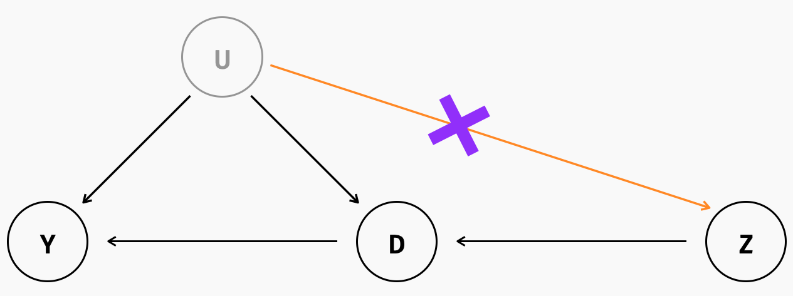

```{r setup, include = FALSE, warning = FALSE, message = FALSE}
options(htmltools.dir.version = FALSE)
knitr::opts_chunk$set(
  message = FALSE,
  warning = FALSE,
  dev = "svg",
  cache = TRUE,
  fig.align = "center"
  #fig.width = 11,
  #fig.height = 5
)

# Load packages
library(tidyverse)
library(pander)
library(ggthemes)
library(gapminder)
library(emo)
library(countdown)
library(xaringanthemer)
library(xaringanExtra)
library(sf)

# countdown style
countdown(
  color_border              = "#dd0747",
  color_text                = "black",
  color_running_background  = "#dd0747",
  color_running_text        = "white",
  color_finished_background = "white",
  color_finished_text       = "#dd0747",
  color_finished_border     = "#dd0747",
  font_size = "2em" 
)


style_xaringan( 
  title_slide_background_color = "#dd0747",
  title_slide_text_color = "white",
  text_color = "black",
  header_color = "#dd0747",
  text_bold_color = "#dd0747",
  text_slide_number_color = "black",
  code_inline_background_color = "#e0e1df",
  base_font_size = "24px",
  text_font_family = "Palatino",
  header_font_family = "Palatino",
  header_h1_font_size = "45px",
  header_h2_font_size = "35px",
  header_h3_font_size = "28px",
  inverse_background_color = "#f8cdda",
  inverse_text_color = "black",
  inverse_header_color = "#dd0747")

# Theme with only x and y axis ans names
#theme_minimum = theme_bw() + 
#  theme(
#  text = element_text(family = "Palatino"),
#  line = element_blank(),  # Masquer toutes les lignes par défaut
#  rect = element_blank(),  # Masquer tous les rectangles par défaut
#  axis.line = element_line(color = "black"),  # Afficher les lignes des axes
#  axis.ticks = element_blank(),  # Masquer les ticks des axes
#  plot.title = element_blank(),  # Masquer le titre du graphique
#  panel.background = element_blank(),  # Masquer le fond du panneau
#  panel.grid.major = element_blank(),  # Masquer la grille principale
#  panel.grid.minor = element_blank(),  # Masquer la grille secondaire
#  plot.background = element_blank(),  # Masquer le fond du graphique
#  legend.position = "none"  # Masquer la légende
#)

theme_minimum = theme_bw() + 
  theme(
  text = element_text(family = "Palatino"),
  line = element_blank(),  # Masquer toutes les lignes par défaut
  rect = element_blank(),  # Masquer tous les rectangles par défaut
  axis.line = element_line(color = "black"),  # Afficher les lignes des axes
  axis.ticks = element_blank(),  # Masquer les ticks des axes
  plot.title = element_blank(),  # Masquer le titre du graphique
  panel.background = element_rect(fill = "#FAFAFA", color = "#FAFAFA"), # Masquer le fond du panneau
  panel.grid.major = element_blank(),  # Masquer la grille principale
  panel.grid.minor = element_blank(),  # Masquer la grille secondaire
  plot.background = element_rect(fill = "#FAFAFA", color = "#FAFAFA"), # Masquer le fond du graphique
  legend.position = "none"  # Masquer la légende
)


# A blank theme for ggplot
theme_empty = theme_bw() + 
  theme(
  text = element_text(family = "Palatino"),
  line = element_blank(),  # Masquer toutes les lignes par défaut
  rect = element_blank(),  # Masquer tous les rectangles par défaut
  axis.line = element_line(color = "black"),  # Afficher les lignes des axes
  axis.ticks = element_blank(),  # Masquer les ticks des axes
  axis.text = element_blank(),  # Masquer les étiquettes des axes
  axis.title = element_text(size = 12),  # Afficher les titres des axes
  plot.title = element_blank(),  # Masquer le titre du graphique
  panel.background = element_blank(),  # Masquer le fond du panneau
  panel.grid.major = element_blank(),  # Masquer la grille principale
  panel.grid.minor = element_blank(),  # Masquer la grille secondaire
  plot.background = element_blank(),  # Masquer le fond du graphique
  legend.position = "none"  # Masquer la légende
)


```

layout: true


---
# Selection sur les non-observables

Les méthodes d'identification basées sur la **selection sur les observables** supposent que l'on peut supprimer le biais de sélection au traitement $D_i$ en contrôlant par des variables observables $X_i$. L'hypothèse d'identification sous-jacente:

$$\{Y_{0i}, Y_{1i}\} \perp D_i|X_i$$

Les méthodes d'identification basées sur la **sélection sur les non-observables** supposent que l'on peut utiliser seulement la "bonne variation" de $D_i$, que l'on appelle $Z_i$, et l'utiliser pour estimer l'effet de $D_i$ sur $Y_i$. Cela permet par ailleurs de supprimer tout biais de sélection (en supprimant la "mauvaise" variation de $D_i$). L'hypothèse d'identification devient double: 

$$\{Y_{0i}, Y_{1i}\} \perp Z_i$$     

$$Cov(Z_i, D_i) \neq 0$$

---
# Intuition

La méthode des variables instrumentales permet d'isoler la "bonne variation" de D, c'est à dire celle qui est correlée avec Y, de la mauvaise variation, c'est à dire celle qui est correlée avec u et rend la variable D endogène. 

Comment? Au moyen d'une variable observable Z, correlée acec D mais pas avec u.

<span style="color:#9933FF"> Formellement: $\color{#9933FF}{(Y_{1i}, Y_{0i}) \perp D_i}$ </span>


---
# Hypothèses d'identification

<span style="color:#9933FF"> **Relevance:**</span> 
- <span style="color:#9933FF">Intuition: l'instrument et la variable endogène sont corrélés</span> 
- <span style="color:#9933FF"> Formellement,  $\color{#9933FF}{Cov(D_i, Z_i) \neq 0}$ </span> 


```{r relevance, echo=FALSE, out.width="60%"}
knitr::include_graphics("imgs/relevance.png")
```

---
# Hypothèses d'identification

<span style="color:#9933FF">L'instrument est **as-good-as-random:**</span> 
- <span style="color:#9933FF">Intuition: l'instrument est distribué aléatoirement </span> 
- <span style="color:#9933FF"> Formellement,  $\color{#9933FF}{Cov(Z_i, \varepsilon_i) = 0}$ </span> 

```{r agar, echo=FALSE, out.width="60%"}

```

---
# Hypothèses d'identification

<span style="color:#9933FF"> **Exclusion restriction:**</span> 
- <span style="color:#9933FF">Intuition: l'instrument affecte $\color{#9933FF}{Y}$ **uniquement via** $\color{#9933FF}{D}$ </span> 
- <span style="color:#9933FF"> Formellement,  $\color{#9933FF}{Cov(Z_i, \varepsilon_i) = 0}$ </span> 

```{r exclusion, echo=FALSE, out.width="60%"}
knitr::include_graphics("imgs/exclusion.png")
```


---


$$\begin{align} Cov(Y_i, Z_i) &= Cov(\alpha + \beta Z_i + \varepsilon_i, Z_i) \\ &= \beta Cov(D_i, Z_i) + \underbrace{Cov(\varepsilon_i, Z_i)}_{=0}\end{align}$$
Donc, $\beta$ est identifié: 

$$ \beta = \frac{Cov(Y_i, Z_i)}{Cov(D_i, Z_i)} $$
---
# Lien avec 


---
# Quatres modèles

**Modèle avec variable endogène**: 
- $Y_i = \alpha + \beta D_i + \varepsilon_i$


**First Stage**: régression de la <span style="color:#e07126">**variable endogène**</span> sur l'<span style="color:#9e5188">**instrument**</span> 
- $\color{#e07126}{D_i} = \alpha + \gamma \color{#9e5188}{Z_i} + \epsilon_i$

**Second Stage**: régression de l'outcome d'intérêt sur les <span style="color:#199c2c">**valeurs prédites en *first stage* **</span> 
- $Y_i = \alpha + \beta \color{#199c2c}{\hat{D_i}} + \varepsilon_i$

**Reduced Form**: régression de l'outcome sur l'<span style="color:#9e5188">**instrument**</span> 
- $Y_i = \mu + \pi \color{#9e5188}{Z_i} + \nu_i$


---
background-color: #f19bb5
# Application: Angrist and Krueger (1991)

**Question de Recherche**: quel est l'effet causal du niveau d'études sur le salaire?

--

**Question**: pourquoi ne peut-on pas simplement comparer le salaire de deux individus ayant un niveau de diplôme différent?      

--
**Biais de sélection/OVB**: 
- les individus ayant de meilleures capacités ou davantage de motivation ont tendance à poursuivre leurs études plus longtemps et par ailleurs cela peut également avoir un impact sur leur salaire
- Problème: on n'observe pas la motivation ni les capacités (ie. ces variables sont dans $u$)
  - donc estimate biaisé 
  
---
background-color: #f19bb5
# Application: Angrist and Krueger (1991)

Angrist et Krueger proposent un instrument pour le niveau d'éducation: **le trimestre de naissance** (Quarter of Birth, QOB):

**Contexte**
- Aux USA,
  - entrée à l'école l'année des 6 ans
  - école olbligatoire jusqu'à 16 ans
  


---
background-color: #f19bb5

[Angrist Data Archive](https://economics.mit.edu/people/faculty/josh-angrist/angrist-data-archive)

```{r, echo = F, include = F}
qob = read.table("data/QOB", header = F, sep = " ") %>%
  rename(
    AGE = V1,
    AGEQ = V2,
    EDUC = V4,
    ENOCENT = V5,
    ESOCENT = V6,
    LWKLYWGE = V9,
    MARRIED = V10,
    MIDATL = V11,
    MT = V12,
    NEWENG = V13,
    CENSUS = V16,
    QOB = V18,
    RACE = V19,
    SMSA = V20,
    SOATL = V21,
    WNOCENT = V24,
    WSOCENT = V25,
    YOB = V27
  ) %>% 
  mutate(YOB = as.factor(YOB),
         QOB = as.factor(QOB))
  
```

---


```{r, include = T, echo = F,  dev = "svg", fig.width = 9, fig.height = 4.5}

qob %>%
    mutate(QOB = as.numeric(as.character(QOB)),
           YOB = as.numeric(as.character(YOB))) %>% 
    filter(YOB %in% 30:40) %>% 
    group_by(QOB, YOB) %>%
    summarise(mean_w = mean(LWKLYWGE), mean_educ = mean(EDUC)) %>%
    mutate(q4 = (QOB == 4)) %>% 
    ggplot(aes(x = (as.numeric(YOB) + (as.numeric(QOB) - 1) / 4), y = mean_educ)) +
    geom_line() +
    geom_label(mapping = aes(label = QOB, color = q4), size = 5) +  # Ajout de la taille pour les labels 
    scale_x_continuous("Year of birth", breaks = 30:40) +
    scale_y_continuous("Years of Education", breaks = seq(12.2, 13.2, by = 0.1),
                       limits = c(12.2, 13.2)) +
    scale_color_manual(values = c("FALSE" = "grey40", "TRUE" = "#dd0747")) +
    theme_minimum
```

---
background-color: #f2c394
# Recap: Variables Instrumentales

**Data**: Données expérimentales

<span style="color:#9933FF">**Hypothèse d'identification**:  </span>
- <span style="color:#9933FF"> Intuition: allocation aléatoire du statut de traitement </span>
- <span style="color:#9933FF"> Formellement: $\color{#9933FF}{(Y_{1i}, Y_{0i}) \perp D_i}$ </span>

**Modèle**: pour tout individu $i$,
$$Y_i = \alpha + \delta D_i + \varepsilon$$

**Estimateur de l'effet du traitement**:
- Différence entre l'outcome moyen du groupe des individus traîtés et celui du groupe de contrôle
- $\hat{\delta} = \mathbb{E}(Y_i | D_i = 1) - \mathbb{E}(Y_i | D_i = 0)$

**Implémentation sur `R`**: 
- Balancing Tests: 
- Estimation de l'effet du traitement: `lm(y ~ D, data = data)`


---
# Sources

[Mastering Metrics R Code](https://jrnold.github.io/masteringmetrics/quarter-of-birth-and-returns-to-schooling.html)    
[Causal inference: The Mixtape, Scott Cunningham](https://mixtape.scunning.com/07-instrumental_variables)    


