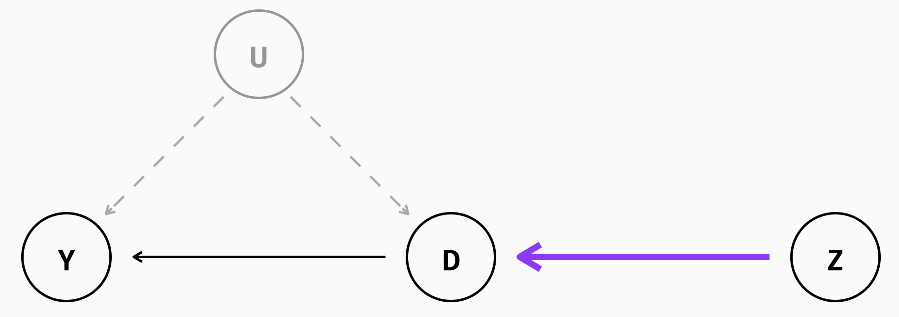

```{r setup, include = FALSE, warning = FALSE, message = FALSE}
options(htmltools.dir.version = FALSE)
knitr::opts_chunk$set(
  message = FALSE,
  warning = FALSE,
  dev = "svg",
  cache = TRUE,
  fig.align = "center"
  #fig.width = 11,
  #fig.height = 5
)

# Load packages
library(tidyverse)
library(pander)
library(ggthemes)
library(gapminder)
library(emo)
library(countdown)
library(xaringanthemer)
library(xaringanExtra)
library(sf)

# countdown style
countdown(
  color_border              = "#dd0747",
  color_text                = "black",
  color_running_background  = "#dd0747",
  color_running_text        = "white",
  color_finished_background = "white",
  color_finished_text       = "#dd0747",
  color_finished_border     = "#dd0747",
  font_size = "2em" 
)


style_xaringan( 
  title_slide_background_color = "#dd0747",
  title_slide_text_color = "white",
  text_color = "black",
  header_color = "#dd0747",
  text_bold_color = "#dd0747",
  text_slide_number_color = "black",
  code_inline_background_color = "#e0e1df",
  base_font_size = "24px",
  text_font_family = "Palatino",
  header_font_family = "Palatino",
  header_h1_font_size = "45px",
  header_h2_font_size = "35px",
  header_h3_font_size = "28px",
  inverse_background_color = "#f8cdda",
  inverse_text_color = "black",
  inverse_header_color = "#dd0747")

theme_minimum = theme_bw() + 
  theme(
  text = element_text(family = "Palatino"),
  line = element_blank(),  # Masquer toutes les lignes par défaut
  rect = element_blank(),  # Masquer tous les rectangles par défaut
  axis.line = element_line(color = "black"),  # Afficher les lignes des axes
  axis.ticks = element_blank(),  # Masquer les ticks des axes
  plot.title = element_blank(),  # Masquer le titre du graphique
  panel.background = element_rect(fill = "#FAFAFA", color = "#FAFAFA"), # Masquer le fond du panneau
  panel.grid.major = element_blank(),  # Masquer la grille principale
  panel.grid.minor = element_blank(),  # Masquer la grille secondaire
  plot.background = element_rect(fill = "#FAFAFA", color = "#FAFAFA"), # Masquer le fond du graphique
  legend.position = "none"  # Masquer la légende
)


# A blank theme for ggplot
theme_empty = theme_bw() + 
  theme(
  text = element_text(family = "Palatino"),
  line = element_blank(),  # Masquer toutes les lignes par défaut
  rect = element_blank(),  # Masquer tous les rectangles par défaut
  axis.line = element_line(color = "black"),  # Afficher les lignes des axes
  axis.ticks = element_blank(),  # Masquer les ticks des axes
  axis.text = element_blank(),  # Masquer les étiquettes des axes
  axis.title = element_text(size = 12),  # Afficher les titres des axes
  plot.title = element_blank(),  # Masquer le titre du graphique
  panel.background = element_rect(fill = "#FAFAFA", color = "#FAFAFA"), # Masquer le fond du panneau
  panel.grid.major = element_blank(),  # Masquer la grille principale
  panel.grid.minor = element_blank(),  # Masquer la grille secondaire
  plot.background = element_rect(fill = "#FAFAFA", color = "#FAFAFA"), # Masquer le fond du graphique
  legend.position = "none"  # Masquer la légende
)


```

layout: true

---
# Selection on unobservables

Les méthodes d'identification basées sur l'**hypothèse d'indépendance conditionnelle** (CIA, ou **selection sur les observables**) supposent qu'en contrôlant par des variables observables $W_i$, l'estimateur OLS donne l'effet causal du traitement $D$
  - i.e. on peut contrôler pour toute la sélection dans le traitement (*mauvaise variation*) par des variables **observées** $W$

&nbsp;

--

```{r ols, echo=FALSE, out.width="40%"}

```


---
# Selection on unobservables


.center[`r emo::ji("rotating_light")` <span style="color:#dd0747"> **Il existe (quasiment) TOUJOURS des variables inobservables qui affectent à la fois le traitement et l'outcome**</span> `r emo::ji("rotating_light")`]


--

.center[
<span style="color:#dd0747"> $\color{#dd0747}{\implies}$ **Biais de sélection (le groupe de traitement et contrôle ne sont pas comparables)**</span>
]


--

.center[
<span style="color:#dd0747"> $\color{#dd0747}{\implies} \; D$ **est endogène**</span>
]


--

.center[
<span style="color:#dd0747"> $\implies \; \hat{\beta}$ **n'est pas causal**</span>
]

--

&nbsp;

```{r selection unobs, echo=FALSE, out.width="40%"}

```


---
# Intuition IV

La méthode des **variables instrumentales**

--

- sépare $D$ en une partie exogène (*bonne variation*) et une partie endogène (*mauvaise variation*)
  
--
  
- grâce à une variable que l'on appelle <span style="color:#dd0747">**instrument** $\color{#dd0747}{Z_i}$</span> 
  
--

- pour n'utiliser que la partie exogène dans l'estimation de l'effet du traitement
   
--
   
Cela permet de supprimer le biais de sélection en *supprimant la mauvaise variation* de $D_i$


--

&nbsp;

```{r instrument, echo=FALSE, out.width="50%"}

```


---
# Estimateur IV

On a le modèle usuel:

$$Y_i = \alpha + \beta D_i + W_i + \varepsilon_i$$
&nbsp;


***Rappel***: l'esimateur OLS garantie que l'estimateur de $\beta$ de l'effet du traitement $D$ est causal/bien identifié si et seulement si $Cov(D_i,\varepsilon_i)=0$, ce qui est une <span style="color:#dd0747">hypothèse très forte</span>.

&nbsp;

La méthode des **variables instrumentales** suppose qu'il existe une variable $Z_i$, corrélée avec la variable endogène et qui impacte l'outcome uniquement via son effet sur la variable endogène.


L'<span style="color:#33B8FF">**estimateur IV**</span> s'écrit:

$$\color{#33B8FF}{\hat{\beta}^{IV} = (Z'D)^{-1}(Z'Y)}$$
où $Z=(ZW)$ et $D=(DW)$, avec $W$ les variables de contrôle.


---
# Hypothèses d'identification


<span style="color:#9933FF"> **Relevance:**</span> 
- <span style="color:#9933FF">L'instrument est corrélé à la variable endogène/traitement</span> (cela nous assure qu'on garde bien une partie de la *bonne variation* de  $\color{#9933FF}{D}$ )</span> 
- <span style="color:#9933FF"> Formellement,  $\color{#9933FF}{Cov(D_i, Z_i) \neq 0}$ </span>
- <span style="color:#9933FF"> **Hypothèse testable!**: via la régression de première étape (*first-stage*) en montrant que l'instrument a bien un effet statistiquement significatif sur la variable endogène/instrument + F-stat > 10</span>

&nbsp;

```{r relevance, echo=FALSE, out.width="60%"}

```


---
# Hypothèses d'identification

<span style="color:#9933FF"> **Exclusivité**</span> 
- <span style="color:#9933FF">L'instrument affecte $\color{#9933FF}{Y}$ **uniquement via** $\color{#9933FF}{D}$. Dit autrement, l'instrument n'impacte pas directement $\color{#9933FF}{Y}$ </span> 
- <span style="color:#9933FF"> Hypothèse **NON testable!**</span> 

&nbsp;

```{r exclusion, echo=FALSE, out.width="60%"}
knitr::include_graphics("imgs/exclusion.png")
```


---
# Hypothèses d'identification

<span style="color:#9933FF">**Exogeneité/as-good-as-random:**</span> 
- <span style="color:#9933FF">L'instrument est **exogène** (non corrélé avec le terme d'erreur) </span> 
- <span style="color:#9933FF"> Formellement,  $\color{#9933FF}{Cov(Z_i, \varepsilon_i) = 0}$ </span> 
- <span style="color:#9933FF"> Hypothèse **NON testable!**</span> 

&nbsp;

```{r agar, echo=FALSE, out.width="60%"}

```

&nbsp;

*NB: Exogeneité + Exclusivité = Exclusion Restriction*


---
# Comment savoir si un instrument est bon ?

&nbsp;

.center[<span style="color:#dd0747">***Good instruments should feel weird***  `r emo::ji("disbelief")`</span>]

&nbsp;

Les bons instruments peuvent sembler **contre-intuitifs**: ils créent un effet sur la variable endogène/instrument mais ne déterminent pas l'outcome.
  - un bon instrument doit susciter la confusion chez un auditeur non averti
  
&nbsp;

L’***exclusion restriction***, hypothèse clé mais **non testable**, est plus crédible lorsque l'instrument semble incongru 
  - il faut pouvoir défendre cette hypothèse avec une argumentation logique et théorique
&nbsp;  
  
Exemples : 
  - composition de genre des deux premiers enfants comme instrument du numbre d'enfants et l’offre de travail des femmes
  - pluviométrie comme instrument pour le revenu sur la fréquence de conflits
  - lotteries


---
# Two-stage least squares (2SLS)

&nbsp;  

La méthode des variables instrumentales est souvent utilisée en deux étapes, en l'occurence lorsqu'il y a plusieurs instruments/variables endogènes:

1. <span style="color:#33B8FF">**First stage**</span>: on régresse la variable endogène sur l'instrument et les contrôles, $D_i = \delta + \color{#27b072}{\gamma} Z_i + \xi_i$ et on garde la valeur prédite de la variable endogène $\hat{D}$
2. <span style="color:#33B8FF">**Second stage**</span>: on régresse l'outcome sur la valeur prédite de la variable endogène $\hat{D}$ et les variables de contrôle. Cette régression ne conserve que la partie de l'instrument $Z$ qui est corrêlée avec la variable endogène $D$

&nbsp;  

L'estimateur 2SLS s'écrit:

$$\color{#33B8FF}{\hat{\beta}^{2SLS} = \frac{\text{Estimateur de Reduced-Form}}{\text{Estimateur de First Stage}}} = \frac{\color{#eb8934}{\hat{\pi}}}{\color{#27b072}{\hat{\gamma}}} $$


---
# Forme réduite (*Reduced-Form*)

Le modèle en <span style="color:#33B8FF">**reduced-form**</span>  s'écrit:

$$Y_i = \mu + \color{#eb8934}{\pi} \color{#9e5188}{Z_i} + \nu_i$$

L'estimateur OLS de cette équation donne un estimateur causal de **l'effet de l'instrument** ( $\neq$ effet du traitement $D_i$) sur l'outcome.

L'hypothèse d'identification est que l'instrument est bien exogène ( $Cov(\varepsilon_i, Z_i) = 0$ ) 


---
# Recap: quatres modèles

&nbsp;  


**Modèle avec variable endogène**: 
- $Y_i = \alpha + \beta D_i + W_i + \varepsilon_i$

**First Stage**: régression de la <span style="color:#e07126">**variable endogène**</span> sur l'<span style="color:#9e5188">**instrument**</span> 
- $\color{#e07126}{D_i} = \alpha + \gamma \color{#9e5188}{Z_i} + W_i + \epsilon_i$

**Second Stage**: régression de l'outcome d'intérêt sur les <span style="color:#199c2c">**valeurs prédites en *first stage* **</span> 
- $Y_i = \alpha + \beta \color{#199c2c}{\hat{D_i}} + W_i + \varepsilon_i$

**Reduced Form**: régression de l'outcome sur l'<span style="color:#9e5188">**instrument**</span> 
- $Y_i = \mu + \pi \color{#9e5188}{Z_i} + W_i + \nu_i$


---
# IV sur `R`

## Option 1: à la main

L’estimation peut être réalisée en deux étapes manuelles:

.pull-left[
**Étape 1**:

`first_stage <- lm(D ~ Z + W, data = data)`

`data$D_hat <- predict(first_stage)`           
]

--

.pull-right[
**Étape 2**:

`second_stage <- lm(Y ~ D_hat + W, data = data)`
]

--

&nbsp;  

## Option 2: Package `estimater`, fonction `iv_robust`

`iv_model <- iv_robust(Y ~ D + W | Z + W, data = data)`

**Avantage**: gère directement l'erreur standard robuste.

.center[`r emo::ji("rotating_light")` Toujours inclure les contrôles dans la first stage et second stage `r emo::ji("rotating_light")`]


---
background-color: #f19bb5
# Application: Angrist and Krueger (1991)


**Question de Recherche**: quel est l'effet du niveau d'études sur le salaire (= *Mincer equation*)?

--

**Question**: pourquoi ne peut-on pas simplement comparer le salaire de deux individus ayant un niveau de diplôme différent?      

--

**Biais de sélection/OVB**: **Ability Bias**
- les individus ayant de meilleures capacités ou davantage de motivation ont tendance à poursuivre leurs études plus longtemps et par ailleurs cela peut également avoir un impact sur leur salaire
- Problème: on n'observe pas la motivation ni les capacités (ie. ces variables sont dans $\varepsilon_i$)
  - donc estimate biaisé 
  
--

<span style="color:#dd0747">**Angrist et Krueger (1991)**</span>
- papier de référence pour la prise en compte du biais d'abilité
- proposent un instrument pour le niveau d'éducation: **le trimestre de naissance** (Quarter of Birth, QOB):

**Contexte**: USA
  - entrée à l'école l'**année des 6 ans**
  - école obligatoire jusqu'à 16 ans
  
  
---
background-color: #f19bb5
# Application: Angrist and Krueger (1991)

```{r, echo = T}
library(estimatr)
data("ak91", package = "masteringmetrics")

```


---
background-color: #f19bb5
# Application: Angrist and Krueger (1991)


1. Expliquer pourquoi le trimestre de naissance est un bon instrument du nombre d'années d'études? 
  - quel est le mécanisme? l'instrument est-il valide?
  
2. Représenter graphiquement le nombre d'années d'études en fonction du trimestre de naissance. Que constatez-vous?

3. Régressez le salaire sur le nombre d'années d'études. Interprétez.

4. Régressez le nombre d'années d'études sur le trimestre de naissance. Interprétez

5. Régressez le salaire sur le trimestre de naissance. Interprétez.

6. Calculer l'estimateur 2SLS
  - 1) à la main
  - 2) avec la commande `iv_robust`
  
&nbsp;   

[Angrist Data Archive](https://economics.mit.edu/people/faculty/josh-angrist/angrist-data-archive)


---
background-color: #fbe6ec
# Solution : Angrist and Krueger (1991)


1) Expliquer pourquoi le trimestre de naissance est un bon instrument du nombre d'années d'études? 
  - quel est le mécanisme? l'instrument est-il valide?
  
&nbsp; 

Mécanisme?

--

  - les enfants nés en début d'année commencent l'école plus tard (6 ans + quelques mois), et ont donc moins d'années d'éducation en moyenne
  - au contraire, les enfants nés en fin d'année commencent l'école plus tôt (5 ans et quelques mois) et passent en moyenne plus de temps scolarisés

--

Instrument valide?

--

  - Relevance: OK
  - Exogeneité: indépendant de l'abilité (impossible que les élèves les plus abiles choisissent leur date de naissance)
  - Excluabilité: n'a pas de raison d'affecter le salaire autrement que par l'effet sur l'éducation


---
background-color: #fbe6ec
# Solution : Angrist and Krueger (1991)

2) Représenter graphiquement le nombre d'années d'études et le salaire en fonction du trimestre de naissance. Que constatez-vous?


```{r, include = T, echo = F,  dev = "svg", fig.width = 9, fig.height = 4.5}

ak91 %>%
    mutate(qob = as.numeric(as.character(qob)),
           yob = as.numeric(as.character(yob))) %>% 
    filter(yob %in% 1930:1940) %>% 
    group_by(qob, yob) %>%
    summarise(mean_w = mean(lnw), mean_educ = mean(s)) %>%
    mutate(q4 = (qob == 4)) %>% 
    ggplot(aes(x = (as.numeric(yob) + (as.numeric(qob) - 1) / 4), y = mean_educ)) +
    geom_line() +
    geom_label(mapping = aes(label = qob, color = q4), size = 5) +  # Ajout de la taille pour les labels 
    scale_x_continuous("Year of birth", breaks = 1930:1940) +
    scale_y_continuous("Years of Education", breaks = seq(12.2, 13.2, by = 0.1),
                       limits = c(12.2, 13.2)) +
    scale_color_manual(values = c("FALSE" = "grey40", "TRUE" = "#dd0747")) +
    theme_minimum
```

---
count:false
background-color: #fbe6ec
# Solution : Angrist and Krueger (1991)

2) Représenter graphiquement le nombre d'années d'études et le salaire en fonction du trimestre de naissance. Que constatez-vous?


```{r, include = T, echo = F,  dev = "svg", fig.width = 9, fig.height = 4.5}

ak91 %>%
    mutate(qob = as.numeric(as.character(qob)),
           yob = as.numeric(as.character(yob))) %>% 
    filter(yob %in% 1930:1940) %>% 
    group_by(qob, yob) %>%
    summarise(mean_w = mean(lnw), mean_educ = mean(s)) %>%
    mutate(q4 = (qob == 4)) %>% 
    ggplot(aes(x = (as.numeric(yob) + (as.numeric(qob) - 1) / 4), y = mean_w)) +
    geom_line() +
    geom_label(mapping = aes(label = qob, color = q4), size = 5) +  # Ajout de la taille pour les labels 
    scale_x_continuous("Year of birth", breaks = 1930:1940) +
    scale_y_continuous("Log weekly wage") +
    scale_color_manual(values = c("FALSE" = "grey40", "TRUE" = "#dd0747")) +
    theme_minimum
```


---
background-color: #fbe6ec
# Solution : Angrist and Krueger (1991)

3) Régressez le salaire sur le nombre d'années d'études. Interprétez

.pull-left[
```{r, echo = T}
ols = lm(lnw ~ s, data = ak91)
summary(ols)
```
]

--

.pull-right[
- Estimate OLS sûrement biaisé
- Ability corrélée positivement à l'éducation et salaire $\implies$ *downward bias*
]

---
background-color: #fbe6ec
# Solution : Angrist and Krueger (1991)

4) Régressez le nombre d'années d'études sur la dummy Né au Q4. Interprétez

.pull-left[
```{r, echo = T}
fs = lm(s ~ q4, data = ak91 %>% mutate(q4 = (qob == 4)))
summary(fs)
```
]

.pull-right[
- FS statistiquement sognificative! $\implies$ **We have a first stage!!** 
- F-stat > 10!
]

---
background-color: #fbe6ec
# Solution : Angrist and Krueger (1991)


5) Régressez le salaire sur la dummy Né au Q4. Interprétez.

```{r, echo = T}
rf = lm(lnw ~ q4, data = ak91 %>% mutate(q4 = (qob == 4)))
summary(rf)
```

---
background-color: #fbe6ec
# Solution : Angrist and Krueger (1991)

6) Calculer l'estimateur 2SLS
  - 1) à la main

```{r, echo = T}
# 1) On stocke les prédictions de la FS 
pred_fs = predict(fs)

# 2) On régresse l'outcome sur la prédiction de première étape
ss = lm(ak91$lnw ~ pred_fs)
summary(ss)
```

---
background-color: #fbe6ec
# Solution : Angrist and Krueger (1991)

6) Calculer l'estimateur 2SLS
  - 2) avec la commande `iv_robust`

```{r, echo = T}

ss_b = iv_robust(lnw ~ s | q4, data = ak91 %>% mutate(q4 = (qob == 4)))

summary(ss_b)

```

---
# IV and RCT avec *imperfect compliance*

## Example 2: Women in STEM

On cherche (encore et toujours!) à connaître l'effet des études ( $D_i$ ) sur le salaire ( $Y_i$ )
  - Plus précisément, on s'intéresse à l'effet d'aller en CPGE **STEM**

Inspiré de <span style="color:#dd0747">**Breda, Grenet, Monnet et Van Effenterre (2023)**</span>

**Motivation**: les filles sont sous-représentées dans les filières scientifiques alors même qu'elles sont douées en maths
  - Implications à LT sur le salaire 
  - <span style="color:#dd0747">Problème: aller en CPGE n'est pas random </span>

**Solution**: Intervention randomisée
- interventions en classes tirées aléatoirement de femmes scientifiques (*Role Models*) pour déconstruire les stéréotypes de genre dans les sciences et pousser les filles à s’orienter dans les filières scientifiques


---
# IV and RCT avec *imperfect compliance*

## Example 2: Women in STEM


$\implies$ **Notre instrument = assignation aléatoire à ce programme**
  - corrélé avec le choix d'aller en CPGE (+3,5 pts ou +30% d'après Breda, Grenet, Monnet et Van Effenterre (2023))
  - Hypothèse: n'affecte le salaire que via l'effet sur la probabilité d'aller en CPGE

--

Si on estime le modèle en forme réduite, $\text{Salaire_i} = \alpha + \beta \text{Traîté}_i + W_i + \varepsilon_i$, où $D_i = 1$ si l'individu $i$ est assigné au programme, que représente $\beta$?

--

$\beta$ représente la différence de salaire moyen des filles assignées au programme par rapport à celles qui n'ont pas bénéficié de l'intervention
  - on dit que $\beta$ est l'**Intention To Treat (ITT)**

---
# IV and RCT avec *imperfect compliance*

## Example 2: Women in STEM

**Problème**: imperfect compliance
- toutes les filles assignées à l'intervention ne vont pas aller en CPGE (= *never-takers*), donc l'effet est en quelques sortes dilué
- certaines filles non assignées au traitement vont aller en CPGE (= *always-takers*)
$\implies$ l'estimateur ne donne pas vraiment l'effet moyen de la CPGE sur le salaire puisque toutes les personnes traitées ne vont pas aller en CPGE

--

**Solution**: mesurer l'effet de la CPGE uniquement pour les filles qui ont changé d'avis grâce à l'intervention (=*Compliers*)
  - $\beta$ est alors le Local Average Treatment Effect (LATE), où $LATE = \frac{\text{ITT}}{\text{Proportion de Compliers}}$

---
# IV and RCT avec *imperfect compliance*

## Example 2: Women in STEM

Pour résumer:

**Estimation de l'ITT (Intention-to-Treat)**

On régresse le salaire sur l’assignation pour voir l’effet moyen de l’assignation sur le salaire (*Reduced-Form*):
`itt_model <- lm(salaire ~ Assignation, data = data)`

**Estimation du LATE (Local Average Treatment Effect)**

On fait une estimation 2SLS:

`iv_model <- iv_robust(salaire ~ CPGE | Assignation, data = data)`


---
# Sources

[Mastering Metrics R Code](https://jrnold.github.io/masteringmetrics/quarter-of-birth-and-returns-to-schooling.html)    
[Causal inference: The Mixtape, Scott Cunningham](https://mixtape.scunning.com/07-instrumental_variables)    
[Instrumental Variables, Edward Rubin](https://raw.githack.com/edrubin/EC525S19/master/NotesLecture/08IV/08IV.html#1)           
[Instrumental Variables - Applications, Florian Oswald](https://raw.githack.com/edrubin/EC525S19/master/NotesLecture/08IV/08IV.html#1)        


