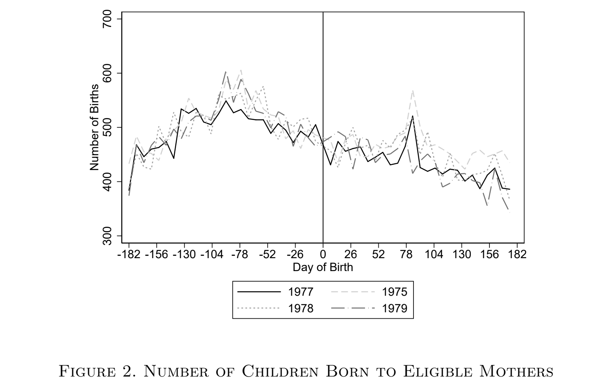

```{r setup, include = FALSE, warning = FALSE, message = FALSE}
options(htmltools.dir.version = FALSE)
knitr::opts_chunk$set(
  message = FALSE,
  warning = FALSE,
  dev = "svg",
  cache = TRUE,
  fig.align = "center"
  #fig.width = 11,
  #fig.height = 5
)

# Load packages
library(tidyverse)
library(pander)
library(ggthemes)
library(gapminder)
library(emo)
library(countdown)
library(xaringanthemer)
library(xaringanExtra)
library(sf)


# countdown style
countdown(
  color_border              = "#dd0747",
  color_text                = "black",
  color_running_background  = "#dd0747",
  color_running_text        = "white",
  color_finished_background = "white",
  color_finished_text       = "#dd0747",
  color_finished_border     = "#dd0747",
  font_size = "2em" 
)


style_xaringan( 
  title_slide_background_color = "#dd0747",
  title_slide_text_color = "white",
  text_color = "black",
  header_color = "#dd0747",
  text_bold_color = "#dd0747",
  text_slide_number_color = "black",
  code_inline_background_color = "#e0e1df",
  base_font_size = "24px",
  text_font_family = "Palatino",
  header_font_family = "Palatino",
  header_h1_font_size = "45px",
  header_h2_font_size = "35px",
  header_h3_font_size = "28px",
  inverse_background_color = "#f8cdda",
  inverse_text_color = "black",
  inverse_header_color = "#dd0747")

# Theme with only x and y axis ans names
theme_minimum = theme_bw() + 
  theme(
  text = element_text(family = "Palatino"),
  line = element_blank(),  # Masquer toutes les lignes par défaut
  rect = element_blank(),  # Masquer tous les rectangles par défaut
  axis.line = element_line(color = "black"),  # Afficher les lignes des axes
  axis.ticks = element_blank(),  # Masquer les ticks des axes
  plot.title = element_blank(),  # Masquer le titre du graphique
  panel.background = element_blank(),  # Masquer le fond du panneau
  panel.grid.major = element_blank(),  # Masquer la grille principale
  panel.grid.minor = element_blank(),  # Masquer la grille secondaire
  plot.background = element_blank(),  # Masquer le fond du graphique
  legend.position = "none"  # Masquer la légende
)

# A blank theme for ggplot
theme_empty = theme_bw() + 
  theme(
  text = element_text(family = "Palatino"),
  line = element_blank(),  # Masquer toutes les lignes par défaut
  rect = element_blank(),  # Masquer tous les rectangles par défaut
  axis.line = element_line(color = "black"),  # Afficher les lignes des axes
  axis.ticks = element_blank(),  # Masquer les ticks des axes
  axis.text = element_blank(),  # Masquer les étiquettes des axes
  axis.title = element_text(size = 12),  # Afficher les titres des axes
  plot.title = element_blank(),  # Masquer le titre du graphique
  panel.background = element_blank(),  # Masquer le fond du panneau
  panel.grid.major = element_blank(),  # Masquer la grille principale
  panel.grid.minor = element_blank(),  # Masquer la grille secondaire
  plot.background = element_blank(),  # Masquer le fond du graphique
  legend.position = "none"  # Masquer la légende
)


```

layout: true


---
# 1. Intuition

De nombreux traitements sont définis selon une **règle/un seuil**. 

Par exemple:
- le revenu à partir duquel un individu peut bénéficier d'une prestation sociale
- l'âge d'entrée à l'école, âge légal pour avoir droit de vote, consommer de l'alcool (majorité)
- moyenne au bac requise pour pouvoir candidater à certaines écoles


La régression sur discontinuité, ou ***Regression Discontinuity Design***, exploite ce(s) seuil(s) pour estimer l'effet causal du traitement.

Intuition: **exogeneité locale**
- les individus proches du seuil sont raisonnablement comparables
- cependant ceux au dessus du seuil sont traîtés alors que ceux en dessous ne le sont pas
- la discontinuité crée une **quasi-expérience** au voisinage du seuil de discontinuité 
  - autour du seuil, l'allocation au traitement est *as good as random*


---
# 1. Intuition

### Formellement

Si l'on revient au framework des outcomes potentiels:

$$Y_i = Y_{1i} D_i + Y_{0i}(1-D_i)$$
<span style="color:#33B8FF"> ***Running/Forcing variable***</span>: variable sur laquelle s'applique le critère de traitement.


---
# 2. Sharp RDD

## 2.1. Définition de l'estimateur

La probabilité pour l'individu $i$ d'être traîté passe de 0 à 1 au seuil de discontinuité $c$:

$$D_i = \mathbb{1}\{X_i \ge c\}$$
<span style="color:#9933FF"> **Hypothèse d'identification: $\color{#9933FF}{\mathbb{E}(Y_{1i} | X_i = x)}$ et $\color{#9933FF}{\mathbb{E}(Y_{0i} | X_i = x)}$ sont continues en $\color{#9933FF}{x}$**</span> 

L'estimateur de l'effet causal du traitement $D_i$ sur $Y_i$ revient alors à comparer la moyenne de l'outcome $Y_i$ de part et d'autre du seuil $c$:

$$\begin{align} \tau_{\text{RDD}}^{\text{sharp}} &= \underset{x \rightarrow c^{+}}{\text{lim}} \mathbb{E}(Y_i | X_i = x) - \underset{x \rightarrow c^{-}}{\text{lim}} \mathbb{E}(Y_i | X_i = x) \\  &= \underset{x \rightarrow c^{+}}{\text{lim}} \mathbb{E}(\color{#dd0747}{Y_{1i}} | X_i = x) - \underset{x \rightarrow c^{-}}{\text{lim}} \mathbb{E}(\color{#dd0747}{Y_{0i}} | X_i = x) \end{align}$$

L'estimateur $\tau_{\text{RDD}}^{\text{sharp}}$ est un estimateur local de l'effet moyen du traitement (***LATE***).


---
# 2. Sharp RDD

## 2.2. En pratique


<span style="color:#33B8FF"> ***Bandwith***</span>: .


---
# 2. Sharp RDD

## 2.3. Example 1

<span style="color:#dd0747">**Bütikofer, A., Riise, J., & M. Skira, M. (2021)**</span>. *The impact of paid maternity leave on maternal health*. AEJ: Economic Policy

**Motivation**:
- Peu d'évidence sur les effets du congé maternité rémunéré sur la santé mentale des mères... alors même que c'est la première jsutification de l'existence de ce congé
- Effet ambigü:
  - Effets positifs si l'emploi augmente le stress ou réduit le temps que la femme consacre à s'occuper d'elle-même et à se remettre des effets physiques de l'accouchement   
  - Effets négatifs si cela permet à la mère d'avoir davantage d'interractions sociales et cela augmente le revenu

**Contexte**:
- Introduction d'un congé payé maternité en Norvège, au 1er Juillet 1977
  - avant la réforme, aucun congé rémunéré; seulement 12 semaines de congé non rémunérés
  - après la réforme:  4 mois de congés payés et à 12 mois de congés non rénumérés
  
  
**Question de recherche**: quel effet l'introduction du congé payé a t-elle eu sur la santé mentale des mères ?
  
---
# 2. Sharp RDD

## 2.3. Example 1

<span style="color:#dd0747">**Bütikofer, A., Riise, J., & M. Skira, M. (2021)**</span>. *The impact of paid maternity leave on maternal health*. AEJ: Economic Policy

**Question**: pourquoi ne peut-on pas simplement comparer la santé mentale moyenne des mères ayant recours au congé maternité et celle des mères n'y ayant pas recours?

--

**Endogeneité**
- certaines caractéristiques inobservables peuvent affecter à la fois le recours au congé maternité et la santé mentale des mères
- causalité inversée: si la santé mentale des mères impacte le recours au congé maternité


---
# 2. Sharp RDD

## 2.3. Example 1

<span style="color:#dd0747">**Bütikofer, A., Riise, J., & M. Skira, M. (2021)**</span>. *The impact of paid maternity leave on maternal health*. AEJ: Economic Policy

**Stratégie d'identification**: Regression Discontinuity Design!!

**Question**: quelle est la running variable? quel est le seuil? 

--
- Date de naissance de l'enfant
- 1er juillet 1977

Les mères ayant accouché de leur enfant **avant le 1er juillet 1977** ne bénéficient pas de l'introduction du congé maternité rémunéré. Celles ayant accouché **le 1er juillet 1977 ou après** peuvent en bénéficier.


---
# 2. Sharp RDD

## 2.3. Example 1

<span style="color:#dd0747">**Bütikofer, A., Riise, J., & M. Skira, M. (2021)**</span>. *The impact of paid maternity leave on maternal health*. AEJ: Economic Policy

**Stratégie d'identification**: Regression Discontinuity Design!!

**Question**: quelles sont les hypothèses d'identification?

--
- **Pas de manipulation de la running variable**: ici, cela signifie que les mères ne peuvent pas stratégiquement choisir d'accoucher avant ou après le 1er juillet 1977   
- **Continuité de la running variable au point de discontinuité**: ici, cela signifie que le nombre de naissances est continu au point de discontinuité    

---
# 2. Sharp RDD

## 2.3. Example 1

<span style="color:#dd0747">**Bütikofer, A., Riise, J., & M. Skira, M. (2021)**</span>. *The impact of paid maternity leave on maternal health*. AEJ: Economic Policy

.pull-left[
```{r, echo=FALSE, out.width="100%"}
knitr::include_graphics("imgs/bütikofer_et_al_2021_eligibility.png")
```
]

.pull-right[
```{r, echo=FALSE, out.width="100%"}

```
]


---
# 2. Sharp RDD

## 2.3. Example 1

<span style="color:#dd0747">**Bütikofer, A., Riise, J., & M. Skira, M. (2021)**</span>. *The impact of paid maternity leave on maternal health*. AEJ: Economic Policy

.center[
```{r, echo=FALSE, out.width="45%"}
knitr::include_graphics("imgs/bütikofer_et_al_2021_covariates.png")
```
]

---
# 2. Sharp RDD

## 2.3. Example 1

<span style="color:#dd0747">**Bütikofer, A., Riise, J., & M. Skira, M. (2021)**</span>. *The impact of paid maternity leave on maternal health*. AEJ: Economic Policy

<div style="display: flex; justify-content: space-around;">

  
  
  

</div>

---
# 2. Sharp RDD

## 2.3. Example 2

<span style="color:#dd0747">**Canaan, S. (2022)** </span>. *Parental leave, household specialization and children’s well-being*. Labour Economics.

  - Impact de l'allongement de la durée du congé parental en France en 1994: allocation mensuelle pouvant aller jusqu'aux trois ans de l'enfant
    - avant réforme, parents éligibles à partir du 3ème enfant
    - après la réforme, parents éligibles à partir du 2ème enfant 
    - $\simeq$ augmentation de la durée du congé parental de 3 ans   
    
  - Effets :
    - Négatifs sur l'emploi des mères: éloignées plus longtemps du marché du travail et baisse du salaire 
    - Négatifs la spécialization des tâches au sein du ménage: les hommes ne prennent pas ce congé parental et travaillent davantage
    - Négatifs sur le développement verbal des enfants


---
# 3. Fuzzy RDD


---
background-color: #f2c394
# Recap: Regression Discontinuity Design (RDD)

**Data**: Données observationnelles 

<span style="color:#9933FF">**Hypothèse d'identification**:  </span>
- <span style="color:#9933FF"> Intuition: allocation aléatoire du statut de traitement </span>
- <span style="color:#9933FF"> Formellement: $\color{#9933FF}{(Y_{1i}, Y_{0i}) \perp D_i}$ </span>

**Modèle**: pour tout individu $i$,
$$Y_i = \alpha + \delta D_i + \varepsilon$$

**Estimateur de l'effet du traitement**:
- Différence entre l'outcome moyen du groupe des individus traîtés et celui du groupe de contrôle
- $\hat{\delta} = \mathbb{E}(Y_i | D_i = 1) - \mathbb{E}(Y_i | D_i = 0)$

**Implémentation sur `R`**: 
- Balancing Tests: 
- Estimation de l'effet du traitement: `lm(y ~ D, data = data)`


---
# Sources

[Causal inference: The Mixtape, Scott Cunningham](https://mixtape.scunning.com/06-regression_discontinuity)    


---

## Introduction to RDD
- RDD exploits a threshold-based assignment rule for treatment.
- Often used when treatment is assigned based on a continuous variable.
- Observations close to the threshold are comparable.

---

## Key Assumptions
- **Continuity assumption**: The potential outcomes would be smooth in the absence of treatment.
- **No manipulation**: No strategic behavior around the threshold.

---

## Estimation Methods
- Compare outcomes just below and above the threshold.
- Local linear regression is commonly used.

---

## Sharp vs. Fuzzy RDD
- **Sharp RDD**: Treatment is perfectly assigned at the threshold.
- **Fuzzy RDD**: Probability of treatment increases at the threshold but is not guaranteed.

---

## Common Pitfalls
- Misspecification of the functional form.
- Data manipulation around the cutoff.
- Incorrect bandwidth choice.

---

## Practical Applications
- Educational interventions, social programs, and political studies.

---

## Conclusion
- RDD provides causal estimates in a non-experimental setting when correctly implemented.