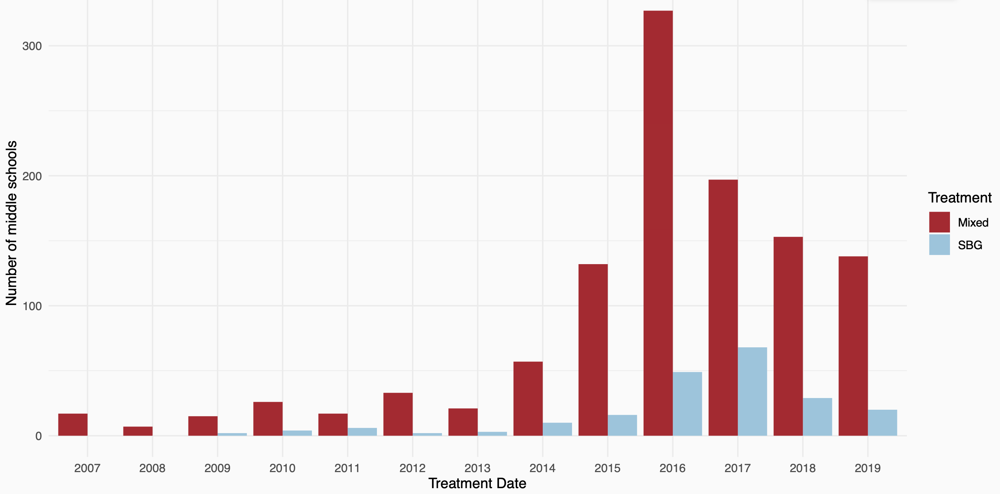
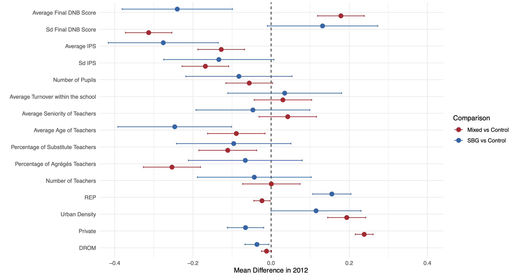
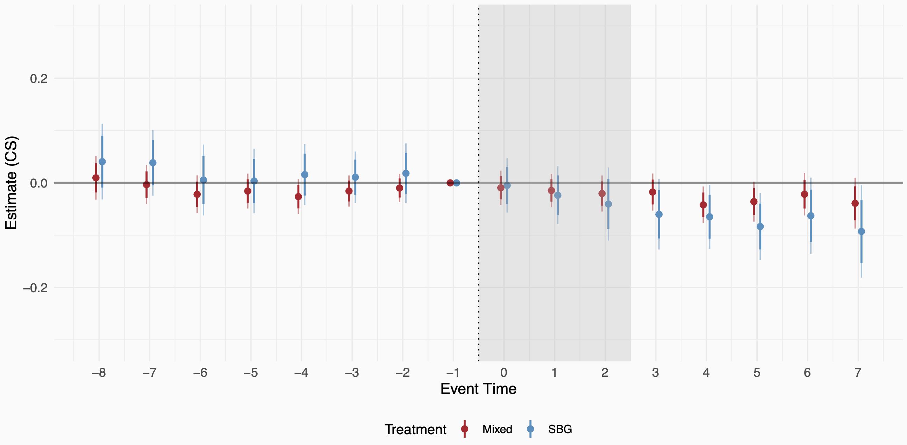
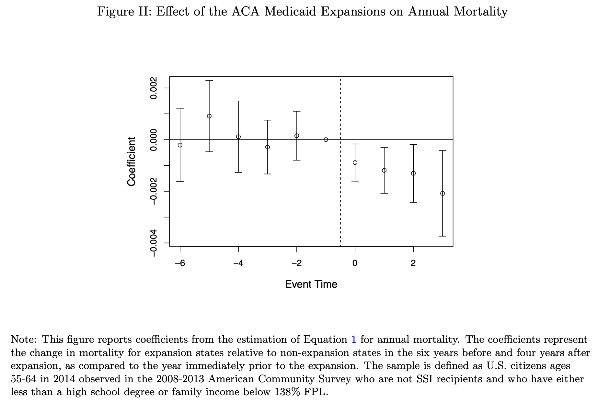

```{r setup, include = FALSE, warning = FALSE, message = FALSE}
options(htmltools.dir.version = FALSE)
knitr::opts_chunk$set(
  message = FALSE,
  warning = FALSE,
  dev = "svg",
  cache = TRUE,
  fig.align = "center"
  #fig.width = 11,
  #fig.height = 5
)

# Load packages
library(tidyverse)
library(pander)
library(ggthemes)
library(gapminder)
library(emo)
library(countdown)
library(xaringanthemer)
library(xaringanExtra)
library(sf)
library(fixest)


style_xaringan( 
  title_slide_background_color = "#dd0747",
  title_slide_text_color = "white",
  text_color = "black",
  header_color = "#dd0747",
  text_bold_color = "#dd0747",
  text_slide_number_color = "black",
  code_inline_background_color = "#e0e1df",
  base_font_size = "24px",
  text_font_family = "Palatino",
  header_font_family = "Palatino",
  header_h1_font_size = "45px",
  header_h2_font_size = "35px",
  header_h3_font_size = "28px",
  inverse_background_color = "#f8cdda",
  inverse_text_color = "black",
  inverse_header_color = "#dd0747")

# Theme with only x and y axis ans names
theme_minimum = theme_bw() + 
  theme(
  text = element_text(family = "Palatino"),
  line = element_blank(),  # Masquer toutes les lignes par défaut
  rect = element_blank(),  # Masquer tous les rectangles par défaut
  axis.line = element_line(color = "black"),  # Afficher les lignes des axes
  axis.ticks = element_blank(),  # Masquer les ticks des axes
  plot.title = element_blank(),  # Masquer le titre du graphique
  panel.background = element_rect(fill = "#FAFAFA", color = "#FAFAFA"), # Masquer le fond du panneau
  panel.grid.major = element_blank(),  # Masquer la grille principale
  panel.grid.minor = element_blank(),  # Masquer la grille secondaire
  plot.background = element_rect(fill = "#FAFAFA", color = "#FAFAFA"), # Masquer le fond du graphique
  legend.position = "none"  # Masquer la légende
)

# A blank theme for ggplot
theme_empty = theme_bw() + 
  theme(
  text = element_text(family = "Palatino"),
  line = element_blank(),  # Masquer toutes les lignes par défaut
  rect = element_blank(),  # Masquer tous les rectangles par défaut
  axis.line = element_line(color = "black"),  # Afficher les lignes des axes
  axis.ticks = element_blank(),  # Masquer les ticks des axes
  axis.text = element_blank(),  # Masquer les étiquettes des axes
  axis.title = element_text(size = 12),  # Afficher les titres des axes
  plot.title = element_blank(),  # Masquer le titre du graphique
  panel.background = element_rect(fill = "#FAFAFA", color = "#FAFAFA"), # Masquer le fond du panneau
  panel.grid.major = element_blank(),  # Masquer la grille principale
  panel.grid.minor = element_blank(),  # Masquer la grille secondaire
  plot.background = element_rect(fill = "#FAFAFA", color = "#FAFAFA"), # Masquer le fond du graphique
  legend.position = "none"  # Masquer la légende
)

#npx decktape \
# --url-load-timeout=60000 --page-load-timeout=60000 --buffer-timeout=60000 \
# --chrome-arg="--disable-web-security" --chrome-arg="--allow-file-access-from-files" \
# "file:///Users/florentineoliveira/Desktop/Teaching/CPES/pratiques-de-la-recherche/Lecture 6/lecture_6_fr.html" \
# "/Users/florentineoliveira/Desktop/Teaching/CPES/pratiques-de-la-recherche/Lecture 6/lecture_6_fr.pdf"

```

layout: true

---


&nbsp;

Les méthodes abordées précédemment (régression OLS simple, variable instrumentale) concernaient des données en **coupe instantanée** (*cross-section*) ou des échantillons répétés dans le temps (*repeated cross-section*) sans suivi individuel

&nbsp;

Cette séance: données de panel   
  - Effets fixes individus (très rapidement)   
  - Méthode des doubles différences   


---
# Données de Pannel et Effet Fixe Individu

&nbsp;

Dans un jeu de données de panel, on observe:
- de multiples observations $t$ (année, trimestre, etc)
- pour de multiples individus $i$ 

Le modèle de régression devient alors, pour tout <span style="color:#27b072">individu</span> $\color{#27b072}{i}$ et <span style="color:#9e5188">période</span> $\color{#9e5188}{t}$:

$$y_{\color{#27b072}{i} \color{#9e5188}{t}} = \alpha + \beta D_{\color{#27b072}{i} \color{#9e5188}{t}} + \varepsilon_{\color{#27b072}{i} \color{#9e5188}{t}}$$
où:
- $y_{it}$ est l'outcome d'intérêt
- $D_{it}$ le traitement qui vaut 1 si l'individu $i$ est traité, 0 sinon
- $\varepsilon_{it}$ le terme d'erreur


---
# Effet fixe

En incluant un **effet fixe individu** dans notre modèle de régression, on contrôle par tous les facteurs individuels **constants au cours du temps**, à la fois observables et <span style="color:#dd0747">**non-observables**</span>

  $\implies$ on utilise la variation intra-individuelle (variation pour un même individu dans le temps, *within*).

Le modèle s'écrit:
$$y_{it} = \alpha + \beta D_{it} + \color{#dd0747}\alpha_{\color{#27b072}{i}} +  \varepsilon_{it}$$

---
# Exemple: effet de la taille de la ville sur le salaire

&nbsp;
  
Quel est l'effet de la taille de la ville sur le salaire (*urban wage premium*) ? 

--

Pourquoi ne peut-on pas déduire l'effet de la taille de la ville en comparant le salaire des individus qui vivent en ville au salaire des individus qui vivent dans des zones peu densément peuplées?

--

**Endogeneous sorting**: le lieu d'habitation n'est pas aléatoire (eg: les individus les plus diplômés choisissent souvent de vivre dans de grandes villes!)

--

**Solution**: Effet fixe individu! Cela veut dire que l'on exploite pour l'identification la variation de lieu de résidence individuelle, autrement dit uniquement sur les individus qui sont amenés à déménager (*movers*).

--

**Problème**: les effets fixes individu ne nous permettent pas de contrôler pour les caractéristiques des individus qui varient dans le temps...


---
# Méthode des Doubles Différences

&nbsp;

Méthode des doubles-différences s'appuie sur des **expériences naturelles**, i.e. une politique ou un changement institutionnel qui induit un traitement pour un groupe donné à un moment précis

&nbsp;

Contrairement aux "vraies expériences" où les groupes de contrôle et de traitement sont constitués par assignation aléatoire, les groupes sont déterminées par le changement de politique particulier.

&nbsp;

Les données de panel et la méthode des DiD permettent de tenir compte de cette sélection sur des caractéristiques non-observables, à condition que ces <span style="color:#dd0747">**caractéristiques soient constantes dans le temps**</span>


---
# Intuition

&nbsp;


Si, avant la mise en place du traitement, le groupe d'individus traités et contrôles diffèrent, cela est probablement en partie dû à des éléments non observés (biais de sélection)

  $\implies$ on utilise cette différence pré-traitement comme référence pour "corriger" le biais initial

&nbsp;

--

On compare donc la différence entre les deux groupes (première différence), avant et après traitement (deuxième différence).

  - en soustrayant la différence initiale, on obtient l'effet 'net' du traitement
  
&nbsp;

  
Cela suppose que l’**hypothèse de tendance parallèle** est valable: en l’absence de politique (traitement), l’écart entre les deux groupes serait resté constant dans le temps.


---
# Estimation  

Supposons qu'il y a:      
- $t$ périodes $\in \{1,T\}$   
- un groupe d'individus $i \in [\![1;n]\!]$ traités $D_i = 1$, et non traités $D_i = 0$   
- les individus sont traités en $g_i$   

&nbsp;

Si $T=n=2$, le modèle s'écrit: 

$$Y_{it} = \alpha + \color{#dd0747}{\beta_{DiD}} (D_i \times Post_{t}) + \delta D_i + \eta Post_t + \varepsilon_{it}$$
Généralisation d'un modèle à plusieurs périodes:

$$Y_{it} = \color{#dd0747}{\beta^{TWFE}} D_{it} + \delta_i + \gamma_t +  \varepsilon_{it}$$
avec $D_{it} = \mathbb{1}\{t \ge g_i\}$


---
# Hypothèses d'identification

<span style="color:#9933FF"> **Parallel trends**</span> 
- <span style="color:#9933FF">En l'absence de traitement, l'outcome moyen des individus traités aurait évolué de la même manière que celui des individus non traités</span> 
- <span style="color:#9933FF"> Formellement,</span>  $\color{#9933FF}{\underbrace{\mathbb{E}[Y_{i2}(0) - Y_{i1}(0) | D_i = 1 ]}_{\text{Changement de Y(0) pour les traités}}  =  \underbrace{ \mathbb{E}[Y_{i2}(0) - Y_{i1}(0) | D_i = 0]}_{\text{Changement de Y(0) pour les contrôles}}}$ 
- <span style="color:#9933FF"> Ou encore,</span>  $\color{#9933FF}{\underbrace{\mathbb{E}[Y_{i2}(0) | D_i = 1 ] - \mathbb{E}[Y_{i2}(0) | D_i = 0 ]}_{\text{Biais de sélection en période 2}}  =  \underbrace{\mathbb{E}[Y_{i1}(0) | D_i = 1 ] - \mathbb{E}[Y_{i1}(0) | D_i = 0 ]}_{\text{Biais de sélection en période 1}}}$ 


<span style="color:#9933FF"> **Absence d'anticipation**</span> 
- <span style="color:#9933FF">Le traitement n'a pas d'effet causal avant qu'il ne soit implanté</span> 
- <span style="color:#9933FF"> Formellement,</span>  $\color{#9933FF}{Y_{i1}(1) = Y_{i1}(0)}$ 


---
# Event Study

On peut aussi estimer un effet dynamique, par période relative à l'adoption du traitement:

$$Y_{it} = \sum_{k \neq -1} \color{#dd0747}{\beta_{k}} \mathbb{1}\{k = t - g_i \} + \delta_i + \gamma_t + \varepsilon_{it}$$

où $k = t - g_i$ est le **temps relatif à l'adoption** (*time to treatment*)

&nbsp;

Pour <span style="color:#dd0747">**tester les tendances parallèles**</span>, on vérifie que pur $k < -1$, le traitement n'est pas encore actif $\hat{\beta}_k \approx 0$

Les coefficients $\hat{\beta}_k$ permettent d'<span style="color:#dd0747">**estimer la dynamique de l'effet**</span>: pour $k \geq 0$, $\hat{\beta}_k$ capture l'effet du traitement $k$ périodes après l'adoption

NB: La période $k = -1$ est normalisée à zéro par construction (catégorie de référence)


**Implémentation sur `R`** : `feols(y ~ i(time_to_treat, ref = -1) | id + year, data = data)`

---
# Traitement à adoption différé et effets hétérogènes

La littérature sur les DiD est très active ces dernières années et a notamment permis de montrer

- La **décomposition de l’estimateur TWFE** en une moyenne pondérée des effets de traitement deux à deux (Goodman-Bacon, 2021)

&nbsp;

--

- Les problèmes liés à l'utilisation de l'estimateur TWFE lorsque l'adoption du traitement est différée et que les effets sont hétérogènes, et les **estimateurs permettant de corriger ces biais**
  - de Chaisemartin and d'Hautefeuille (2020), package R `DIDmultiplegtDYN`
  - Callaway and Sant'Anna (2021), package R `did`
  - Sun and Abraham (2020), `sunab()` argument in `fixest`
  - Borusyak, Jaravel and Spiess (2024), package R `didimputation`
  
&nbsp;

--

- Les méthodes permettant de gérer des traitements dits *non-absorbing* 


---
# Exemple: les collèges sans note

```{r, echo=FALSE,  fig.height=20, fig.width=13, out.width="90%"}

```


---
# Exemple: les collèges sans note

```{r, echo=FALSE, fig.height=16, fig.width=10, out.width="90%"}

```

---
# Exemple: les collèges sans note

```{r, echo=FALSE, fig.height=20, fig.width=13, out.width="90%"}

```


---
class: clearinverse
background-color: #f19bb5

&nbsp;

# Application 1: Card and Krueger (1994)


**Question de Recherche**: quel est l'effet causal d'une augmentation du salaire minimum sur le taux d'emploi?

--

**Question**: pourquoi ne peut-on pas simplement comparer le taux de chômage de deux états ayant des niveaux de salaire minimum différents?      

--

**Biais de sélection/OVB**: 

  
--

<span style="color:#dd0747">**Angrist et Krueger (1994)**</span>
- expérience naturelle: augmentation du salaire minimum dans le New Jersey au 1er Avril 1992 de \$4,25 à \$5,05 par heure
- focus sur l'industrie des fast-foods
- comparaison avec l'état de Pennsylvanie


```{r, include = F}

#codebook = readLines("data/codebook")
#
#varnames = codebook %>% 
#  enframe(name = NULL, value = "var") %>%  
#  slice(8:59) %>%                         
#  slice(-c(5, 6, 13, 14, 32, 33)) %>%     
#  mutate(var = str_sub(var, 1, 13),   
#         var = str_squish(var),        
#         var = str_to_lower(var)) %>%     
#  pull(var)    
#
#df = read_table2("data/public.dat", col_names = F) %>% 
#  select(-X47) %>% 
#  setNames(varnames) %>% 
#  mutate_all(as.numeric) %>% 
#  mutate(sheet = as.character(sheet))
#
#saveRDS(df, "data/ck1994.rds")

df = readRDS("data/ck1994.rds")

```

---
class: clearinverse
background-color: #f19bb5

&nbsp;

# Application 1: Card and Krueger (1994)

1) Importez les données sur `R`et stockez dans `df`. Créer les variables:
  - `fte_before` (équivalent temps-plein)  `= empft + nmgrs + (0.5*emppt)`  
  - `fte_after = empft2 + nmgrs2 + (0.5*emppt2)`  
  - Ré-encoder `state` de pour que ce soit égal à Pennsylvanie si state = 0 et New Jersey si state = 1  
  
2) Pourquoi s'intéresser à l'industrie des fast-food, et à quel effet s'attend-t-on?  
  
3) Calculer le nombre moyen d'employés en équivalent temps-plein par store dans chaque état, avant et après la réforme, et l'évolution de cette moyenne. Interpréter.

4) Calculer la différence de changement d'heures entre New Jersey et Pennsylvanie. Interprétez.

5) Proposez un modèle économétrique qui estime l'effet du traitement.


---
exclude: true
class: clearinverse
background-color: #fbe6ec

&nbsp;

# Solution : Card and Krueger (1994)

1) Importez les données sur `R`et stockez dans `df`. Créer les variables:
  - `fte_before` (équivalent temps-plein)  `= empft + nmgrs + (0.5*emppt)`
  - `fte_after = empft2 + nmgrs2 + (0.5*emppt2)`
  - Ré-encoder `state` de pour que sa valeur soit "Pennsylvanie" si state = 0 et "New Jersey" si state = 1


```{r, echo = T}

df = readRDS("data/ck1994.rds") %>% 
  mutate(fte_before = empft + nmgrs + (0.5*emppt),
         fte_after = empft2 + nmgrs2 + (0.5*emppt2),
         state = ifelse(state == 0, "Pennsylvanie", "New Jersey"))

```

---
exclude: true
class: clearinverse
background-color: #fbe6ec

&nbsp;

# Solution : Card and Krueger (1994)

2) **Pourquoi s'intéresser à l'industrie des fast-food**, et à quel effet s'attend-t-on?  

--

- Secteur dont une forte proportion de travailleurs est rémunérée au salaire minimum $\implies$ terrain d'observation idéal pour étudier l'effet d'une augmentation du salaire minimum.

--

- Marché très concurrentiel: les fast-foods présentent des caractéristiques homogènes en termes de produits et de processus, ce qui permet de réduire les variations non liées au salaire minimum et d'isoler plus clairement l'effet de la politique salariale.

---
exclude: true
class: clearinverse
count:false
background-color: #fbe6ec

&nbsp;

# Solution : Card and Krueger (1994)

2) Pourquoi s'intéresser à l'industrie des fast-food, et **à quel effet s'attend-t-on? ** 

--

- Secteur dont une forte proportion de travailleurs est rémunérée au salaire minimum $\implies$ terrain d'observation idéal pour étudier l'effet d'une augmentation du salaire minimum.

--

- Marché très concurrentiel: les fast-foods présentent des caractéristiques homogènes en termes de produits et de processus, ce qui permet de réduire les variations non liées au salaire minimum et d'isoler plus clairement l'effet de la politique salariale.

--

Théoriquement, on s'attend à un effet négatif:
- une hausse du coût de la main d’oeuvre $\implies$ 


---
exclude: true
class: clearinverse
background-color: #fbe6ec

&nbsp;

# Solution : Card and Krueger (1994)

3) Calculer le nombre moyen d'employés en équivalent temps-plein par store dans chaque état, avant et après la réforme, et l'évolution de cette moyenne. Interpréter.


```{r, echo = T}

df %>% 
  group_by(state) %>% 
  summarise(mean_before = mean(fte_before, na.rm = T),
            mean_after = mean(fte_after, na.rm = T)) %>% 
  ungroup() %>% 
  mutate(diff = mean_after - mean_before)

```

---
exclude: true
class: clearinverse
background-color: #fbe6ec

&nbsp;

# Solution : Card and Krueger (1994)

4) Calculer la différence de changement d'heures entre New Jersey et Pennsylvanie. Interprétez.

`0.59 − (−2.17) = 2.76`


--

5) Proposez un modèle économétrique qui estime l'effet du traitement.


$$FTE = \alpha + \beta \;\text{New Jersey}_{i} + \delta \; \text{Post April 1st 1992}_{t} + \gamma \;({\text{New Jersey}_i \;\times \; \text{Post April 1st 1992}_t }) + \varepsilon_{it}$$


---
class: clearinverse
background-color: #f19bb5

&nbsp;

# Application 2: Medicaid Expansion

Exemple tiré du site interractif de reproduction des résultats de Difference-in-Differences Designs: A Practitioner's Guide, Baker, Callaway, Cunningham and Goodman-Bacon (JEL) [https://psantanna.com/JEL-DiD/markdown/R_Stata/Code_Appendix.html#introduction]

--

**Contexte** : l'Affordable Care Act (ACA) a permis aux états américains d'étendre leur programme Medicaid
- L'adoption est **échelonnée** (*staggered*) : certains états adoptent en 2014, d'autres en 2015, 2016, etc
- Les états non-adoptants servent de groupe contrôle

**Outcome** : taux de mortalité brut pour les 20-64 ans (`crude_rate_20_64`)

**Question de recherche** : l'expansion Medicaid a-t-elle réduit la mortalité ?


---
class: clearinverse
background-color: #f19bb5

&nbsp;

# Application 2: Medicaid Expansion

**Partie 1 — Préparation des données**

1) Importez les données (`county_mortality_data_cleaned.rds`) et stockez dans `data`. Créez les variables suivantes :
   - `treat` : vaut 1 si l'état a adopté Medicaid avant 2019 ou en 2019, 0 sinon
   - `treat_year` : année d'adoption de l'état, égal à 0 si jamais adoptant ou adoptant après 2019
   - `time_to_treat` : nombre d'années par rapport à l'adoption ( $= t - g$ ), égal à $-\infty$ pour les non-adoptants
   - `post` : vaut 1 si l'année de traitement est supérieure ou égale à 2014, 0 sinon

2) Tracez l'évolution du taux de mortalité moyen au cours du temps selon le groupe de traitement. Que remarquez-vous ?
  - *Hints: utiliser la variable `crude_rate_20_64` et les poids `set_wt`*

---
class: clearinverse
background-color: #f19bb5

&nbsp;

# Application 2: Medicaid Expansion

**Partie 2 — DiD 2×2 de référence**

3) Restreignez l'échantillon aux comtés des états adoptant en **2014** et des états **jamais adoptants**. Appelez ce sous-échantillon `data_2x2`.

4) Sur `data_2x2`, calculez le taux de mortalité moyen par groupe (adoptants 2014 / non-adoptants) et par période (avant 2014 / après 2014). Calculez l'estimateur DiD 2×2 à la main puis par régression OLS avec `feols()`. Interprétez.


&nbsp;

**Partie 3 — Estimation TWFE sur toutes les cohortes**

5) Sur l'ensemble des données `data`, estimez le TWFE suivant avec `feols()`. Interprétez.

6) Réalisez une **event-study** en estimant : `crude_rate_20_64 ~ i(time_to_treat, ref = -1) | county_code + year`
   Représentez graphiquement les coefficients $\hat{\beta}_k$ avec leurs intervalles de confiance à 95%.   
   Que nous apprend ce graphique sur l'hypothèse de tendances parallèles ? Sur l'effet du traitement?


---
class: clearinverse
background-color: #fbe6ec

&nbsp;

# Solution: Medicaid Expansion

1) Importez les données (`county_mortality_data_cleaned.rds`) et stockez dans `data`. Créez les variables suivantes :
   - `treat` : vaut 1 si l'état a adopté Medicaid avant 2019 ou en 2019, 0 sinon
   - `treat_year` : année d'adoption de l'état, égal à 0 si jamais adoptant ou adoptant après 2019
   - `time_to_treat` : nombre d'années par rapport à l'adoption ( $= t - g$ ), égal à $-\infty$ pour les non-adoptants
   - `post` : vaut 1 si l'année de traitement est supérieure ou égale à 2014, 0 sinon
   
```{r, include = T, echo = T,  fig.show = 'hide'}

data = readRDS("data/county_mortality_data_cleaned.rds") %>%
  mutate(treat = ifelse(!is.na(yaca) & yaca <= 2019, 1, 0),
         treat_year = ifelse(!is.na(yaca) & yaca <= 2019, yaca, 0),
         time_to_treat = ifelse(treat == 1, year - treat_year, -Inf),
         post = ifelse(year >= 2014, 1, 0))
  
```


---
count: false
class: clearinverse
background-color: #fbe6ec

&nbsp;

# Solution: Medicaid Expansion

1) Importez les données (`county_mortality_data_cleaned.rds`) et stockez dans `data`. Créez les variables suivantes :
   - **`treat` : vaut 1 si l'état a adopté Medicaid avant 2019 ou en 2019, 0 sinon**
   - `treat_year` : année d'adoption de l'état, égal à 0 si jamais adoptant ou adoptant après 2019
   - `time_to_treat` : nombre d'années par rapport à l'adoption ( $= t - g$ ), égal à $-\infty$ pour les non-adoptants
   - `post` : vaut 1 si l'année de traitement est supérieure ou égale à 2014, 0 sinon
   
```{r, include = T, echo = T,  fig.show = 'hide'}

data = readRDS("data/county_mortality_data_cleaned.rds") %>%
  mutate(treat = ifelse(!is.na(yaca) & yaca <= 2019, 1, 0), #<<
         treat_year = ifelse(!is.na(yaca) & yaca <= 2019, yaca, 0),
         time_to_treat = ifelse(treat == 1, year - treat_year, -Inf),
         post = ifelse(year >= 2014, 1, 0))
  
```


---
count: false
class: clearinverse
background-color: #fbe6ec

&nbsp;

# Solution: Medicaid Expansion

1) Importez les données (`county_mortality_data_cleaned.rds`) et stockez dans `data`. Créez les variables suivantes :
   - `treat` : vaut 1 si l'état a adopté Medicaid avant 2019 ou en 2019, 0 sinon
   - **`treat_year` : année d'adoption de l'état, égal à 0 si jamais adoptant ou adoptant après 2019**
   - `time_to_treat` : nombre d'années par rapport à l'adoption ( $= t - g$ ), égal à $-\infty$ pour les non-adoptants
   - `post` : vaut 1 si l'année de traitement est supérieure ou égale à 2014, 0 sinon
   
```{r, include = T, echo = T,  fig.show = 'hide'}

data = readRDS("data/county_mortality_data_cleaned.rds") %>%
  mutate(treat = ifelse(!is.na(yaca) & yaca <= 2019, 1, 0),
         treat_year = ifelse(!is.na(yaca) & yaca <= 2019, yaca, 0), #<<
         time_to_treat = ifelse(treat == 1, year - treat_year, -Inf),
         post = ifelse(year >= 2014, 1, 0))
  
```


---
count: false
class: clearinverse
background-color: #fbe6ec

&nbsp;

# Solution: Medicaid Expansion

1) Importez les données (`county_mortality_data_cleaned.rds`) et stockez dans `data`. Créez les variables suivantes :
   - `treat` : vaut 1 si l'état a adopté Medicaid avant 2019 ou en 2019, 0 sinon
   - `treat_year` : année d'adoption de l'état, égal à 0 si jamais adoptant ou adoptant après 2019
   - **`time_to_treat` : nombre d'années par rapport à l'adoption ( $= t - g$ ), égal à $-\infty$ pour les non-adoptants**
   - `post` : vaut 1 si l'année de traitement est supérieure ou égale à 2014, 0 sinon
   
```{r, include = T, echo = T,  fig.show = 'hide'}

data = readRDS("data/county_mortality_data_cleaned.rds") %>%
  mutate(treat = ifelse(!is.na(yaca) & yaca <= 2019, 1, 0),
         treat_year = ifelse(!is.na(yaca) & yaca <= 2019, yaca, 0),
         time_to_treat = ifelse(treat == 1, year - treat_year, -Inf), #<<
         post = ifelse(year >= 2014, 1, 0))
  
```

---
count: false
class: clearinverse
background-color: #fbe6ec

&nbsp;

# Solution: Medicaid Expansion

1) Importez les données (`county_mortality_data_cleaned.rds`) et stockez dans `data`. Créez les variables suivantes :
   - `treat` : vaut 1 si l'état a adopté Medicaid avant 2019 ou en 2019, 0 sinon
   - `treat_year` : année d'adoption de l'état, égal à 0 si jamais adoptant ou adoptant après 2019
   - `time_to_treat` : nombre d'années par rapport à l'adoption ( $= t - g$ ), égal à $-\infty$ pour les non-adoptants
   - **`post` : vaut 1 si l'année de traitement est supérieure ou égale à 2014, 0 sinon**
   
```{r, include = T, echo = T,  fig.show = 'hide'}

data = readRDS("data/county_mortality_data_cleaned.rds") %>%
  mutate(treat = ifelse(!is.na(yaca) & yaca <= 2019, 1, 0),
         treat_year = ifelse(!is.na(yaca) & yaca <= 2019, yaca, 0),
         time_to_treat = ifelse(treat == 1, year - treat_year, -Inf),
         post = ifelse(year >= 2014, 1, 0)) #<<
  
```

---
class: clearinverse
background-color: #fbe6ec

&nbsp;

# Solution: Medicaid Expansion

2) Tracez l'évolution du taux de mortalité moyen au cours du temps selon le groupe de traitement. Que remarquez-vous ?
  - *Hints: utiliser la variable `crude_rate_20_64` et les poids `set_wt`*


```{r, echo = TRUE, fig.show='hide'}
data %>% 
  mutate(treat_year = ifelse(treat_year == 0, "Counties non adoptants", as.character(treat_year))) %>% 
  group_by(treat_year, year) %>% 
  summarize(mortality = weighted.mean(crude_rate_20_64, set_wt)) %>% 
  ggplot(aes(x = year, y = mortality, group = as.factor(treat_year), color = as.factor(treat_year))) + 
  geom_point(size = 2) + geom_line(linewidth = 1) + 
  scale_color_manual(values = c("#7C7189", "#D04E59", "#BC8E7D", "#2F3D70", "#CABEE9")) + 
  scale_x_continuous(breaks = 2009:2019) + 
  labs(x = "", y = "Mortalité (20-64) \n pour 100,000 habitants") + 
  theme(legend.position = 'bottom',
        axis.title.y = element_text(hjust = 0.5, vjust = 0.5, angle = 360),
        strip.text = element_text(size = 14),
        panel.border = element_rect(color = "black", fill = NA, linewidth = 1),
        legend.title = element_blank(),
        panel.background = element_rect(fill = "#FAFAFA", color = "#FAFAFA"),
        plot.background = element_rect(fill = "#FAFAFA", color = "#FAFAFA"),
        axis.title = element_text(size = 12),
        axis.text = element_text(size = 10)) 
```


---
count: false
class: clearinverse
background-color: #fbe6ec

&nbsp;

# Solution: Medicaid Expansion

2) Tracez l'évolution du taux de mortalité moyen au cours du temps selon le groupe de traitement. Que remarquez-vous ?
  - *Hints: utiliser la variable `crude_rate_20_64` et les poids `set_wt`*


```{r, echo = F, fig.height = 5, fig.width = 12, out.width= '90%'}
data %>% 
  mutate(treat_year = ifelse(treat_year == 0, "Counties non adoptants", as.character(treat_year))) %>% 
  group_by(treat_year, year) %>% 
  summarize(mortality = weighted.mean(crude_rate_20_64, set_wt)) %>% 
  ggplot(aes(x = year, y = mortality, group = as.factor(treat_year), color = as.factor(treat_year))) + 
  geom_point(size = 2) + geom_line(linewidth = 1) + 
  scale_color_manual(values = c("#7C7189", "#D04E59", "#BC8E7D", "#2F3D70", "#CABEE9")) + 
  scale_x_continuous(breaks = 2009:2019) + 
  labs(x = "", y = "Mortalité (20-64) \n pour 100,000 habitants") + 
  theme(legend.position = 'bottom',
        axis.title.y = element_text(hjust = 0.5, vjust = 0.5, angle = 360),
        strip.text = element_text(size = 14),
        panel.border = element_rect(color = "black", fill = NA, linewidth = 1),
        legend.title = element_blank(),
        panel.background = element_rect(fill = "#FAFAFA", color = "#FAFAFA"),
        plot.background = element_rect(fill = "#FAFAFA", color = "#FAFAFA"),
        axis.title = element_text(size = 12),
        axis.text = element_text(size = 10)) 
```


---
class: clearinverse
background-color: #fbe6ec

&nbsp;

# Solution: Medicaid Expansion

3) Restreignez l'échantillon aux comtés des états adoptant en **2014** et des états **jamais adoptants**. Appelez ce sous-échantillon `data_2x2`.

4) Sur `data_2x2`, calculez le taux de mortalité moyen par groupe (adoptants 2014 / non-adoptants) et par période (avant 2014 / après 2014). Calculez l'estimateur DiD 2×2 à la main puis par régression OLS avec `feols()`. Interprétez.


```{r, echo = T}

data_2x2 = data %>% 
  filter(treat_year %in% c(0, 2014)) 

did = data_2x2 %>% 
  group_by(treat_year, post) %>%
  summarise(mortality = weighted.mean(crude_rate_20_64, set_wt)) %>%
  ungroup() 

did_estimate = (did[did$treat_year == 2014 & did$post == 1, "mortality"] -  did[did$treat_year == 2014 & did$post == 0, "mortality"]) - 
  (did[did$treat_year == 0 & did$post == 1, "mortality"] - did[did$treat_year == 0 & did$post == 0, "mortality"])

did_estimate_ols = summary(feols(crude_rate_20_64 ~ treat*post, data = data_2x2, weights = ~set_wt))$coeftable["treat:post", "Estimate"]

```

---
class: clearinverse
background-color: #fbe6ec

&nbsp;

# Solution: Medicaid Expansion

5) Sur l'ensemble des données `data`, estimez le TWFE suivant avec `feols()`. Interprétez.

```{r, echo = T}

data$post_all = ifelse(data$treat == 1 & data$year >= data$treat_year, 1, 0)

twfe = feols(crude_rate_20_64 ~ post_all | county_code + year, data = data, weights = ~ as.numeric(set_wt), cluster = ~ county_code)
 
etable(twfe)

```

---
class: clearinverse
background-color: #fbe6ec

&nbsp;

# Solution: Medicaid Expansion

6) Réalisez une **event-study** en estimant : `crude_rate_20_64 ~ i(time_to_treat, ref = -1) | county_code + year`
   Représentez graphiquement les coefficients $\hat{\beta}_k$ avec leurs intervalles de confiance à 95%.   
   Que nous apprend ce graphique sur l'hypothèse de tendances parallèles ? Sur l'effet du traitement?

```{r, echo = T}

es = feols(crude_rate_20_64 ~ i(time_to_treat, treat, ref = -1) | county_code + year, data = data, weights = ~ set_wt, cluster = ~ county_code) 

coefs_es = broom::tidy(es, conf.int = TRUE) %>%
    filter(str_detect(term, "time_to_treat")) %>%
    mutate(k = as.numeric(str_extract(term, "-?[0-9]+"))) %>%
    bind_rows(tibble(k = -1, estimate = 0, conf.low = 0, conf.high = 0)) %>%
    arrange(k)

ggplot(coefs_es, aes(x = k, y = estimate)) +
    geom_hline(yintercept = 0, linetype = "dashed", color = "gray50", linewidth = 0.8) +
    geom_vline(xintercept = -0.5, linetype = "dotted", color = "gray50", linewidth = 0.8) +
    geom_ribbon(aes(ymin = conf.low, ymax = conf.high),
                fill = "#f8cdda", alpha = 0.6) +
    geom_line(color = "#D04E59", linewidth = 1) +
    geom_point(color = "#D04E59", size = 2.5) +
    geom_point(data = filter(coefs_es, k == -1),
               shape = 21, fill = "white", color = "#D04E59", size = 3) +
    scale_x_continuous(breaks = seq(-10, 5, by = 1)) +
    labs(
        x = "Années par rapport à l'adoption (k)",
        y = "Coefficient estimé\n(pour 100 000)"
    ) +
    theme_bw() +
    theme(
        text             = element_text(family = "Palatino"),
        panel.grid.minor = element_blank(),
        panel.grid.major = element_line(color = "gray90"),
        axis.title.y     = element_text(hjust = 0.5, vjust = 0.5)
    )

```

---
class: clearinverse
background-color: #fbe6ec

&nbsp;

# Solution: Medicaid Expansion

6) Réalisez une **event-study** en estimant : `crude_rate_20_64 ~ i(time_to_treat, ref = -1) | county_code + year`
   Représentez graphiquement les coefficients $\hat{\beta}_k$ avec leurs intervalles de confiance à 95%.   
   Que nous apprend ce graphique sur l'hypothèse de tendances parallèles ? Sur l'effet du traitement?

```{r, echo = F, fig.height = 5, fig.width = 12, out.width= '90%'}

coefs_es = broom::tidy(es, conf.int = TRUE) %>%
    filter(str_detect(term, "time_to_treat")) %>%
    mutate(k = as.numeric(str_extract(term, "-?[0-9]+"))) %>%
    bind_rows(tibble(k = -1, estimate = 0, conf.low = 0, conf.high = 0)) %>%
    arrange(k)

ggplot(coefs_es %>% filter(k %in% -5:5), aes(x = k, y = estimate)) +
    geom_hline(yintercept = 0, linetype = "dashed", color = "gray50", linewidth = 0.8) +
    geom_vline(xintercept = -0.5, linetype = "dotted", color = "gray50", linewidth = 0.8) +
    geom_ribbon(aes(ymin = conf.low, ymax = conf.high),
                fill = "#f8cdda", alpha = 0.6) +
    geom_line(color = "#D04E59", linewidth = 1) +
    geom_point(color = "#D04E59", size = 2.5) +
    geom_point(data = filter(coefs_es, k == -1),
               shape = 21, fill = "white", color = "#D04E59", size = 3) +
    scale_x_continuous(breaks = seq(-10, 5, by = 1)) +
    labs(
        x = "Années par rapport à l'adoption (k)",
        y = "Coefficient estimé\n(pour 100 000)"
    ) +
    theme_bw() +
    theme(
        text             = element_text(family = "Palatino"),
        panel.grid.minor = element_blank(),
        panel.grid.major = element_line(color = "gray90"),
        axis.title.y     = element_text(hjust = 0.5, vjust = 0.5)
    )

```


---
# VRAIS effets de l'expansion Medicaid sur la mortalité

&nbsp;

Les estimations obtenues sont purement illustratives:
- nos données agrégées au niveau comté diluent l'effet en incluant des populations non éligibles à Medicaid
- elles couvrent une fenêtre post-traitement trop courte pour que les effets sur la mortalité se matérialisent

--

Miller, Johnson and Wherry (2021, QJE): *individuals in expansion states experienced a 0.132 percentage point decline in annual mortality, a 9.4% reduction over the sample mean, as a result of the Medicaid expansions. The effect is driven by a reduction in disease-related deaths and grows over time.*


---
# Miller et al. (2021, QJE)

```{r, echo=FALSE,  fig.height=20, fig.width=13, out.width="90%"}

```

---
class: clearinverse
background-color: #d7e2d8

&nbsp;

# Recap: Méthode des Doubles Différences

**Data**: Données de pannel 

<span style="color:#9933FF">**Hypothèses d'identification**:  </span>
- <span style="color:#9933FF"> **Parallel Trends**: en l'absence du traitement, les groupes traités et contrôles auraient évolué de manière similaire ( $\color{#9933FF}{\mathbb{E}[Y_{i2}(0) - Y_{i1}(0) | D_i = 1 ]  =  \mathbb{E}[Y_{i2}(0) - Y_{i1}(0) | D_i = 0]}$ ) </span>
- <span style="color:#9933FF"> **Absence d'anticipation**: le traitement n'a pas d'effet avant sa mise en place $\color{#9933FF}{Y_{i1}(1) = Y_{i1}(0)}$ </span>

**Modèle TWFE** : pour tout individu $i$ et période $t$,
$$Y_{it} = \beta D_{it} + \delta_i + \gamma_t +  \varepsilon_{it}$$
**Implémentation sur `R`**:  package `fixest`
- `feols(y ~ i(post, treat, ref = 0) | FE, data = data)`
- de Chaisemartin and d'Hautefeuille (2020), package R `DIDmultiplegtDYN`
- Callaway and Sant'Anna (2021), package R `did`
- Sun and Abraham (2020), `sunab()` argument in `fixest`
- Borusyak, Jaravel and Spiess (2024), package R `didimputation`

---
# Sources

Borusyak, Kirill, Xavier Jaravel, and Jann Spiess, “Revisiting Event Study Designs: Robust and Efficient Estimation,” Review of Economic Studies, 2024        

de Chaisemartin, Clément and Xavier D’Haultfœuille, “Two-Way Fixed Effects Estimators with Heterogeneous Treatment Effects,” American Economic Review, 2020, 110 (9), 2964–2996.        

Callaway, Brantly and Pedro H. C. Sant’Anna, “Difference-in-Differences with Multiple Time Periods,” Journal of Econometrics, 2021, 225 (2), 200–230.        

[Causal inference: The Mixtape, Scott Cunningham](https://mixtape.scunning.com/09-difference_in_differences)      

[Panel Data, Peter Hull](https://uc6f961a8b1db5f4e6a9d3145f01.dl.dropboxusercontent.com/cd/0/inline2/ClZISGT1gPREZxePSa6rQfr-XAhfy0Q8IVCHeATVG8f2W87LH_HjVQZ_dM0m-IZ9tOQesZZMuJwVdafQDGh9Ansuh8sy_JAtUscYNcmz_K6gqdn1WQCVYCBYrXETYtIgusmcYXIPdYYXtnS2NW36vVV3Kgz-O2qNnMEcFxRu4cVRBJoSBlFCczRsbb-8eTi-UVe7BTIfIEp-vaXZbjtQXjDnDm3SBFQMLzb_Fr1aXUE2jQaw-q9wyf_2DCulyA4tis6lNLiYw83QfYn17idCJ7-1rN91csG9usORFbrG6fwVHqou2s0_uNN-VgACuyQMr5QcPecdP7Yym527bzCZgCuOk-u6n7GCQqkp5wlmQeJS4pZDZFfrbuxRcHI6L2ZPdxg/file#)          

[Introduction to DiD with Multiple Time Periods, Callaway and Sant'Anna](https://bcallaway11.github.io/did/articles/multi-period-did.html)       
[Differences-in-Differences, Florian Oswald, Gustave Kennedy, Pierre Villedieu et Mylène Feuillade](https://raw.githack.com/ScPoEcon/ScPoEconometrics-Slides/master/chapter_did/chapter_did.html#1)         

[Interactive reproduction of Difference-in-Differences Designs: A Practitioner's Guide, by Andrew Baker, Brantly Callaway, Scott Cunningham, and Andrew Goodman-Bacon, Journal of Economic Literature](https://psantanna.com/JEL-DiD/markdown/R_Stata/Code_Appendix.html#introduction)          


Sun, Liyan and Sarah Abraham, “Estimating Dynamic Treatment Effects in Event Studies with Heterogeneous Treatment Effects,” Journal of Econometrics, 2021, 225 (2).      


