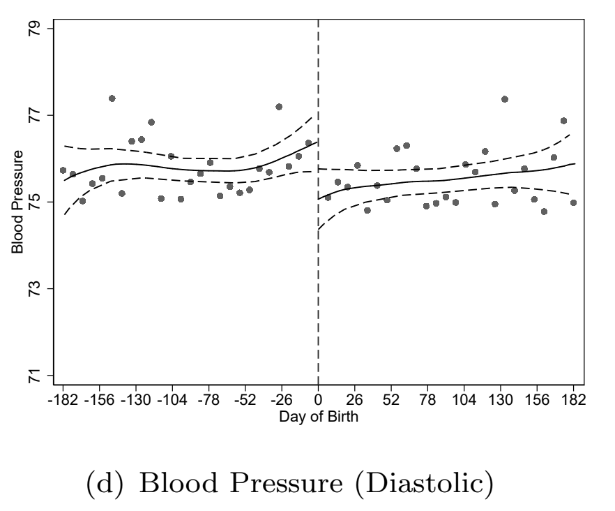

```{r setup, include = FALSE, warning = FALSE, message = FALSE}
options(htmltools.dir.version = FALSE)
knitr::opts_chunk$set(
  message = FALSE,
  warning = FALSE,
  dev = "svg",
  cache = TRUE,
  fig.align = "center"
  #fig.width = 11,
  #fig.height = 5
)

# Load packages
library(tidyverse)
library(pander)
library(ggthemes)
library(gapminder)
library(emo)
library(xaringanthemer)
library(xaringanExtra)
library(sf)


style_xaringan( 
  title_slide_background_color = "#dd0747",
  title_slide_text_color = "white",
  text_color = "black",
  header_color = "#dd0747",
  text_bold_color = "#dd0747",
  text_slide_number_color = "black",
  code_inline_background_color = "#e0e1df",
  base_font_size = "24px",
  text_font_family = "Palatino",
  header_font_family = "Palatino",
  header_h1_font_size = "45px",
  header_h2_font_size = "35px",
  header_h3_font_size = "28px",
  inverse_background_color = "#f8cdda",
  inverse_text_color = "black",
  inverse_header_color = "#dd0747")

# Theme with only x and y axis ans names
theme_minimum = theme_bw() + 
  theme(
  text = element_text(family = "Palatino"),
  line = element_blank(),  # Masquer toutes les lignes par défaut
  rect = element_blank(),  # Masquer tous les rectangles par défaut
  axis.line = element_line(color = "black"),  # Afficher les lignes des axes
  axis.ticks = element_blank(),  # Masquer les ticks des axes
  plot.title = element_blank(),  # Masquer le titre du graphique
  panel.background = element_rect(fill = "#FAFAFA", color = "#FAFAFA"), # Masquer le fond du panneau
  panel.grid.major = element_blank(),  # Masquer la grille principale
  panel.grid.minor = element_blank(),  # Masquer la grille secondaire
  plot.background = element_rect(fill = "#FAFAFA", color = "#FAFAFA"), # Masquer le fond du graphique
  legend.position = "none"  # Masquer la légende
)

# A blank theme for ggplot
theme_empty = theme_bw() + 
  theme(
  text = element_text(family = "Palatino"),
  line = element_blank(),  # Masquer toutes les lignes par défaut
  rect = element_blank(),  # Masquer tous les rectangles par défaut
  axis.line = element_line(color = "black"),  # Afficher les lignes des axes
  axis.ticks = element_blank(),  # Masquer les ticks des axes
  axis.text = element_blank(),  # Masquer les étiquettes des axes
  axis.title = element_text(size = 12),  # Afficher les titres des axes
  plot.title = element_blank(),  # Masquer le titre du graphique
  panel.background = element_rect(fill = "#FAFAFA", color = "#FAFAFA"), # Masquer le fond du panneau
  panel.grid.major = element_blank(),  # Masquer la grille principale
  panel.grid.minor = element_blank(),  # Masquer la grille secondaire
  plot.background = element_rect(fill = "#FAFAFA", color = "#FAFAFA"), # Masquer le fond du graphique
  legend.position = "none"  # Masquer la légende
)


```

layout: true


---
# 1. Intuition et définitions

De nombreux traitements sont définis selon une **règle/un seuil**. 

Par exemple:
- le revenu à partir duquel un individu peut bénéficier d'une prestation sociale
- l'âge d'entrée à l'école, âge légal pour avoir droit de vote, consommer de l'alcool (majorité)
- moyenne au bac requise pour pouvoir candidater à certaines écoles


La régression sur discontinuité, ou ***Regression Discontinuity Design***, exploite ce(s) seuil(s) pour estimer l'effet causal du traitement.

Intuition: <span style="color:#dd0747">**exogeneité locale**</span>
- les individus proches du seuil sont raisonnablement comparables
- cependant ceux au-dessus du seuil sont traîtés alors que ceux en dessous ne le sont pas
- la discontinuité crée une **quasi-expérience** au voisinage du seuil de discontinuité 
  - autour du seuil, l'allocation au traitement est *as good as random*


---
# 1. Intuition & définitions

### Formellement

Si l'on revient au framework des outcomes potentiels:

$$Y_i = Y_{1i} D_i + Y_{0i}(1-D_i)$$

Maintenant, 

$$D_i = \mathbb{1}\{X_i \ge c\}$$

où $X_i$ est appelée <span style="color:#33B8FF"> ***running/forcing variable***</span>, c'est à dire la variable (*continue*) sur laquelle s'applique le critère de sélection dans le traitement.

i.e. la probabilité pour l'individu $i$ d'être traîté passe de 0 à 1 au seuil de discontinuité $c$

Deux types de régressions sur discontinuité:
- **sharp**: la probabilité de traitement devient certaine au seuil $c$ (ex: la consommation légale d'alcool ( $D_i$ ) à partir d'un certain âge ( $X_i$ ))
- **fuzzy**: la probabilité de traitement augmente au seuil $c$ mais ne passe pas nécessairement à 1 (ex:)


---
# 1. Intuition & définitions

&nbsp;

<span style="color:#33B8FF"> ***Bandwith***</span>: intervalle autour du seuil de discontinuité dans lequel on conserve les observations pour estimer l'effet du traitement.      
  $\implies$ Arbitrage:
  - un bandwith trop étroit peut limiter le nombre d'observations
  - un bandwith trop large peut inclure des observations moins comparables


&nbsp;

<span style="color:#33B8FF"> ***Forme fonctionnelle***</span>: désigne la spécification de la relation entre l'outcome et la forcing variable dans le modèle de régression. Elle peut être linéaire, polynomiale, etc.


---
count:false
class: middle, center
background-color: #dd0747

# <span style="color:#FAFAFA;">  2. Sharp RDD</span>


---
# 2. Sharp RDD
## 2.1. Définition de l'estimateur

L'estimateur de l'effet causal du traitement $D_i$ sur $Y_i$ revient alors à comparer la moyenne de l'outcome $Y_i$ de part et d'autre du seuil $c$:

$$\begin{align} \beta_{\text{RDD}}^{\text{sharp}} &= \underset{x \rightarrow c^{+}}{\text{lim}} \mathbb{E}(Y_i | X_i = x) - \underset{x \rightarrow c^{-}}{\text{lim}} \mathbb{E}(Y_i | X_i = x) \\  &= \underset{x \rightarrow c^{+}}{\text{lim}} \mathbb{E}(\color{#9e5188}{Y_{1i}} | X_i = x) - \underset{x \rightarrow c^{-}}{\text{lim}} \mathbb{E}(\color{#27b072}{Y_{0i}} | X_i = x) \end{align}$$

```{r, echo = F, fig.width = 7, fig.height = 3}
y0 <- function(x) 0.7/(1+exp(-3*x))
y1 <- function(x) 0.85/(1+exp(-8*x)) + 0.1

# Simulation
set.seed(123)
srd_df = tibble(
  x = seq(-1,1,0.02),
  y = (x < 0)*y0(x) + (x >= 0)*y1(x) + rnorm(length(x), sd = 0.07)
) %>% mutate(
  y = ifelse(between(y,0,1), y, ifelse(y < 0, 0, 1))
) %>% filter(x != 0)    # Exclure l'observation pile à 0 si besoin

# Graphique de base
gg_srd = ggplot() +
  # Ligne verticale grise au seuil = 0
  geom_vline(xintercept = 0, color = "grey", size = 1, alpha = 0.1) +
  # Personnalisation de l'axe x: on remplace le label "0" par "c"
  scale_x_continuous(
    "Running Variable",
    limits = c(-1, 1),
    breaks = c(-1, -0.5, 0, 0.5, 1),
    labels = c("-1", "-0.5", "c", "0.5", "1")
  ) +
  scale_y_continuous(
    "Outcome",
    limits = c(0,1)
  ) +
  # Nuage de points, colorié différemment selon x<0 ou x>=0
  geom_point(
    data = srd_df, 
    aes(x = x, y = y, color = x >= 0),
    size = 2, alpha = 0.8
  ) +
  scale_color_manual(values = c("#27b072", "#9e5188")) +
  theme_minimum +
  theme(legend.position = "none")

# Régression linéaire avec saut à x=0
lm_tmp = lm(y ~ x + I(x>0), data = srd_df)

# Fonction prédictive
lm_fun = function(x) predict(lm_tmp, newdata = data.frame(x = x))

# Ajout des segments de régression sur le graphique
s6 = gg_srd +
  stat_function(
    fun = lm_fun,
    xlim = c(-1, -0.01),
    color = "#27b072",
    size = 1
  ) +
  stat_function(
    fun = lm_fun,
    xlim = c(0.01, 1),
    color = "#9e5188",
    size = 1
  )

# Pour entourer la discontinuité avec deux cercles,
# on calcule la prédiction juste à gauche et à droite de 0.
y_left  <- lm_fun(-1e-5)  # un tout petit peu à gauche
y_right <- lm_fun(+1e-5)  # un tout petit peu à droite

s7 = s6 +
  geom_point(
    aes(x = 0, y = y_left),
    shape = 21,
    size = 5,       # taille du point
    stroke = 1.2,   # épaisseur du contour
    color = "black",
    fill  = NA      # cercle vide à l'intérieur
  ) +
  # Cercle vide côté droit
  geom_point(
    aes(x = 0, y = y_right),
    shape = 21,
    size = 5,
    stroke = 1.2,
    color = "black",
    fill  = NA
  ) 

# Affichage final
s7
```


---
# 2. Sharp RDD
## 2.1. Définition de l'estimateur

L'estimateur de l'effet causal du traitement $D_i$ sur $Y_i$ revient alors à comparer la moyenne de l'outcome $Y_i$ de part et d'autre du seuil $c$:

$$\begin{align} \beta_{\text{RDD}}^{\text{sharp}} &= \underset{x \rightarrow c^{+}}{\text{lim}} \mathbb{E}(Y_i | X_i = x) - \underset{x \rightarrow c^{-}}{\text{lim}} \mathbb{E}(Y_i | X_i = x) \\  &= \underset{x \rightarrow c^{+}}{\text{lim}} \mathbb{E}(\color{#9e5188}{Y_{1i}} | X_i = x) - \underset{x \rightarrow c^{-}}{\text{lim}} \mathbb{E}(\color{#27b072}{Y_{0i}} | X_i = x) \end{align}$$

```{r, echo = F, fig.width = 7, fig.height = 3}

# Affichage final
s7 +
geom_errorbar(
  data = tibble(x = 0, y0 = lm_fun(-1e-3), y1 = lm_fun(1e-3)),
  aes(x = x, ymin = y0, ymax = y1),
  color = "#dd0747", size = 1, width = 0.07
) +
  annotate("text", 
           x = -0.15, 
           y = (lm_fun(-1e-3) + lm_fun(1e-3)) / 2, 
           label = paste0("β = ", round(lm_fun(1e-3) - lm_fun(-1e-3), 3)), 
           vjust = -1, 
           color = "#dd0747", 
           size = 4)
```


---
# 2. Sharp RDD
## 2.2. Hypothèse d'identification


&nbsp;

<span style="color:#9933FF"> **Hypothèse d'identification: $\color{#9933FF}{\mathbb{E}(Y_{1i} | X_i = x)}$ et $\color{#9933FF}{\mathbb{E}(Y_{0i} | X_i = x)}$ sont continues en $\color{#9933FF}{x}$**</span> 

Donc. $\beta_{\text{RDD}}^{\text{sharp}} =\mathbb{E}(Y_i | X_i = c) - \mathbb{E}(Y_i | X_i = c)  =  \mathbb{E}(\color{#eb9b34}{Y_{1i}} - \color{#aa6ff2}{Y_{0i}} | X_i = c)$

&nbsp;

L'estimateur $\beta_{\text{RDD}}^{\text{sharp}}$ est un estimateur local de l'effet moyen du traitement (***LATE***).

**NB**: on n'a pas fait l'hypothèse ici d'assignation aléatoire du traitement $D_i$ (et donc $X_i$).


---
# 2. Sharp RDD
## 2.3. Exemples

<span style="color:#dd0747">**Bütikofer, A., Riise, J., & M. Skira, M. (2021)**</span>. *The impact of paid maternity leave on maternal health*. AEJ: Economic Policy

**Motivation**:
- Peu d'évidence sur les effets du congé maternité rémunéré sur la santé mentale des mères... alors même que c'est la première justification de l'existence de ce congé
- Effet ambigu:
  - Effets positifs si l'emploi augmente le stress ou réduit le temps que la femme consacre à s'occuper d'elle-même et à se remettre des effets physiques de l'accouchement   
  - Effets négatifs si cela permet à la mère d'avoir davantage d'interactions sociales et cela augmente le revenu

**Contexte**:
- Introduction d'un congé payé maternité en Norvège, au 1er Juillet 1977
  - avant la réforme, aucun congé rémunéré; seulement 12 semaines de congé non rémunérés
  - après la réforme:  4 mois de congés payés et à 12 mois de congés non rémunérés
  
  
**Question de recherche**: quel effet l'introduction du congé payé a t-elle eu sur la santé mentale des mères ?
  
---
# 2. Sharp RDD
## 2.3. Exemples

<span style="color:#dd0747">**Bütikofer, A., Riise, J., & M. Skira, M. (2021)**</span>. *The impact of paid maternity leave on maternal health*. AEJ: Economic Policy

**Question**: pourquoi ne peut-on pas simplement comparer la santé mentale moyenne des mères ayant recours au congé maternité et celle des mères n'y ayant pas recours?

--

**Endogeneité**
- certaines caractéristiques inobservables peuvent affecter à la fois le recours au congé maternité et la santé mentale des mères
- causalité inversée: si la santé mentale des mères impacte le recours au congé maternité


---
# 2. Sharp RDD
## 2.3. Exemples

<span style="color:#dd0747">**Bütikofer, A., Riise, J., & M. Skira, M. (2021)**</span>. *The impact of paid maternity leave on maternal health*. AEJ: Economic Policy

**Stratégie d'identification**: Regression Discontinuity Design!!

**Question**: quelle est la running variable? quel est le seuil? 

--
- Date de naissance de l'enfant
- 1er juillet 1977

Les mères ayant accouché de leur enfant **avant le 1er juillet 1977** ne bénéficient pas de l'introduction du congé maternité rémunéré. Celles ayant accouché **le 1er juillet 1977 ou après** peuvent en bénéficier.


---
# 2. Sharp RDD
## 2.3. Exemples

<span style="color:#dd0747">**Bütikofer, A., Riise, J., & M. Skira, M. (2021)**</span>. *The impact of paid maternity leave on maternal health*. AEJ: Economic Policy

**Stratégie d'identification**: Regression Discontinuity Design!!

**Question**: quelles sont les hypothèses d'identification?

--
- **Pas de manipulation de la running variable**: ici, cela signifie que les mères ne peuvent pas stratégiquement choisir d'accoucher avant ou après le 1er juillet 1977   
- **Continuité de la running variable au point de discontinuité**: ici, cela signifie que le nombre de naissances est continu au point de discontinuité    

---
# 2. Sharp RDD
## 2.3. Exemples

<span style="color:#dd0747">**Bütikofer, A., Riise, J., & M. Skira, M. (2021)**</span>. *The impact of paid maternity leave on maternal health*. AEJ: Economic Policy

.pull-left[
```{r, echo=FALSE, out.width="100%"}
knitr::include_graphics("imgs/bütikofer_et_al_2021_eligibility.png")
```
]

.pull-right[
```{r, echo=FALSE, out.width="100%"}
knitr::include_graphics("imgs/bütikofer_et_al_2021_births.png")
```
]


---
# 2. Sharp RDD
## 2.3. Exemples

<span style="color:#dd0747">**Bütikofer, A., Riise, J., & M. Skira, M. (2021)**</span>. *The impact of paid maternity leave on maternal health*. AEJ: Economic Policy

.center[
```{r, echo=FALSE, out.width="45%"}
knitr::include_graphics("imgs/bütikofer_et_al_2021_covariates.png")
```
]

---
# 2. Sharp RDD
## 2.3. Exemples

<span style="color:#dd0747">**Bütikofer, A., Riise, J., & M. Skira, M. (2021)**</span>. *The impact of paid maternity leave on maternal health*. AEJ: Economic Policy

<div style="display: flex; justify-content: space-around;">

  
  
  

</div>

---
# 2. Sharp RDD
## 2.3. Exemples

<span style="color:#dd0747">**Canaan, S. (2022)** </span>. *Parental leave, household specialization and children’s well-being*. Labour Economics.

  - Impact de l'allongement de la durée du congé parental en France en 1994: allocation mensuelle pouvant aller jusqu'aux trois ans de l'enfant
    - avant réforme, parents éligibles à partir du 3ème enfant
    - après la réforme, parents éligibles à partir du 2ème enfant 
    - $\simeq$ augmentation de la durée du congé parental de 3 ans   
    
  - Effets :
    - Négatifs sur l'emploi des mères: éloignées plus longtemps du marché du travail et baisse du salaire 
    - Négatifs sur la spécialisation des tâches au sein du ménage: les hommes ne prennent pas ce congé parental et travaillent davantage
    - Négatifs sur le développement verbal des enfants

---
# 2. Sharp RDD
## 2.4. Estimation sur `R`

**Étape 1**: centrer la *running variable*
  - $\tilde{X}_i = X_i - c$

**Étape 2**: choisir le modèle à estimer
- Linéaire avec pentes communes: $Y_i = \alpha + \beta D_i + \delta \tilde{X}_i + \varepsilon_i$
- Linéaire avec pentes différentes: $Y_i = \alpha + \beta  (D_i \times  \tilde{X}_i) + \delta \tilde{X}_i + \eta D_i + \varepsilon_i$
- Quadratique: $Y_i = \alpha + \beta D_i + \delta \tilde{X}_i + \lambda \tilde{X}_i^2 +  \eta (D_i \times  \tilde{X}_i) + \nu (D_i \times  \tilde{X}_i)^2 + \varepsilon_i$

---
# 2. Sharp RDD
## 2.5. Importance de la forme fonctionnelle

```{r, echo = F, cache = T, fig.width = 9, fig.height = 4.5, run = F}
#y0 <- function(x) 0.7/(1+exp(-3*x))
#y1 <- function(x) 0.85/(1+exp(-8*x)) + 0.1
##gg_df <- data.frame(x = c(-1,1))
#
#set.seed(123)
#srd_df = tibble(
#  x = seq(-1,1,0.02),
#  y = (x < 0)*y0(x) + (x >= 0)*y1(x) + rnorm(length(x), sd = 0.07)) %>% 
#  mutate(y = ifelse(between(y,0,1), y, ifelse(y < 0, 0, 1))) %>% 
#  filter(x != 0)
#
#gg_srd = ggplot() +
#geom_vline(xintercept = 0, color = "grey", size = 1, alpha = 0.1) +
#scale_x_continuous(
#  "Running Variable",
#  limits = c(-1,1),
#  breaks = c(-1, -0.5, 0, 0.5, 1),  
#  labels = c("-1", "-0.5", "c", "0.5", "1") 
#) +
#scale_y_continuous(
#  "Outcome",
#  limits = c(0,1),
#  #labels = scales::percent_format(accuracy = 1)
#) +
#geom_point(
#  data = srd_df, 
#  aes(x = x, y = y, color = x >= 0),
#  size = 2, alpha = 0.8
#) +
#scale_color_manual(values = c("#27b072", "#9e5188")) +
#theme_minimum +
#theme(legend.position = "none")
```


$$Y_i = \alpha + \color{#dd0747}{\beta} D_i + \delta \tilde{X}_i + \varepsilon_i$$

```{r, echo = F, cache = T, fig.width = 9, fig.height = 4.5}
#lm_tmp = lm(y ~ x + I(x>0), data = srd_df)
#lm_fun = function(x) predict(lm_tmp, data.frame(x = x))
#
#s6 = gg_srd +
#stat_function(
#  #data = data.frame(x = c(-1, 1)),
#  #aes(x = x),
#  fun = lm_fun,
#  xlim = c(-1,-0.02),
#  color = "#27b072",
#  size = 1
#) +
#stat_function(
#  #data = data.frame(x = c(-1, 1)),
#  #aes(x = x),
#  fun = lm_fun,
#  xlim = c(0.02,1),
#  color = "#9e5188",
#  size = 1
#)
s6
```

---
# 2. Sharp RDD
## 2.5. Importance de la forme fonctionnelle


$$Y_i = \alpha + \color{#dd0747}{\beta} D_i + \delta \tilde{X}_i + \varepsilon_i$$


```{r, echo = F, cache = T, fig.width = 9, fig.height = 4.5}
s6 +
geom_errorbar(
  data = tibble(x = 0, y0 = lm_fun(-1e-3), y1 = lm_fun(1e-3)),
  aes(x = x, ymin = y0, ymax = y1),
  color = "#dd0747", size = 1, width = 0.07
) +
  annotate("text", 
           x = -0.15, 
           y = (lm_fun(-1e-3) + lm_fun(1e-3)) / 2, 
           label = paste0("β = ", round(lm_fun(1e-3) - lm_fun(-1e-3), 3)), 
           vjust = -1, 
           color = "#dd0747", 
           size = 4)
```


---
# 2. Sharp RDD
## 2.5. Importance de la forme fonctionnelle


$$Y_i = \alpha + \color{#dd0747}{\beta} D_i + \delta \tilde{X}_i + \varepsilon_i$$

```{r, echo = F, cache = T, fig.width = 9, fig.height = 4.5}
lm_tmp = lm(y ~ x + I(x>0), data = srd_df %>% filter(abs(x) < 0.5))
lm_fun = function(x) predict(lm_tmp, data.frame(x = x))
gg_srd +
stat_function(
  data = data.frame(x = c(-1, 1)),
  aes(x = x),
  fun = lm_fun,
  xlim = c(-0.5,-0.02),
  color = "#27b072",
  size = 1
) +
stat_function(
  data = data.frame(x = c(-1, 1)),
  aes(x = x),
  fun = lm_fun,
  xlim = c(0.02,0.5),
  color = "#9e5188",
  size = 1
) +
geom_errorbar(
  data = tibble(x = 0, y0 = lm_fun(-1e-3), y1 = lm_fun(1e-3)),
  aes(x = x, ymin = y0, ymax = y1),
  color = "#dd0747", size = 1, width = 0.07
) +
  annotate("text",
    x = -0.15,
    y = (lm_fun(-1e-3) + lm_fun(1e-3)) / 2,
    label = paste0("β = ", round(lm_fun(1e-3) - lm_fun(-1e-3), 3)),
    vjust = -1,
    color = "#dd0747",
    size = 4)
```


---
# 2. Sharp RDD
## 2.5. Importance de la forme fonctionnelle


$$Y_i = \alpha + \color{#dd0747}{\beta} (D_i \times \tilde{X}_i) + \delta \tilde{X}_i + \eta D_i + \varepsilon_i$$

```{r, echo = F, cache = T, fig.width = 9, fig.height = 4.5}
lm_tmp = lm(y ~ x * I(x>0), data = srd_df %>% filter(abs(x) < 0.5))
lm_fun = function(x) predict(lm_tmp, data.frame(x = x))
gg_srd +
stat_function(
  data = data.frame(x = c(-1, 1)),
  aes(x = x),
  fun = lm_fun,
  xlim = c(-0.5,-0.02),
  color = "#27b072",
  size = 1
) +
stat_function(
  data = data.frame(x = c(-1, 1)),
  aes(x = x),
  fun = lm_fun,
  xlim = c(0.02,0.5),
  color = "#9e5188",
  size = 1
) +
geom_errorbar(
  data = tibble(x = 0, y0 = lm_fun(-1e-3), y1 = lm_fun(1e-3)),
  aes(x = x, ymin = y0, ymax = y1),
  color = "#dd0747", size = 1, width = 0.07
) +
  annotate("text",
           x = -0.15,
           y = (lm_fun(-1e-3) + lm_fun(1e-3)) / 2,
           label = paste0("β = ", round(lm_fun(1e-3) - lm_fun(-1e-3), 3)),
           vjust = -1,
           color = "#dd0747",
           size = 4,
           inherit.aes = FALSE)
```


---
# 2. Sharp RDD
## 2.5. Importance de la forme fonctionnelle


$$Y_i = \alpha + \color{#dd0747}{\beta} (D_i \times \tilde{X}_i) + \delta \tilde{X}_i + \eta D_i + \varepsilon_i$$

```{r, echo = F, cache = T, fig.width = 9, fig.height = 4.5}
lm_tmp = lm(y ~ x * I(x>0), data = srd_df %>% filter(abs(x) < 0.25))
lm_fun = function(x) predict(lm_tmp, data.frame(x = x))
gg_srd +
stat_function(
  data = data.frame(x = c(-1, 1)),
  aes(x = x),
  fun = lm_fun,
  xlim = c(-0.25,-0.02),
  color = "#27b072",
  size = 1
) +
stat_function(
  data = data.frame(x = c(-1, 1)),
  aes(x = x),
  fun = lm_fun,
  xlim = c(0.02,0.25),
  color = "#9e5188",
  size = 1
) +
geom_errorbar(
  data = tibble(x = 0, y0 = lm_fun(-1e-3), y1 = lm_fun(1e-3)),
  aes(x = x, ymin = y0, ymax = y1),
  color = "#dd0747", size = 1, width = 0.07
) +
  annotate("text",
           x = -0.15,
           y = (lm_fun(1e-3) + lm_fun(-1e-3)) / 2,
           label = paste0("β = ", round(lm_fun(1e-3) - lm_fun(-1e-3), 3)),
           vjust = -1,
           color = "#dd0747",
           size = 4,
           inherit.aes = FALSE)
```


---
# 2. Sharp RDD
## 2.5. Importance de la forme fonctionnelle


$$Y_i = \alpha + \beta D_i + \delta \tilde{X}_i + \lambda \tilde{X}_i^2 +  \eta (D_i \times  \tilde{X}_i) + \nu (D_i \times  \tilde{X}_i)^2 + \varepsilon_i$$


```{r, echo = F, cache = T, fig.width = 9, fig.height = 4.5}
lm_tmp = lm(y ~ poly(x,2) * I(x>0), data = srd_df %>% filter(abs(x) < 0.5))
lm_fun = function(x) predict(lm_tmp, data.frame(x = x))
gg_srd +
stat_function(
  data = data.frame(x = c(-1, 1)),
  aes(x = x),
  fun = lm_fun,
  xlim = c(-0.5,-0.02),
  color = "#27b072",
  size = 1
) +
stat_function(
  data = data.frame(x = c(-1, 1)),
  aes(x = x),
  fun = lm_fun,
  xlim = c(0.02,0.5),
  color = "#9e5188",
  size = 1
) +
geom_errorbar(
  data = tibble(x = 0, y0 = lm_fun(-1e-3), y1 = lm_fun(1e-3)),
  aes(x = x, ymin = y0, ymax = y1),
  color = "#dd0747", size = 1, width = 0.07
) +
  annotate("text",
           x = -0.15,
           y = (lm_fun(1e-3) + lm_fun(-1e-3)) / 2,
           label = paste0("β = ", round(lm_fun(1e-3) - lm_fun(-1e-3), 3)),
           vjust = -1,
           color = "#dd0747",
           size = 4,
           inherit.aes = FALSE)
```


---
# 2. Sharp RDD
## 2.5. Importance de la forme fonctionnelle


$$Y_i = \alpha + \beta D_i + \delta \tilde{X}_i + \lambda \tilde{X}_i^2 +  \eta (D_i \times  \tilde{X}_i) + \nu (D_i \times  \tilde{X}_i)^2 + \varepsilon_i$$

```{r, echo = F, cache = T, fig.width = 9, fig.height = 4.5}
lm_tmp = lm(y ~ poly(x,2) * I(x>0), data = srd_df)
lm_fun = function(x) predict(lm_tmp, data.frame(x = x))
gg_srd +
stat_function(
  data = data.frame(x = c(-1, 1)),
  aes(x = x),
  fun = lm_fun,
  xlim = c(-1,-0.02),
  color = "#27b072",
  size = 1
) +
stat_function(
  data = data.frame(x = c(-1, 1)),
  aes(x = x),
  fun = lm_fun,
  xlim = c(0.02,1),
  color = "#9e5188",
  size = 1
) +
geom_errorbar(
  data = tibble(x = 0, y0 = lm_fun(-1e-3), y1 = lm_fun(1e-3)),
  aes(x = x, ymin = y0, ymax = y1),
  color = "#dd0747", size = 1, width = 0.07
) +
  annotate("text",
           x = -0.15,
           y = (lm_fun(-1e-3) + lm_fun(1e-3)) / 2,
           label = paste0("β = ", round(lm_fun(1e-3) - lm_fun(-1e-3), 3)),
           vjust = -1,
           color = "#dd0747",
           size = 4,
           inherit.aes = FALSE)
```


---
background-color: #f19bb5
# Application: Carpenter and Dobkin (2011)

**Question de Recherche**: quel est l'effet causal de la consommation d'alcool sur la mortalité des jeunes?

--

**Question**: pourquoi ne peut-on pas simplement comparer?      

--

**Biais de sélection/OVB**: 
- tout ce qui n'est pas observable et qui impacte à la fois la consommation d'alcool et la mortalité
  
--

<span style="color:#dd0747">**Carpenter and Dobkin (2011)**</span>: utilisent l'âge minimum légal à partir duquel un individu est autorisé à consommer de l'alcool (MLDA: Minimum Legal Drinking Age)

**Contexte**: US
  - MLDA: 21 ans

**Importer les données**:  

```{r, include = T, echo =T}
library(masteringmetrics)
data("mlda", package = "masteringmetrics")
```

---
background-color: #f19bb5
# Application: Carpenter and Dobkin (2011)

```{r, echo = F}
head(mlda)
```


---
background-color: #f19bb5
# Application: Carpenter and Dobkin (2011)

1) Quelle est la running variable? Quel est le seuil? Quelle est l'hypothèse d'identification?

2) Construisez la variable `above21` qui vaut 1 pour toutes les classes d'âge $\ge 21$

3) Représenter graphiquement l'évolution **linéraire et quadratique** de la mortalité liée aux accidents de la route (variable `mva`) et de la mortalité globale (`all`) autour du seuil de discontinuité. *Hint: utilisez les commandes `geom_smooth()` de `ggplot` pour tracer des droites de régressions sur un graphique et `poly(x,2)` pour un polynôme de degré 2 de la variable $x$*.

4) **Pour le prochain cours**: Estimez l'effet d'atteindre le MLDA sur la mortalité globale (linéaire avec pente identique, linéaire avec pente différente, et quadratique).


---
background-color: #fbe6ec
# Solution : Carpenter and Dobkin (2011)

1) Quelle est la **running variable**? Quel est le seuil? Quelle est l'hypothèse d'identification?

--

**Running Variable**: Age


---
count:false
background-color: #fbe6ec
# Solution : Carpenter and Dobkin (2011)

1) Quelle est la running variable? Quel est le **seuil**? Quelle est l'hypothèse d'identification?


**Running Variable**: Age

--

**Seuil**: 21 ans


---
count:false
background-color: #fbe6ec
# Solution : Carpenter and Dobkin (2011)

1) Quelle est la running variable? Quel est le seuil? Quelle est l'**hypothèse d'identification**?


**Running Variable**: Age


**Seuil**: 21 ans

--

**Hypothèse d'identification**: Autour du seuil, l'allocation du traitement est *as good as random*, i.e. les individus autour du seuil de leur 21ème anniversaire, ne diffèrent en moyenne que de par leur accès ou on à l'alcool


---
background-color: #f19bb5
# Application: Carpenter and Dobkin (2011)

2) Construisez la variable `above21` qui vaut 1 pour toutes les classes d'âge $\ge 21$

```{r, echo = T}
mlda = mlda %>% 
  mutate(above21 = ifelse(agecell >= 21, 1, 0))

```


---
background-color: #f19bb5
# Application: Carpenter and Dobkin (2011)

```{r, echo = T, fig.width = 7, fig.height = 3}

mlda %>%
  ggplot(aes(x = agecell, y = mva)) +
  geom_point() +
  geom_smooth(aes(group = above21), se = FALSE, method = "lm", formula = y ~ poly(x, 2)) +
  geom_smooth(aes(group = above21), se = FALSE, method = "lm", formula = y ~ x, color = "black") +
  geom_vline(xintercept = 21, color = "#dd0747", linetype = "dotted", linewidth = 1) +
  labs(y = "Motor Vehicle Accidents Mortality rate (per 100,000)", x = "Age") +
  theme_minimum
```


---
background-color: #f19bb5
# Application: Carpenter and Dobkin (2011)

```{r, echo = T, fig.width = 7, fig.height = 3}  
mlda %>%
  ggplot(aes(x = agecell, y = all)) +
  geom_point() +
  geom_smooth(aes(group = above21), se = FALSE, method = "lm", formula = y ~ poly(x, 2)) +
  geom_smooth(aes(group = above21), se = FALSE, method = "lm", formula = y ~ x, color = "black") +
  geom_vline(xintercept = 21, color = "#dd0747", linetype = "dotted", linewidth = 1) +
  labs(y = "Mortality rate (per 100,000)", x = "Age") +
  theme_minimum
```

---
count:false
class: middle, center
background-color: #dd0747

# <span style="color:#FAFAFA;">  3. Fuzzy RDD</span>


---
# 3. Fuzzy RDD

Les **fuzzy RDD** exploitent un changement discontinu dans l'assignation au traitement $D_i$ au seuil de $c$.

Contrairement au *sharp* RDD où la probabilité d'être traité passe de 0 à 1 lorsque *X_i* passe le seuil de discontinuité $c$, dans un cas de *fuzzy* RDD, la probabilité de traitement est continue au voisinage de $c$: 

$$0 < \underset{x \rightarrow c^{+}}{\text{lim}} \mathbb{P}(D_i = 1 | X_i = x) - \underset{x \rightarrow c^{-}}{\text{lim}} \mathbb{P}(D_i = 1 | X_i = x) < 1$$
On a maintenant deux effets lorsque $X_i$ franchit le seuil $c$:

1. L'effet sur l'**outcome**: $\underset{x \rightarrow c^{+}}{\text{lim}} \mathbb{E}(Y_i| X_i = x) - \underset{x \rightarrow c^{-}}{\text{lim}} \mathbb{E}(Y_i | X_i = x)$

2. L'effet sur la **probabilité de traitement**: $\underset{x \rightarrow c^{+}}{\text{lim}} \mathbb{E}(D_i| X_i = x) - \underset{x \rightarrow c^{-}}{\text{lim}} \mathbb{E}(D_i | X_i = x)$

L'estimateur de l'effet du traitement dans le cas d'une *fuzzy* RDD est donc:

$$ \beta_{\text{RDD}}^{\text{fuzzy}} = \frac{\underset{x \rightarrow c^{+}}{\text{lim}} \mathbb{E}(Y_i| X_i = x) - \underset{x \rightarrow c^{-}}{\text{lim}} \mathbb{E}(Y_i | X_i = x)}{\underset{x \rightarrow c^{+}}{\text{lim}} \mathbb{E}(D_i| X_i = x) - \underset{x \rightarrow c^{-}}{\text{lim}} \mathbb{E}(D_i | X_i = x)}$$
---
# 3. Fuzzy RDD


La formule de l’estimateur nous rappelle...

--

Celle de l'estimateur IV! Ici, l'instrument $Z_i = 1\{{X_i \ge c}\}$!!

--

&nbsp;

<span style="color:#dd0747">**Angrist, J. and Lavy, V. (1999)**</span>. *Using Maimonides' rule to estimate the effect of class size on scholastic achievement*. QJE


- Règle de Maïmonide: en Israël, règle stipulant qu’au-delà de 40 élèves par classe, l’école doit scinder la classe en deux
  $\implies$ crée une discontinuité dans la taille des classes dès que la taille des classes dépasse 40 élèves, 80 élèves, 120 élèves.

- En pratique : la règle n’est pas toujours appliquée de manière stricte (certaines écoles de petite taille n’ont pas les moyens matériels de scinder la classe, d’autres peuvent décider de scinder avant d’atteindre 40 élèves)
  $\implies$ le fait d’être au-dessus du seuil de 40 élèves augmente fortement la probabilité que la classe soit effectivement scindée **mais ne passe pas de 0 à 1**
 

---
background-color: #d7e2d8
# Recap: Regression Discontinuity Design (RDD)

**Data**: Données observationnelles 

<span style="color:#9933FF">**Hypothèse d'identification**:  </span>
- <span style="color:#9933FF"> Intuition: individus comparables autour du seuil de discontinuité </span>
- <span style="color:#9933FF"> Formellement: $\color{#9933FF}{\mathbb{E}(Y_{1i} | X_i = x) \text{ et } \mathbb{E}(Y_{0i} | X_i = x) \text{ sont continues en } x}$ </span>

**Modèle Sharp RDD**: pour tout individu $i$,
$$Y_i = \alpha + \beta D_i + \delta \tilde{X}_i + \varepsilon_i \quad \text{où} \quad D_i = \mathbb{1}\{X_i \geq c\}$$

**Estimateur de l'effet du traitement**:
- Différence entre les valeurs prédites juste au-dessus et juste en-dessous du seuil
- $\hat{\beta}_{\text{RDD}}^{\text{sharp}} = \underset{x \rightarrow c^{+}}{\text{lim}} \mathbb{E}(Y_i | X_i = x) - \underset{x \rightarrow c^{-}}{\text{lim}} \mathbb{E}(Y_i | X_i = x)$

**Implémentation sur `R`**: 
- Visualisation d' l'outcome autour du seuil avec `ggplot`
- Tests de manipulation: `DCdensity()` du package `rdd` (test de McCrary)
- Estimation: `lm(y ~ D + X + I(D*X), data = data)` ou packages `rdrobust`, `rddensity`

---
# Sources

[Causal inference: The Mixtape, Scott Cunningham](https://mixtape.scunning.com/06-regression_discontinuity)               
[Mixtape Sessions: RDD, Scott Cunningham](https://nbviewer.org/github/Mixtape-Sessions/Causal-Inference-1/blob/main/Slides/04-RDD.pdf)           
[Mastering Metrics: RDD](https://jrnold.github.io/masteringmetrics/mlda-regression-discontinuity.html)           
[RDD, Edward Rubin](https://raw.githack.com/edrubin/EC607S23/master/notes-lecture/10-rd/10-rd.html#1)           


